# 📄 Proyecto de Módulo: Integración de Sistemas Heterogéneos

## 💼 Contexto empresarial
Trabajas para una empresa que históricamente ha trabajado solo con entornos Windows. Debido al aumento de costes en licencias, la dirección técnica ha decidido que el nuevo **Servidor de Almacenamiento** sea una máquina **Linux**, ya que es más eficiente y además, es gratuito.

Sin embargo, el Director de Seguridad ha impuesto un requisito innegociable: **"No quiero gestionar dos bases de datos de usuarios distintas. Los usuarios deben usar sus contraseñas actuales de Windows para entrar a las carpetas de Linux."**

Como el equipo técnico actual desconoce cómo conectar ambos mundos, se te ha encargado la investigación del procedimiento y la ejecución del despliegue.

## ✅ Objetivo
**1.** Desplegar una infraestructura de red básica con Active Directory.  
**2.** Documentar y analizar los métodos existentes para integrar un host Linux en un dominio Microsoft.  
**3.** Implementar la solución investigada para unir el servidor Linux al dominio.  
**4.** Configurar Samba para compartir recursos utilizando ACLs basadas en usuarios/grupos del dominio (no locales).  

## 📌 Fase A: Infraestructura base
Para el proyecto usaré las siguientes máquinas con dos adaptadores de red, una en **red interna** para que se comuniquen y la otra en **NAT**. Las versiones que he usado son:
- Windows Server 2025
- Ubuntu Server 24.04
- Windows 10

| Host          | IP             | Máscara de subred | Servidor DNS   |
| ------------- | -------------- | ----------------- | -------------- |
| `WServer-HBF` | 192.168.100.10 | 255.255.255.0 /24 | 127.0.0.1      |
| `server-hbf`  | 192.168.100.20 | 255.255.255.0 /24 | 192.168.100.10 |
| `W10-HBF`     | 192.168.100.30 | 255.255.255.0 /24 | 192.168.100.10 |

> 💬 No hará falta poner la puerta de enlace porque sería para que saliese hacia un router que en este caso no existe.

### Configuración de `Windows Server`
Pulsamos la combinación de teclas `Win+X` y escribimos `ncpa.cpl`, hacemos clic derecho en el adaptador de red y clicamos en `Propiedades`. Luego, clicamos en `Protocolo de Internet versión 4 (TCP/IPv4)` y pondremos lo siguiente:


Lo comprobamos poniendo el comando `ipconfig /all`.


Lo que haremos ahora por si acaso, será desactivar el **Firewall**. Desde el **Panel de control**, vamos hacia `Sistema y seguridad → Firewall de Windows Defender` y en la parte de la izquierda, clicamos en `Activar o desactivar el Firewall de Windows Defender`. Clicamos en `Desactivar Firewall de Windows Defender` tanto en `Redes privadas` como en `Redes públicas o invitadas`, aceptamos y ya está desactivado el **Firewall**.


> 💬 Para la práctica sí que podremos quitar el Firewall para evitar errores pero para un entorno real de empresa no se tendrá que desactivar.

### Configuración de `Ubuntu Server`
Editamos el archivo de configuración para poner la IP estática, pondremos este comando:
```bash
sudo nano /etc/netplan/50-cloud-init.yaml
```


Aplicamos los cambios con el comando `sudo netplan apply`. Para ver la IP pondremos `ifconfig`. Pero antes instalamos las `net-tools` con `sudo apt install net-tools`.


### Configuración de `Windows 10`
Hacemos la combinación de teclas `Win+X` y escribimos `ncpa.cpl`, hacemos clic derecho en el adaptador de red y clicamos en `Propiedades`. Luego, clicamos en `Protocolo de Internet versión 4 (TCP/IPv4)` y pondremos lo siguiente:


Lo comprobamos poniendo el comando `ipconfig /all`.


Desactivamos el **Firewall** de la misma manera que hicimos en nuestro **Windows Server**.


> 💬 Para la práctica sí que podremos quitar el Firewall para evitar errores pero para un entorno real de empresa no se tendrá que desactivar.

### Instalación de Active Directory en `Windows Server`
Para instalar **Active Directory** (o AD), vamos a la parte superior derecha, clicamos en `Administrar` y `Agregar roles y características`.


Para la instalación seguiremos los siguientes pasos:


Clicamos en el `checkbox` para reiniciar el servidor en caso necesario y clicamos en **Instalar**.


Cuando lo tengamos instalado, tendremos que crear el bosque. Nos saldrá un icono de peligro (⚠️) al lado de la bandera de notificaciones. 


Al clicar, nos saldrá una ventana para promover el controlador de dominio. Seguiremos los siguientes pasos para tener un nuevo bosque completamente limpio.

Escogemos la opción de agregar un nuevo bosque y le pondremos un nombre.


Lo dejamos como está y le pondremos una contraseña que nos sea fácil de recordar.


Clicamos directamente en **Siguiente**.


Este será el nombre que va a tener nuestro NetBIOS, es decir, lo que veremos al iniciar sesión antes del nombre de usuario.


Estas serán las rutas que tendrá el AD. Se recomienda no tocarlo a no se que estemos seguros de ello.


Esto de aquí, es un resumen de lo que hemos hecho, podemos clicar en `Ver script` para verlo más detalladamente.


Ahora tendremos que esperar un poco hasta que nos salga lo siguiente y podamos clicar en **Instalar**.


Al clicar en Instalar, llegará un punto en el que nuestra máquina se reiniciará para aplicar los cambios que hemos hecho. Y con esto ya tendríamos instalado nuestro **AD** en Windows Server.

Cuando se haya reiniciado, podremos ver que al iniciar sesión, podremos ver el dominio que hemos hecho.


Iniciamos sesión y ahora nos iremos hacia `Herramientras → Usuarios y equipos de Active Directory` y crearemos las **Unidades Organizativas** de `Ventas`, `IT` y `Gerencia`. Luego, creamos a los usuarios y grupos que se piden dentro de esas Unidades Organizativas.  
Creamos la Unidad Orgnizativa con clic derecho en nuestro dominio y vamos a `Nuevo → Unidad Organizativa`. Para los usuarios y grupos, crearé los siguientes:
- **Ventas:**
  - G_Ventas
  - UsuV1
  - UsuV2
- **IT:**
  - G_IT
  - UsuIT1
  - UsuIT2
- **Gerencia:**
  - G_Gerencia
  - UsuG1
  - UsuG2

Cuando tengamos a los usuarios creados y dentro del grupo asignado, nos quedará de la siguiente manera:


### Meter Windows 10 al dominio
Para meter nuestro Windows 10 al dominio, iremos hacia `Configuración → Sistema → Acerca de` y en la parte de la derecha, clicamos en `Cambiar el nombre de este equipo (Avanzado)`.  
En la primera pestaña, que es la que nos aparece, clicamos en `Cambiar...` y en **Dominio** pondremos el dominio de **Windows Server**.

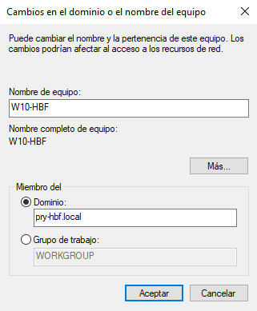

Nos pide las credenciales del administrador de Windows Server. Ponemos la cuenta del administrador.

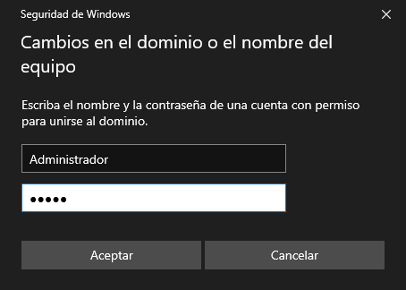

Ahora tendremos que reiniciar el equipo. Luego, podremos ver si el equipo se ha unido yendo hacia nuestro Windows Server e ir hacia `Herramientras → Usuarios y equipos de Active Directory`, clicamos en Computers y veremos que ya lo tendremos conectado.

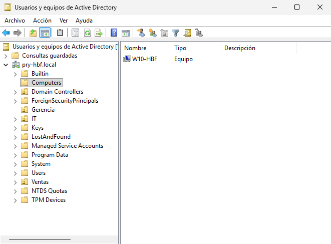

## 📌 Fase C: Implantación e interoperabilidad
### 1. Configuración y unión a Active Directory
Aquí vamos a trabajar la mayor parte con nuestro **Ubuntu Server**. Lo primero que haremos será editar el archivo `hosts` para añadir nuestro hostname al dominio de nuestro **Windows Server**. Pondremos el siguiente comando y añadimos lo que viene en la captura.
```bash
sudo nano /etc/hosts

192.168.100.20 server-hbf.pry-hbf.local server-hbf
```

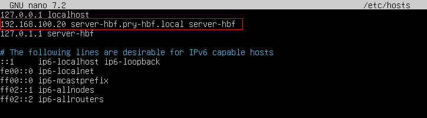

Actualizamos los paquetes e instalamos `chrony` para sincronizar la hora y luego editamos su archivo de configuración. Esto se usa por el protocolo de `Kerberos`.
```bash
sudo apt update
sudo apt install chrony -y
sudo nano /etc/chrony/chrony.conf
```

Pondremos esta línea al principio del las demás líneas que empiezen por pool, a la que tendremos que comentar para que solo apunte hacia nuestro Windows Server.
```bash
server 192.168.100.10 iburst
```

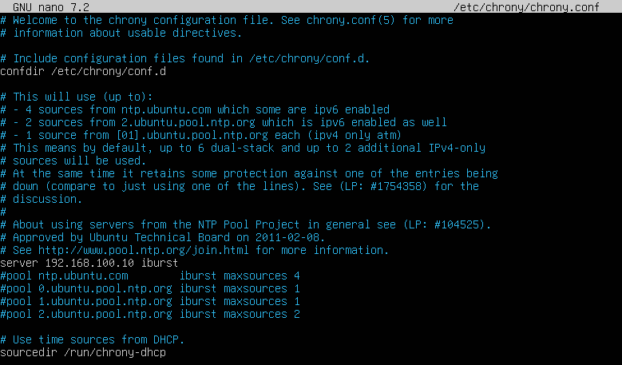

Reiniciamos el servidor y comprobamos su estado.
```bash
sudo systemctl restart chrony
sudo systemctl status chrony
```

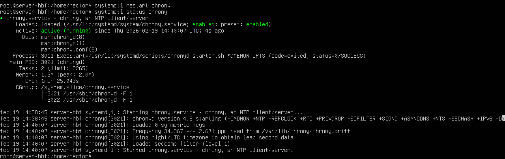

Ahora, instalaremos todas estas herramientas para quese permita la integración.  
- `Realmd` para que la unión se automatize.  
- `SSSD` para el caché y mapeo de identidades.  
- `Samba` para compartir los recursos.

```bash
sudo apt install realmd sssd sssd-tools libnss-sss libpam-sss adcli samba samba-common-bin smbclient packagekit -y
```

Gracias a `realmd`, nos evitaremos editar varios archivos de configuración y todo ello se reduce a pocos comandos. Como por ejemplo, este comando que nos hará ver si detecta nuestro **Active Directory**.
```bash
realm discover pry-hbf.local
```

Veremos que en este caso, sí esta "viendo" nuestro **Active Directory**.

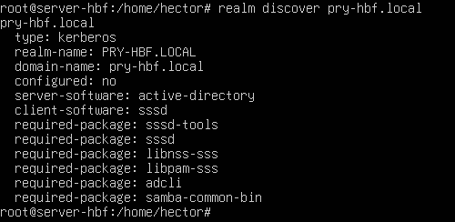

Lo que se hará ahora es si podremos unirnos a **Windows Server**. Para ellos pondremos el siguiente comando.
```bash
sudo realm join --user=Administrador pry-hbf.local
```

Podremos ver que sí ha funcionado porque no ha salido nada más después de la contraseña.

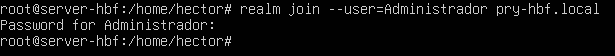

Para comprobar que ya nuestro Ubuntu Server puede leer la base de datos del **Active Directory**, haremos la prueba con un usuario, en este caso, `UsuV1`. Ponemos el siguiente comando:
```bash
id UsuV1@pry-hbf.local
```

Vemos que aparece incluso el grupo de usuarios al que pertenece, por lo que sí lee la base de datos.

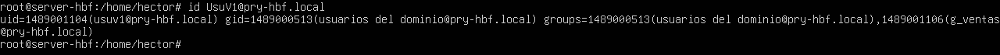

También podemos verlo si vamos a Windows Server.

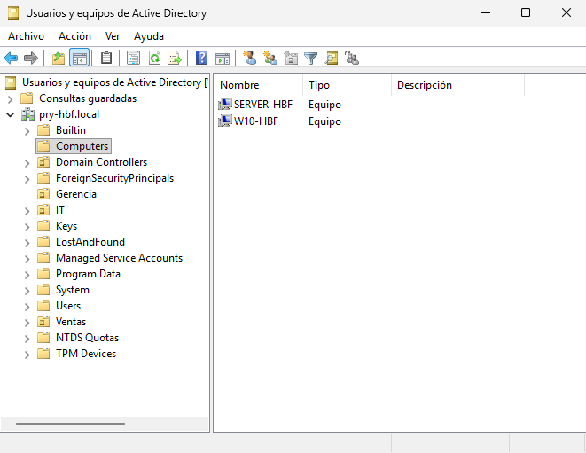

### 2. Configuración de Samba y ACLs
Ya teniendo nuestro Ubuntu Server reconociendo al 100% Active Directory, configuraremos Samba para poder compartir los recursos por la red.

Haremos una copia de seguridad el archivo de configuración de samba para luego configurar el archivo. Pondremos lo siguiente:
```bash
sudo cp /etc/samba/smb.conf /etc/samba/smb.conf.bak
sudo nano /etc/samba/smb.conf
```

Dentro del archivo, tendremos que poner toda esta configuración:
> 💬 He puesto comentarios por medio para saber que es lo qué hace cada cosa, podemos quitarlos a la hora de ponerlo en el archivo y no pasaría nada.

```bash
[global]
   # Configuración de Identidad
   workgroup = PRY-HBF
   security = ads
   realm = PRY-HBF.LOCAL

   # Registros y Logs
   log file = /var/log/samba/%m.log
   log level = 1

   # CONFIGURACIÓN DE MAPEO DE IDENTIDAD (ID MAPPING)

   # Rango para usuarios locales de la máquina Linux
   idmap config * : backend = tdb
   idmap config * : range = 3000-7999
   
   # Rango para los usuarios del dominio (Gestionado por SSSD)
   idmap config PRY-HBF : backend = sss
   idmap config PRY-HBF : range = 10000-500000

   # Soporte para Listas de Control de Acceso (ACLs) de Windows
   vfs objects = acl_xattr
   map acl inherit = yes
   store dos attributes = yes

   # Desactivar soporte de impresoras (evita errores en logs)
   load printers = no
   printing = bsd
   printcap name = /dev/null
   disable spoolss = yes

# CARPETAS COMPARTIDAS

[Ventas]
   comment = Departamento de Ventas
   path = /srv/samba/ventas
   read only = no
   browseable = yes
   # Solo el grupo G_Ventas de AD puede entrar
   valid users = "@G_Ventas@pry-hbf.local"
   force group = "Usuarios del dominio@pry-hbf.local"
   create mask = 0660
   directory mask = 0770

[IT]
   comment = Departamento de IT
   path = /srv/samba/it
   read only = no
   browseable = yes
   # Solo el grupo G_IT de AD puede entrar
   valid users = "@G_IT@pry-hbf.local"
   force group = "Usuarios del dominio@pry-hbf.local"
   create mask = 0660
   directory mask = 0770

[Gerencia]
   comment = Departamento de Gerencia
   path = /srv/samba/gerencia
   read only = no
   browseable = yes
   # Solo el grupo G_Gerencia de AD puede entrar
   valid users = "@G_Gerencia@pry-hbf.local"
   force group = "Usuarios del dominio@pry-hbf.local"
   create mask = 0660
   directory mask = 0770
```

Quitando los comentarios, nos tendría que quedar de esta manera:

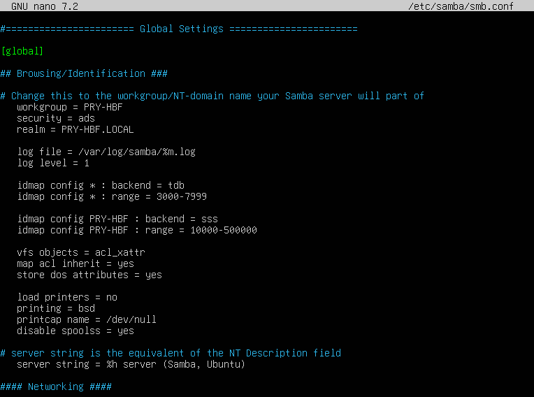

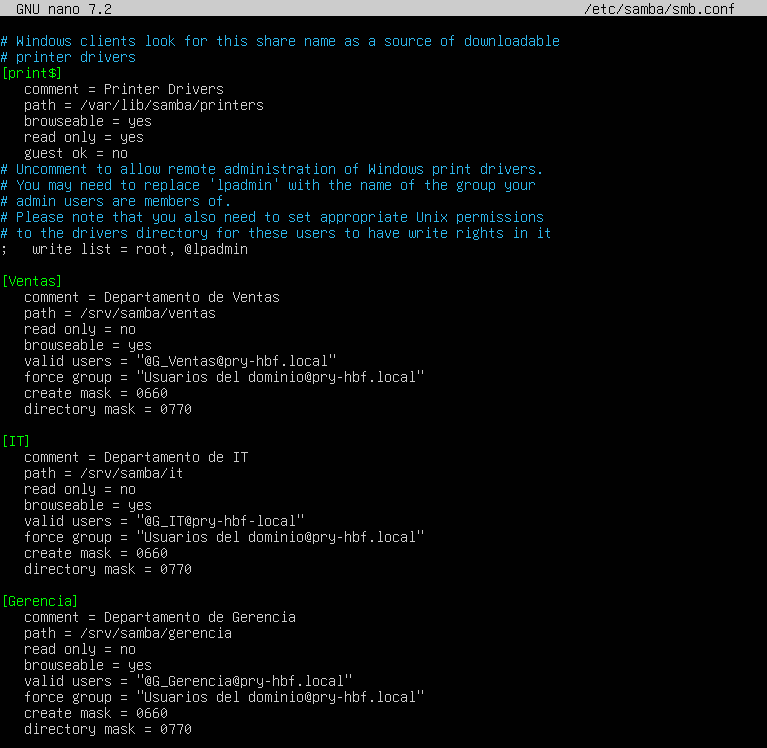

Reiniciamos el servidor y comprobamos su estado.
```bash
sudo systemctl restart smbd nmbd
sudo systemctl status smbd
```

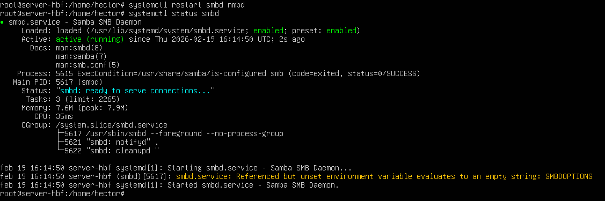

Podemos hacer una comprobación rápida desde localhost para comprobar si hemos hecho bien la configuración. Para ello pondremos este comando:
```bash
smbclient -L localhost -N
```

Vemos que sí podemos ver las carpetas.

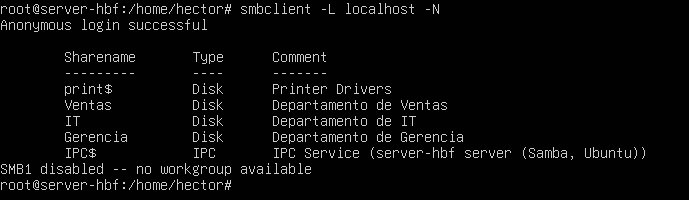

El siguiente paso será hacer los directorios y permisos necesarios, es decir, que cada grupo tenga su carpeta y no la de otro. Procedemos a poner toda esta configuración:
> 💬 He vuelto a poner comentarios para saber bien qué hace cada apartado.

```bash
# Crear las estructuras de directorios
sudo mkdir -p /srv/samba/ventas
sudo mkdir -p /srv/samba/it
sudo mkdir -p /srv/samba/gerencia

# Asignar propiedad (Usuario root, Grupo de AD)
sudo chown root:"G_Ventas@pry-hbf.local" /srv/samba/ventas
sudo chown root:"G_IT@pry-hbf.local" /srv/samba/it
sudo chown root:"G_Gerencia@pry-hbf.local" /srv/samba/gerencia

# Asignar permisos estrictos (770: Dueño y Grupo control total, Otros nada)
sudo chmod 770 /srv/samba/ventas
sudo chmod 770 /srv/samba/it
sudo chmod 770 /srv/samba/gerencia
```

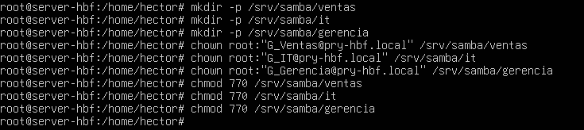

### Comprobación final
Para ver que todo haya funcionado, iremos a nuestra máquina de **Windows 10** e iniciamos sesión con un usuario, por ejemplo, voy a hacerlo con el usuario `UsuV1`.

### Errores e intento de solución
He puesto todos estos comandos en Windows 10 desde Powershell como administrador para solucionarlo.
```powershell
ipconfig /flushdns
nbtstat -R
nbtstat -RR
net stop workstation /y
net start workstation
netsh int ip reset
netsh winsock reset
net use * /delete /y
klist purge
net use X: \\192.168.100.20\Ventas /user:PRY-HBF\UsuV1 * (error 1311)
```

También he desactivado el Firewall del dominio tanto en Windows Server como en Windows 10 y tampoco se ha conectado.

### Método clásico


---
### [⬅️ Volver a Proyecto de Módulo](../index.md)
---