# 📄 Proyecto de Módulo: Integración de Sistemas Heterogéneos

## 💼 Contexto empresarial
Trabajas para una empresa que históricamente ha trabajado solo con entornos Windows. Debido al aumento de costes en licencias, la dirección técnica ha decidido que el nuevo **Servidor de Almacenamiento** sea una máquina **Linux**, ya que es más eficiente y además, es gratuito.

Sin embargo, el Director de Seguridad ha impuesto un requisito innegociable: **"No quiero gestionar dos bases de datos de usuarios distintas. Los usuarios deben usar sus contraseñas actuales de Windows para entrar a las carpetas de Linux."**

Como el equipo técnico actual desconoce cómo conectar ambos mundos, se te ha encargado la investigación del procedimiento y la ejecución del despliegue.

## ✅ Objetivo
**1.** Desplegar una infraestructura de red básica con Active Directory.  
**2.** Documentar y analizar los métodos existentes para integrar un host Linux en un dominio Microsoft.  
**3.** Implementar la solución investigada para unir el servidor Linux al dominio.  
**4.** Configurar Samba para compartir recursos utilizando ACLs basadas en usuarios/grupos del dominio (no locales).  

## 📌 Fases de Ejecución
### Fase A: Infraestructura base
---

Para el proyecto usaré las siguientes máquinas con dos adaptadores de red, una en **red interna** para que se comuniquen y la otra en **NAT**. Las versiones que he usado son:
- Windows Server 2025
- Ubuntu Server 24.04
- Windows 10

| Host          | IP             | Máscara de subred | Servidor DNS   |
| ------------- | -------------- | ----------------- | -------------- |
| `WServer-HBF` | 192.168.100.10 | 255.255.255.0 /24 | 127.0.0.1      |
| `server-hbf`  | 192.168.100.20 | 255.255.255.0 /24 | 192.168.100.10 |
| `W10-HBF`     | 192.168.100.30 | 255.255.255.0 /24 | 192.168.100.10 |

> 💬 No hará falta poner la puerta de enlace porque sería para que saliese hacia un router que en este caso no existe.

### - Configuración de `Windows Server`
Pulsamos la combinación de teclas `Win+X` y escribimos `ncpa.cpl`, hacemos clic derecho en el adaptador de red y clicamos en `Propiedades`. Luego, clicamos en `Protocolo de Internet versión 4 (TCP/IPv4)` y pondremos lo siguiente:

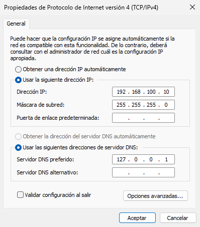

Lo comprobamos poniendo el comando `ipconfig /all`.

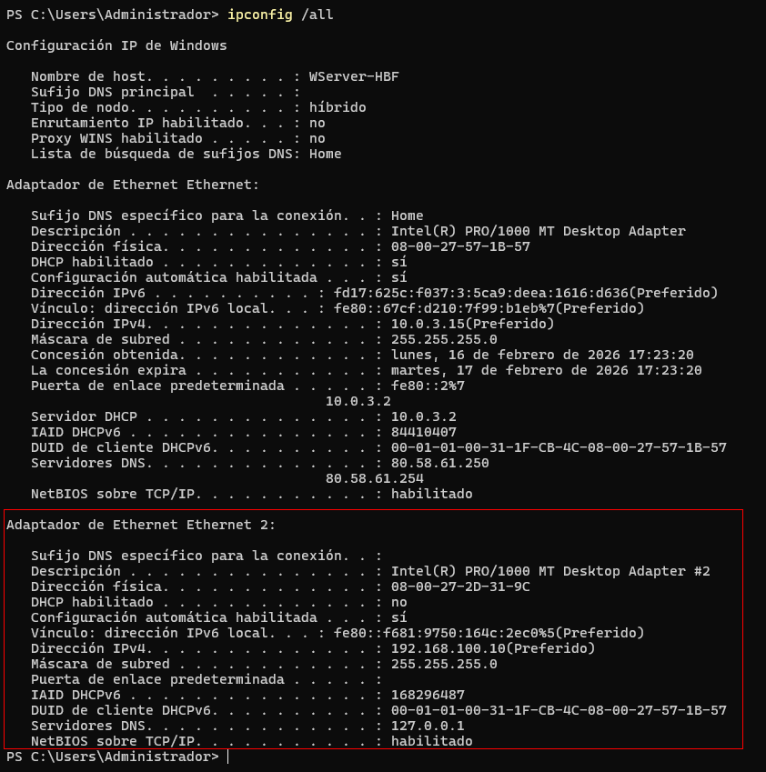

Lo que haremos ahora por si acaso, será desactivar el **Firewall**. Desde el **Panel de control**, vamos hacia `Sistema y seguridad → Firewall de Windows Defender` y en la parte de la izquierda, clicamos en `Activar o desactivar el Firewall de Windows Defender`. Clicamos en `Desactivar Firewall de Windows Defender` tanto en `Redes privadas` como en `Redes públicas o invitadas`, aceptamos y ya está desactivado el **Firewall**.

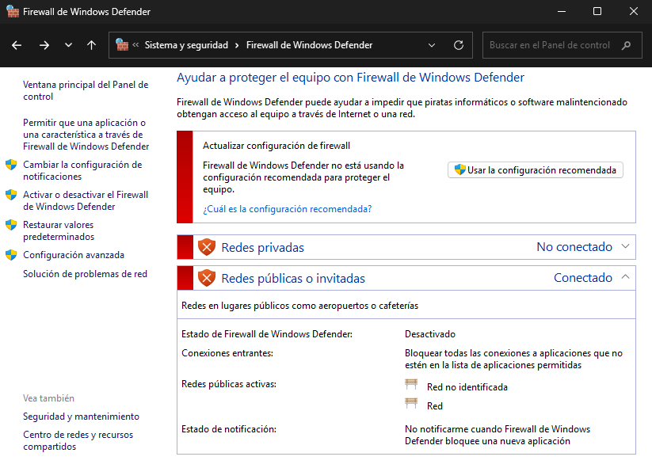

> 💬 Para la práctica sí que podremos quitar el Firewall para evitar errores pero para un entorno real de empresa no se tendrá que desactivar.

### - Configuración de `Ubuntu Server`
Editamos el archivo de configuración para poner la IP estática, pondremos este comando:
```bash
sudo nano /etc/netplan/50-cloud-init.yaml
```

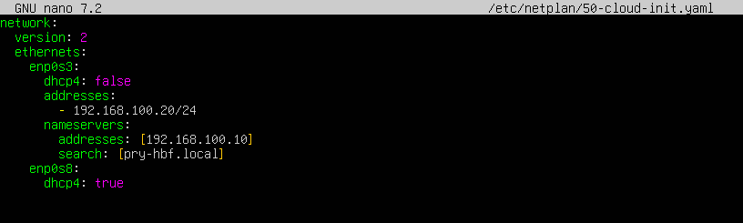

Aplicamos los cambios con el comando `sudo netplan apply`. Para ver la IP pondremos `ifconfig`. Pero antes instalamos las `net-tools` con `sudo apt install net-tools`.


### - Configuración de `Windows 10`
Hacemos la combinación de teclas `Win+X` y escribimos `ncpa.cpl`, hacemos clic derecho en el adaptador de red y clicamos en `Propiedades`. Luego, clicamos en `Protocolo de Internet versión 4 (TCP/IPv4)` y pondremos lo siguiente:

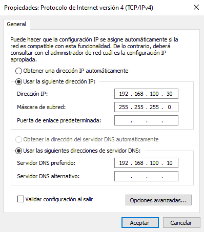

Lo comprobamos poniendo el comando `ipconfig /all`.

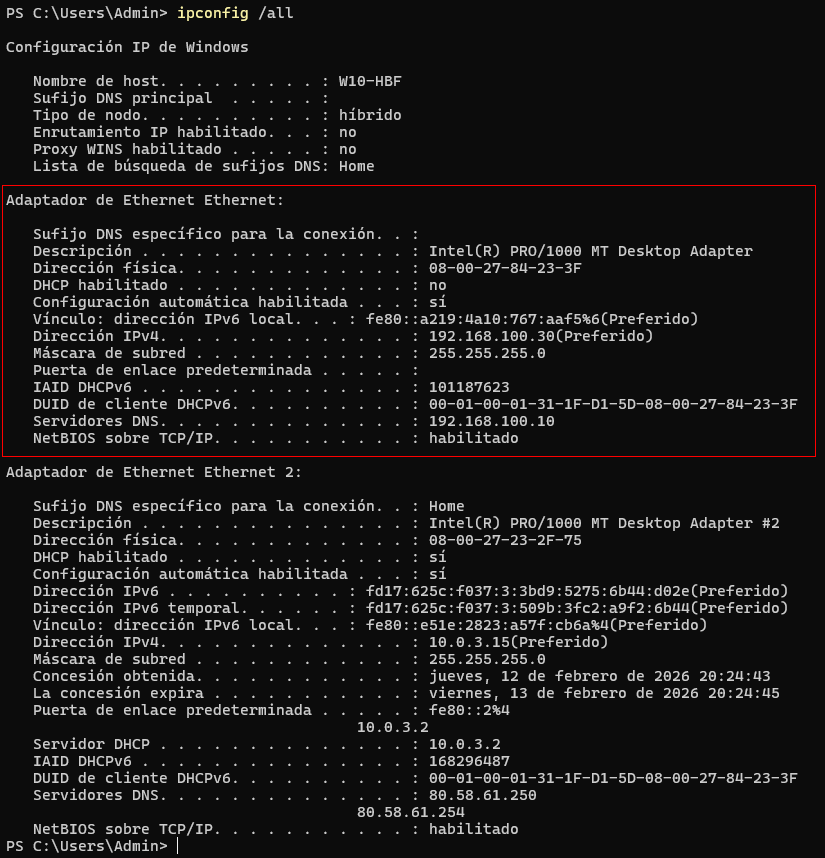

Desactivamos el **Firewall** de la misma manera que hicimos en nuestro **Windows Server**.

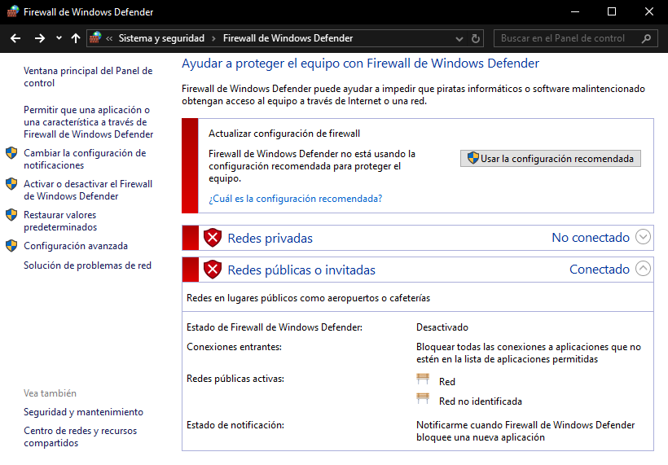

> 💬 Para la práctica sí que podremos quitar el Firewall para evitar errores pero para un entorno real de empresa no se tendrá que desactivar.

### - Instalación de Active Directory en `Windows Server`
Para instalar **Active Directory** (o AD), vamos a la parte superior derecha, clicamos en `Administrar` y `Agregar roles y características`.

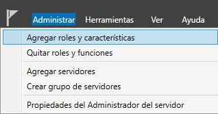

Para la instalación seguiremos los siguientes pasos:

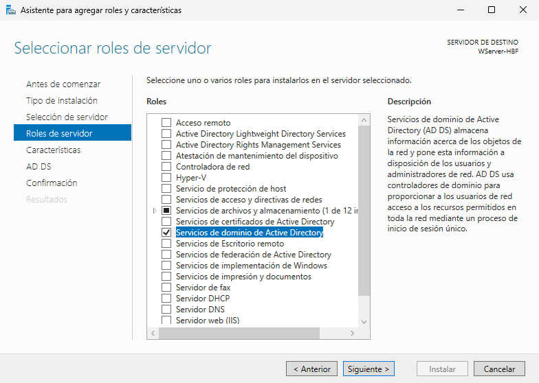

Clicamos en el `checkbox` para reiniciar el servidor en caso necesario y clicamos en **Instalar**.

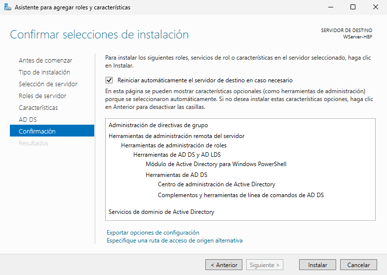

Cuando lo tengamos instalado, tendremos que crear el bosque. Nos saldrá un icono de peligro (⚠️) al lado de la bandera de notificaciones. 

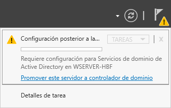

Al clicar, nos saldrá una ventana para promover el controlador de dominio. Seguiremos los siguientes pasos para tener un nuevo bosque completamente limpio.

Escogemos la opción de agregar un nuevo bosque y le pondremos un nombre.

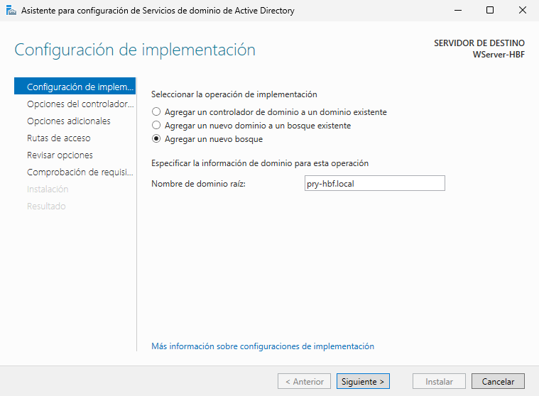

Lo dejamos como está y le pondremos una contraseña que nos sea fácil de recordar.

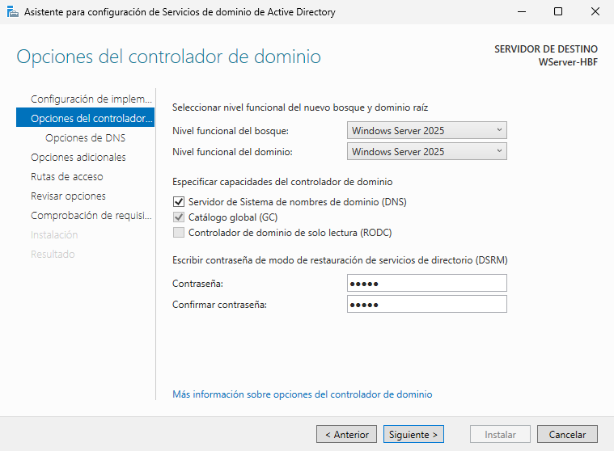

Clicamos directamente en **Siguiente**.

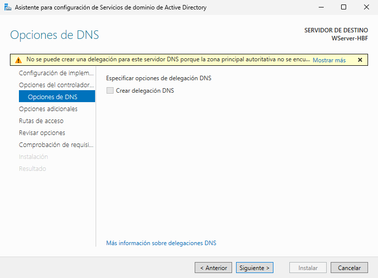

Este será el nombre que va a tener nuestro NetBIOS, es decir, lo que veremos al iniciar sesión antes del nombre de usuario.


Estas serán las rutas que tendrá el AD. Se recomienda no tocarlo a no se que estemos seguros de ello.

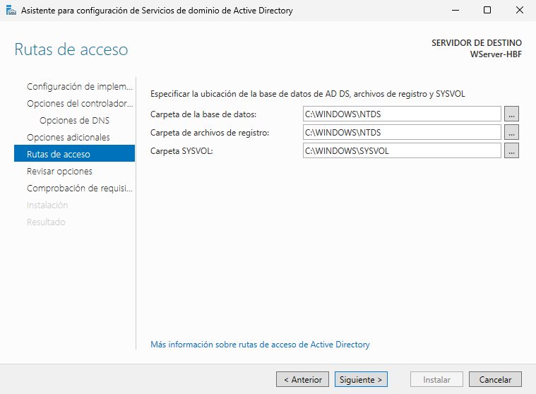

Esto de aquí, es un resumen de lo que hemos hecho, podemos clicar en `Ver script` para verlo más detalladamente.


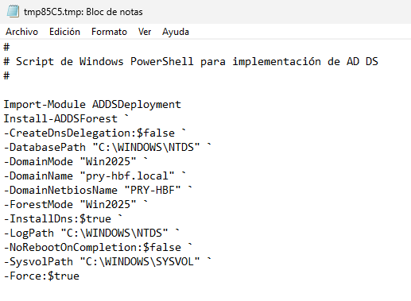

Ahora tendremos que esperar un poco hasta que nos salga lo siguiente y podamos clicar en **Instalar**.


Al clicar en Instalar, llegará un punto en el que nuestra máquina se reiniciará para aplicar los cambios que hemos hecho. Y con esto ya tendríamos instalado nuestro **AD** en Windows Server.

Cuando se haya reiniciado, podremos ver que al iniciar sesión, podremos ver el dominio que hemos hecho.

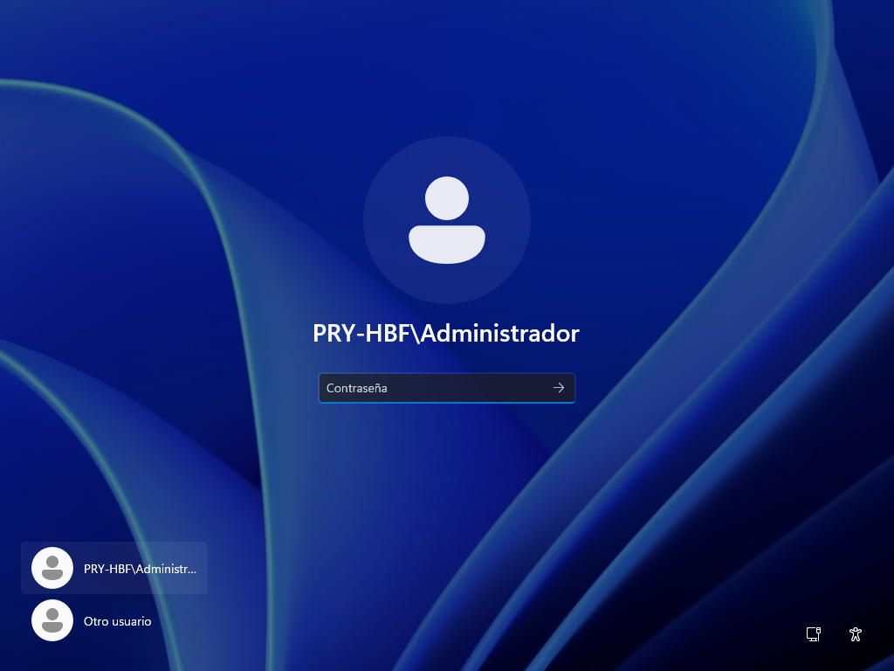

Iniciamos sesión y ahora nos iremos hacia `Herramientras → Usuarios y equipos de Active Directory` y crearemos las **Unidades Organizativas** de `Ventas`, `IT` y `Gerencia`. Luego, creamos a los usuarios y grupos que se piden dentro de esas Unidades Organizativas.  
Creamos la Unidad Orgnizativa con clic derecho en nuestro dominio y vamos a `Nuevo → Unidad Organizativa`. Para los usuarios y grupos, crearé los siguientes:
- **Ventas:**
  - G_Ventas
  - UsuV1
  - UsuV2
- **IT:**
  - G_IT
  - UsuIT1
  - UsuIT2
- **Gerencia:**
  - G_Gerencia
  - UsuG1
  - UsuG2

Cuando tengamos a los usuarios creados y dentro del grupo asignado, nos quedará de la siguiente manera:

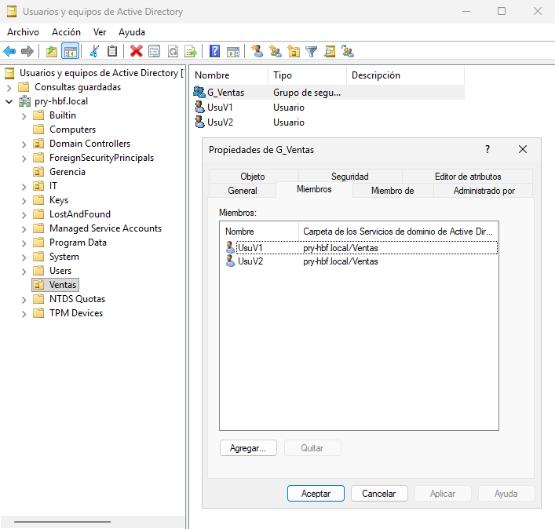

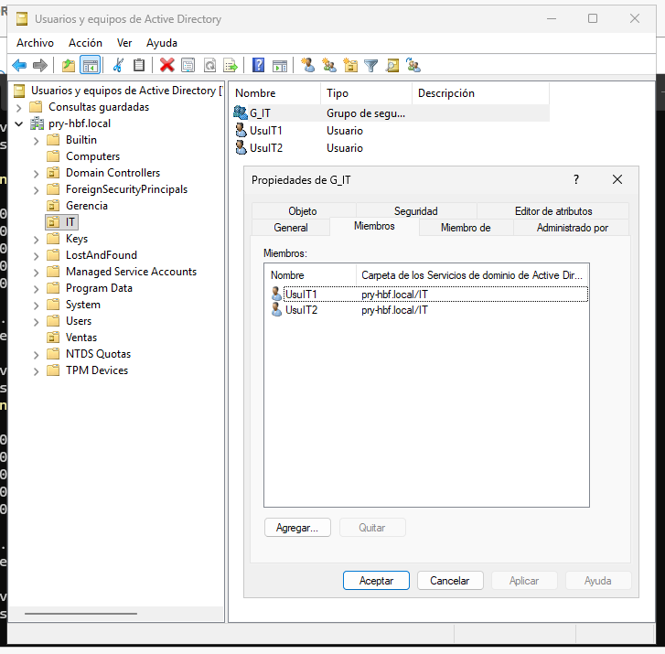

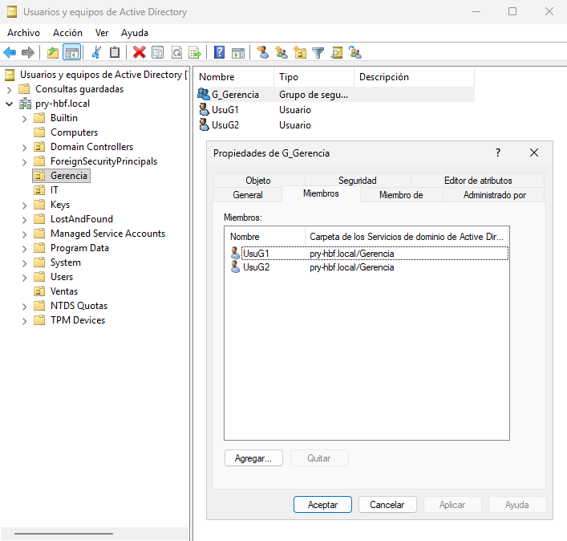

### Fase B: Investigación
---

### 1. Análisis de herramientas

- **Kerberos:**  
  Es un protocolo de autenticación de redes de ordenador que permite a dos ordenadores en una red insegura demostrar su identidad mutuamente de manera segura. Se concentraron primeramente en un modelo de `cliente-servidor`, y brinda autenticación mutua: tanto cliente como servidor verifican la identidad uno del otro.  
  Kerberos se basa en criptografía de clave simétrica y requiere un tercero de confianza.
  - **Función:** Cuando un usuario intenta acceder, no envía su contraseña por la red en texto plano. En su lugar, solicita un `"Ticket" (TGT)` al controlador de dominio `(KDC - Key Distribution Center)`. Si el ticket es válido, Linux le deja pasar.
  - **Importancia:** Sin Kerberos configurado `(krb5-user en Linux)`, no hay forma segura de validar que la contraseña del usuario es correcta sin exponerla.

- **Winbind:**  
 Es un emulador de un cliente de Windows en Linux y que se comunica con los servidores de **Active Directory**.  
 Se puede usar realmd para configurar `Samba Winbind`:
  - Configurar la autenticación de la red y la pertenencia a un dominio de forma estándar.
  - Descubrir automáticamente la información sobre los dominios accesibles.
  - No requiere una configuración avanzada para unirse a un dominio.
 
   Hay que tener en cuenta lo siguiente:
  - La integración directa con Winbind en una configuración AD multiforestal requiere confianzas bidireccionales.
  - Los bosques remotos deben confiar en el bosque local para garantizar que el complemento `idmap_ad` maneje correctamente a los usuarios del bosque remoto.

- **SSSD:**  
 Es un servicio del sistema que permite acceder a directorios remotos y mecanismos de autenticación. Funciona en dos etapas:
  - Conecta al cliente con un proveedor remoto para recuperar la información de identidad y autenticación.
  - Utiliza la información de autenticación obtenida para crear una caché local de usuarios y credenciales en el cliente.

  Los usuarios del sistema local pueden entonces autenticarse utilizando las cuentas de usuario almacenadas en el proveedor remoto.

- **Realmd:**  
Proporciona una forma sencilla de descubrir y unirse a dominios de identidad para integrarse directamente en un dominio. Configura los servicios del sistema Linux, como SSSD o Winbind, para realizar la conexión.  
Puede buscar los dominios de Active Directory y Identity Management disponibles y unir el sistema al dominio elegido, configurando también los servicios necesarios para gestionar el acceso de los usuarios. Además, como SSSD permite trabajar con varios dominios, realmd también puede detectar y usar varios dominios a la vez.  
El sistema realmd admite los siguientes tipos de dominios:
  - Microsoft Active Directory
  - Red Hat Linux Identity Management

  Los siguientes clientes de dominio son compatibles con realmd:
  - SSSD tanto para Red Hat Enterprise Linux Identity Management como para Microsoft Active Directory.
  - Winbind para Microsoft Active Directory

### - Bibliografía
- [Kerberos (Wikipedia)](https://es.wikipedia.org/wiki/Kerberos)  
- [Winbind (Red Hat)](https://docs.redhat.com/es/documentation/red_hat_enterprise_linux/8/html/integrating_rhel_systems_directly_with_windows_active_directory/connecting-rhel-systems-directly-to-ad-using-samba-winbind_integrating-rhel-systems-directly-with-active-directory)  
- [SSSD (Red Hat)](https://docs.redhat.com/es/documentation/red_hat_enterprise_linux/8/html/configuring_authentication_and_authorization_in_rhel/understanding-sssd-and-its-benefits_configuring-authentication-and-authorization-in-rhel)  
- [Realmd (Red Hat)](https://docs.redhat.com/es/documentation/red_hat_enterprise_linux/7/html/windows_integration_guide/ch-configuring_authentication)

### 2. Resolución de nombres
- **/etc/resolv.conf (DNS):** `Active Directory` no es solo una base de datos de usuarios, es una estructura de red que depende de registros DNS específicos (registros SRV). Si Linux no tiene configurado el DNS del `Controlador de Dominio` en este archivo, será incapaz de localizar dónde está el servidor de autenticación.
- **NTP (Sincronización de hora):** El protocolo `Kerberos` utiliza marcas de tiempo para evitar ataques de denegación (replay attacks). Si el reloj del servidor **Linux** difiere en más de 5 minutos del reloj del **Windows Server**, los tickets de Kerberos serán rechazados por *"caducados"* o *"inválidos"*, impidiendo el inicio de sesión.

### 3. Estrategia elegida
Para este proyecto se ha elegido por la **Opción Moderna**, utilizando `SSSD` y `Realmd`.

**Justificación:**
- **Facilidad de despliegue:** `Realmd` reduce el proceso de unión a un único comando `(realm join)`, configurando automáticamente la confianza entre sistemas.
- **Rendimiento:** `SSSD` es más eficiente gestionando las peticiones de identidad y permite una gestión más limpia de los permisos mediante el uso de nombres de usuario legibles (por ejemplo, `usuario@dominio.local`).
- **Soporte:** Es la arquitectura recomendada por las distribuciones modernas (Ubuntu, RHEL, Debian) para entornos empresariales actuales.

### 4. Mapeo de identidad
Linux y Windows no usan el mismo *"idioma"* para identificar a sus usuarios:
- En **Windows**, cada usuario tiene un `SID` (Security Identifier), que es una cadena larga y única llena de números y letras (por ejemplo, `S-1-5-21-36...`).
- En **Linux**, los usuarios se identifican con números simples: el `UID` (User ID) y el `GID` (Group ID) (por ejemplo,`1001`).

**¿Cómo se ponen de acuerdo?**  
Para que Linux sepa a quién pertenece un archivo creado por un usuario de Windows, primero tiene que “traducir” ese SID a un UID. Ese proceso se llama **ID Mapping**.  
Para la solución, usamos `SSSD` con un mapeo algorítmico. Básicamente, SSSD toma el `SID` único del usuario de **Windows** y le aplica una fórmula matemática para convertirlo en un número `UID` válido en **Linux**, dentro de un rango definido (por ejemplo, entre `10 000` y `500 000`).

**Así se logra algo muy importante:**  
El mismo usuario de **Windows** siempre obtiene el mismo `UID` en **Linux**, sin que tengamos que crear usuarios manualmente en archivos como `/etc/passwd`. Es una traducción automática y consistente entre ambos sistemas.

### Fase C: Implantación e interoperabilidad
---
<!-- ejemplo: https://docs.redhat.com/es/documentation/red_hat_enterprise_linux/8/html/integrating_rhel_systems_directly_with_windows_active_directory/connecting-to-multiple-domains-different-ad-forests-sssd_connecting-directly-to-ad -->

---
### [⬅️ Volver a Proyecto de Módulo](../index.md)
---