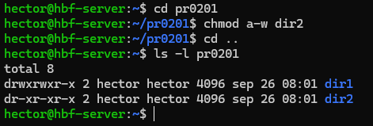
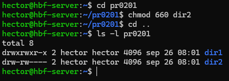
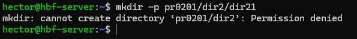
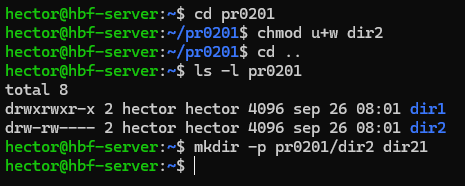

# 💡 PR0201

## 1. Permisos de usuarios

**1.** Para crear el directorio ponemos el comando ``mkdir -p pr0201`` y se nos creará una carpeta llamada **pr0201** que se encontrará en ``/home/"usuario"``.  
Creamos otros dos directorios con el nombre **dir** y **dir2** dentro de **pr0201** con el comando ``mkdir -p pr0201/"directorio"``.

**2.** Para elminar todos los permisos de escritura de **dir2** en notación simbólica, vamos a ponernos en el directorio con ``cd pr0201`` o ponemos el directorio en el propio comando.  
El comando que vamos a poner es ``chmod a-w dir2`` o en su lugar ``chmod a-w pr0201/dir2``. Ahora ponemos el comando ``ls -l pr0201`` para ver si se han cambiado los permisos. El permiso de la lectura es la **w**.  

**3.** Para eliminar los permisos de lectura para otros usuarios de **dir2** en notación octal, nos volvemos a posicionar en el directorio anterior y ponemos el comando ``chmod 000 dir2``.  

**4.** Los permisos que tiene ahora **dir2** es ``d---------``.

**5.** Entramos dentro del directorio de **dir2** ubicado en **pr0201** y creamos el directorio **dir21** con el comando ``mkdir -p pr0201/dir2 dir21``.  
Va a dar error porque no tenemos ningún permiso para poder hacer un directorio dentro de **dir2**.  

**6.** Para poner permisos de escritura al propietario, es decir, nosotros mismos, tenemos las dos opciones de notación para hacerlo.  

- Notación simbólica:  
  ``chmod u+w dir2``
- Notación octal:  
  ``chmod 660 dir2``

Ahora que tenemos los permisos cambiados, volvemos a hacer el directorio **dir21**.  

## 2. Notación octal y simbólica

**1.**  
rwxrwxr-x :  
rwxr--r-- :  
r--r----- :  
rwxr-xr-x :  
rwxr-xr-x :  
r-x--x--x :  
-w-r----x :  
-----xrwx :  
r---w---x :  
-w------- :  
rw-r----- :  
rwx--x--x :  

**2.**  
rwx rwx rwx :  
--x --x --x :  
r-- -w- --x :  
-w- --- --- :  
rw- r-- --- :  
rwx --x --x :  
rwx r-x r-x :  
r-x --x --x :  
-w- r-- --x :  
--- --x rwx :  
