# 📄 PR0201: Usuarios y permisos en Linux

## ✅ Objetivos
- Profundizar conocimientos sobre usuarios y permisos en sistemas Linux.

## 🔎 Recursos
- [Box Ubuntu 22.04](https://app.vagrantup.com/generic/boxes/ubuntu2204)
- [Ficheros /etc/passwd /etc/shadow y /etc/group en GNU/Linux](https://blog.elhacker.net/2022/02/icheros-etc-passwd-shadow-y-group.html)
- [Understanding /etc/shadow file format on Linux](https://www.cyberciti.biz/faq/understanding-etcshadow-file/)
- [How to create SHA512 password hashes on command line](https://unix.stackexchange.com/questions/52108/how-to-create-sha512-password-hashes-on-command-line)
- [Rockyou.txt](https://github.com/brannondorsey/naive-hashcat/releases/download/data/rockyou.txt)
- [SecLists](https://github.com/danielmiessler/SecLists/tree/master)
- [How to use John the Ripper](https://www.varonis.com/blog/john-the-ripper)

## 📌 1. Permisos de usuarios

### Apartado 1
Para crear el directorio ponemos el comando `mkdir -p pr0201` y se nos creará una carpeta llamada **pr0201** que se encontrará en `/home/"usuario"`.

Creamos otros dos directorios con el nombre **dir** y **dir2** dentro de **pr0201** con `mkdir -p pr0201/"directorio"`.

### Apartado 2
Para elminar todos los permisos de escritura de **dir2** en notación simbólica, vamos a ponernos en el directorio con `cd pr0201` o ponemos el directorio en el propio comando.

El comando que vamos a poner es `chmod a-w dir2` o en su lugar `chmod a-w pr0201/dir2`. Ahora ponemos `ls -l pr0201` para ver si se han cambiado los permisos. El permiso de la lectura es la **w**.  

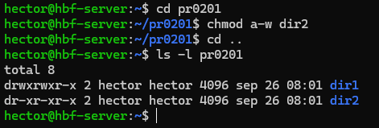

### Apartado 3
Para eliminar los permisos de lectura para otros usuarios de **dir2** en notación octal, nos volvemos a posicionar en el directorio anterior y ponemos `chmod 000 dir2`.

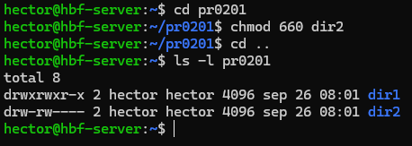

### Apartado 4
Los permisos que tiene ahora **dir2** es `d---------`.

### Apartado 5
Entramos dentro del directorio de **dir2** ubicado en **pr0201** y creamos el directorio **dir21** con `mkdir -p pr0201/dir2 dir21`.

Va a dar error porque no tenemos ningún permiso para poder hacer un directorio dentro de **dir2**.  

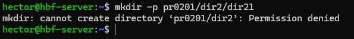

### Apartado 6
Para poner permisos de escritura al propietario, es decir, nosotros mismos, tenemos las dos opciones de notación para hacerlo.  

- Notación simbólica:  
  `chmod u+w dir2`

- Notación octal:  
  `chmod 660 dir2`

Ahora que tenemos los permisos cambiados, volvemos a hacer el directorio **dir21**.  

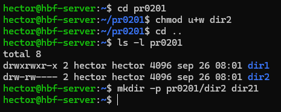
## 📌 2. Notación octal y simbólica

### 1. Notación simbólica
rwxrwxr-x : `chmod u=rwx,g=rwx,o=rx`  
rwxr--r-- : `chmod u=rwx,g=r,o=r`  
r--r----- : `chmod u=r,g=r,o=`  
rwxr-xr-x : `chmod u=rwx,g=rx,o=rx`  
rwxr-xr-x : `chmod u=rwx,g=rx,o=rx`  
r-x--x--x : `chmod u=rx,g=x,o=x`  
-w-r----x : `chmod u=w,g=r,o=x`  
-----xrwx : `chmod u=,g=x,o=rwx`  
r---w---x : `chmod u=r,g=w,o=x`  
-w------- : `chmod u=w,g=,o=`  
rw-r----- : `chmod u=rw,g=r,o=`  
rwx--x--x : `chmod u=rwx,g=x,o=x`  

### 2. Notación octal
rwxrwxrwx : `chmod 777`  
--x--x--x : `chmod 111`  
r---w---x : `chmod 421`  
-w------- : `chmod 200`  
rw-r----- : `chmod 640`  
rwx--x--x : `chmod 711`  
rwxr-xr-x : `chmod 755`  
r-x--x--x : `chmod 511`  
-w-r----x : `chmod 246`  
-----xrwx : `chmod 017`  

## 📌 3. El bit setgid

### Apartado 1
Para crear un grupo ponemos `sudo groupadd "grupo"`, y para ver si se ha creado o no, ponemos `tail /etc/group` y podremos ver los grupos que tiene nuestro servidor.

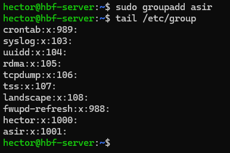

Ahora creamos a los usuarios con `sudo adduser "usuario"`.

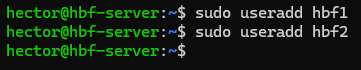

Los metemos en el grupo de **asir** con el comando `sudo usermod "usuario" -g "grupo"`, y para comprobar si los usuarios están en el grupo, ponemos `groups "usuario"`.

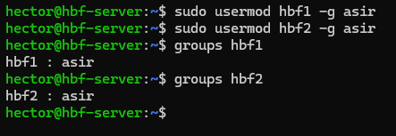

### Apartado 2
Creamos el directorio con `sudo mkdir -p /compartido` y le ponemos de usuario propietario a **root** y el grupo **asir**. Para ello ponemos `sudo chown root:asir /compartido` y para comprobar que todo ha sido correcto, pondremos `ls -ld /compartido`.

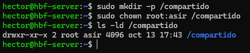

### Apartado 3
Para dar los permisos al usuario propietario y al grupo del propietario y que ningún otro usuario pueda acceder, tendremos que poner `sudo chmod 770 /compartido` y para comprobarlo pondremos `ls -ld /compartido`.

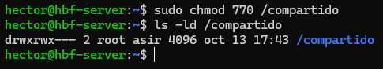

### Apartado 4
Añadimos el grupo propietario al directorio, como ya está hecho de antes no haría falta, pero en caso de añadir uno nuevo pondremos `sudo chgrp "grupo" /compartido`.

Ahora activamos el **setgid**, para activarlo, tendremos que asignar los permisos, en este caso siguiendo los ejercicios, van a ser **770**, por lo que el comando quedaría así `sudo chmod 2770 /compartido`. Y para volver a comprobar los resultados, pondremos `ls -ld /compartido`.

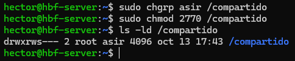

Vemos que al ver los permisos, tenemos una letra **"s"**, eso quiere decir que el **setgid** está activado correctamente.

### Apartado 5
Intentamos acceder al usuario que tenemos, en este caso es **hbf1**, y al crearlo con el comando `useradd` no tiene contraseña como tal, hay que crearle una. Para ello pondremos `sudo passwd hbf1`.

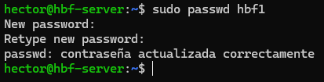

La nueva contraseña que se le ha puesto es **"admin"**.

Ahora, podemos iniciar sesión con el usuario. Para entrar, ponemos `su - "usuario"`, ponemos la contraseña y estamos dentro. Puede que salga un aviso de que no se ha podido crear el directorio /home, esto es porque es la primera vez que iniciamos sesión con el usuario.  

Vamos al directorio **/compartido** y desde ahí crearemos un fichero, para hacer el comando más corto y no tener que escribir de más, podemos hacerlo todo en uno, para ello ponemos `echo "Esto es una prueba" > fichero1`, donde **"echo"** es el mensaje que pondremos y el signo **">"** sirve para meter el echo en un fichero, por eso se le pone el nombre del fichero después, para que se guarde ahí directamente.  

Comprobamos que haya funcionado con poner `ls -l`podemos ver la información del directorio en el que estamos.

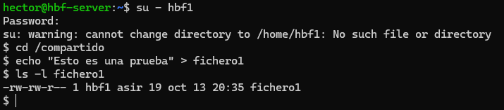

### Apartado 6
Seguimos los pasos anteriores que en el ejercicio anterior. Cuando estemos dentro del **usuario2**, que en este caso es **hbf2**, entramos en el directorio y ponemos `cat fichero1` para ver si podemos ver el contenido del directorio.

Para añadirle el contenido en un solo comando, pondremos `echo "contenido" >> fichero1`, el signo **>>**, sirve para que actualice el contenido nuevo del archivo sin borrar lo anterior.

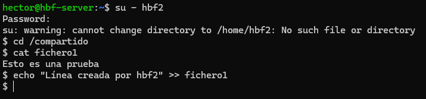

Podemos ver que sí ha dejado meter contenido en el **fichero1**.

### Apartado 7
- Tiene varias ventajas, varias de ellas son:

  - **Herencia de grupo automática:** Cuando un usuario crea un archivo en un directorio con `setgid` activado, el grupo del archivo se establece automáticamente al grupo del directorio.
  
  - **Facilita la colaboración:** En un directorio de grupo de proyecto, por ejemplo, todos los archivos creados por diferentes miembros del equipo pertenecerán al grupo del proyecto.

  - **Mantenimiento de la integridad del grupo:** Asegura que todos los archivos dentro de un directorio compartido pertenezcan a un grupo de trabajo específico, facilitando el control de acceso y la gestión de permisos para el grupo.

  - **Aplicación en directorios compartidos:** Es especialmente útil para directorios compartidos donde muchos usuarios necesitan crear y manipular archivos, como bases de datos, directorios de proyectos o carpetas compartidas a través de servicios como `Samba`.

- Si no se aplica el `setgid` en un entorno colaborativo, los nuevos archivos creados en un directorio compartido pertenecerán al grupo del usuario que los crea, en vez del grupo del directorio.

### Apartado 8
Para eliminar a los usuarios por completo, pondremos `sudo userdel -r "usuario"`. 

Para eliminar el directorio por completo, pondremos `sudo rm -rf /compartido`.

Y para eliminar al grupo por completo, pondremos `sudo groupdel asir`.

## 📌 4. El sticky bit

### Apartado 1
Volvemos a crear el directorio con `sudo mkdir -p /compartido`. Luego, lo modificamos con `sudo chmod 777 /compartido`.  

Para comprobarlo, haríamos `ls -ld /compartido`.

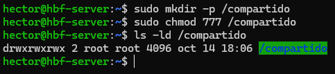

### Apartado 2
Repetimos el crear los usuarios como la otra vez, crearemos en este caso **hbf1** y **hbf2**. Pondremos de comando `sudo useradd -m -s /bin/bash "usuario"`.  

`-m` crea el directorio **/home** para los usuarios. `-s /bin/bash` añade **Bash** como línea de comandos.

Luego de crearlo, le pondremos la contraseña con `sudo passwd "usuario"`. La pedirá dos veces para la comprobación.

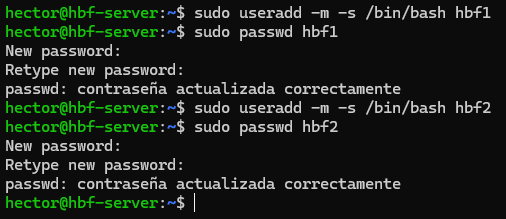

Podemos comprobar si se ha creado bien con el comando `getent passwd "usuario"`.

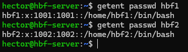

### Apartado 3
Entramos con el usuario **hbf1** y vemos que al haberlo creado esta vez con bash, podemos ver que se parece a la línea de comandos normal que hay.

Ahora, entramos en **/compartido** y dentro hacemos un fichero y escribimos lo que sea para comprobarlo, lo haremos como en los anteriores ejercicios, con el comando `echo "contenido" > fichero1`. Podemos ver que el fichero se ha creado correctamente con haber puesto el comando `ls -l fichero1`.

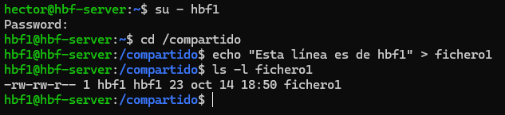

Después, entramos como **hbf2** e intentamos eliminar el fichero que hemos creado. Una vez dentro del directorio, eliminamos el fichero con `rm fichero1`, si no nos ha dado error, podemos comprobarlo con `ls -l fichero1` y podemos ver que no existe dicho archivo o directorio.

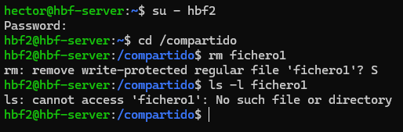

### Apartado 4
Para activarle el **sticky bit**, tenemos que poner solamente el comando `sudo chmod +t /compartido`.

Comprobamos los cambios con `ls -ld /compartido`.

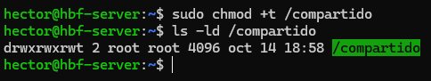

Con esto, todos los usuarios pueden crear ficheros, pero no eliminarlos a excepción del usuario propietario del directorio y de **root**.

### Apartado 5
Entramos como **hbf1** y creamos un fichero con contenido dentro con `echo "contenido" fichero1`. Luego, comprobamos que existe el fichero con `ls -l fichero1`.

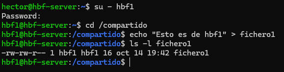

Ahora, entramos como **hbf2** y probaremos a eliminar el fichero estando dentro del directorio con `rm fichero1`.

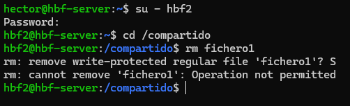

Vemos que nos ha salido un mensaje de que esa operación no está permitido, esto quiere decir que hemos hecho correctamente el **sticky bit**.

### Apartado 6
- El `sticky bit` en un directorio actúa como una medida de seguridad para restringir la modificación y eliminación de los archivos.

- Para poder eliminar un archivo con `sticky bit` activado, puedes hacerlo siendo el propietario del directorio o como el usuario `root`. Noy hay otra manera de poder eliminar.

---
### [⬅️ Volver a UT02](../index.md)
---