# 📄 PR0202: Conexión remota con SSH

## ✅ Objetivos
- Profundizar conocimientos sobre usuarios y permisos en sistemas Linux.

## 🔎 Recursos
- [Box Ubuntu 22.04](https://app.vagrantup.com/generic/boxes/ubuntu2204)
- [How to change hostname on Ubuntu 22.04](https://linuxize.com/post/how-to-change-hostname-on-ubuntu-22-04/)
- [How to male Windows resolve local hosts by their name](https://superuser.com/questions/1182917/how-to-make-windows-resolve-local-hosts-by-their-name)

## 📌 1. Preparación de la máquina y configuración de la red

### Apartado 1
Entramos en la configuración de nuestra máquina virtual y en red, añadimos un adaptador de red y lo ponemos en **Adaptador sólo anfitrión**. Tenemos también el adaptador principal como **NAT** que es el que nos permite conectarnos a la red.

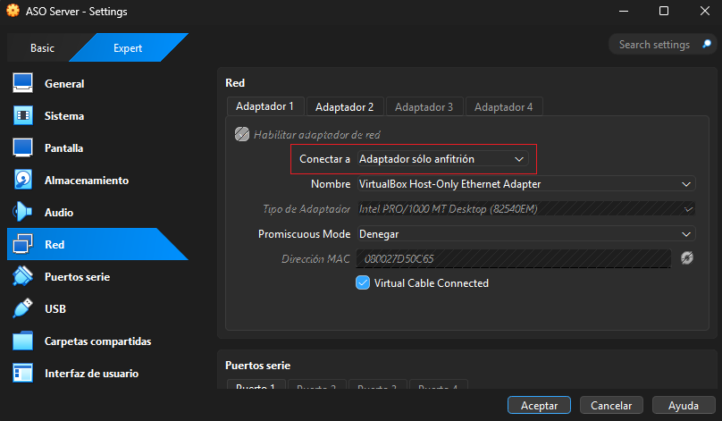

### Apartado 2
Ponemos `ip a` para averiguar que IP tenemos en nuestra máquina. Como tenemos dos adaptadores, se indicarán cuál es cual.  
- **enp0s3:** Adaptador sólo anfitrión
    - **IP:** 192.168.56.103

- **enp0s8**: Adaptador NAT
    - **IP:** 10.0.3.15

Si no tuvieramos puesto el adaptador al haber creado la máquina, tendíamos que poner la red de manera manual y para ello habría que entrar en `sudo nano /etc/netplan/50-cloud-init.yaml` y ahí pondíamos la IP.

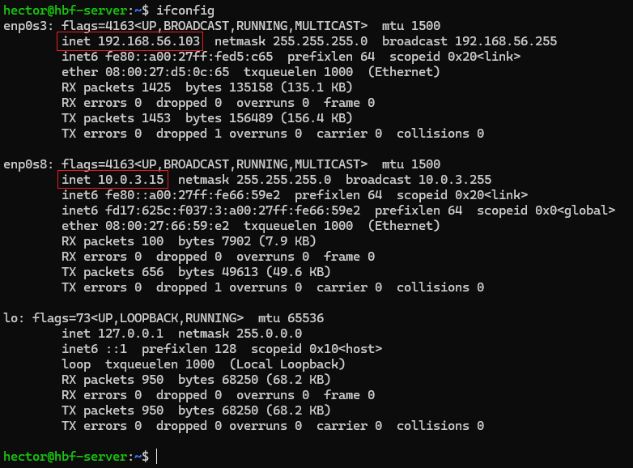

Luego, al guardar el archivo y salir, guardamos los cambios con `sudo netplan apply`. Pero como no es en este caso, solo ponemos `ip a`.

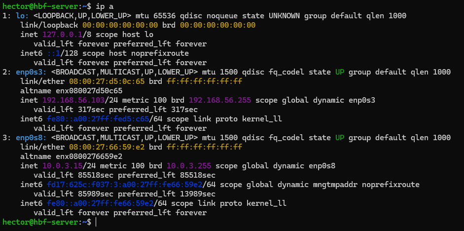

Pero como lo hemos hecho antes de crear la máquina no haría falta.  

Y en **Windows**, nuestro adaptador de VirtualBox, con el nombre de **Adaptador de Ethernet VirtualBox**, tenemos la IP **192.168.56.1**.

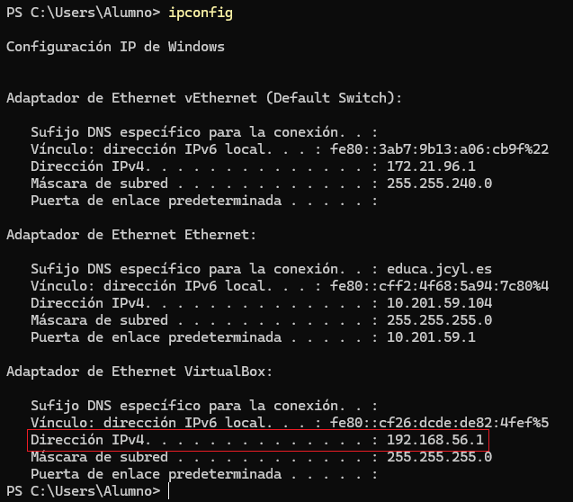

### Apartado 3
Para poder conectarnos con **SSH**, vamos a tener que poner el **usuario** y la **IP del adaptador de red de sólo anfitrión** de tal manera que sea `ssh "usuario"@"IP"`.  

Luego nos pedirá la contraseña, y si es todo correcto, ya estamos dentro de la terminal de la máquina de nuestro **Ubuntu Server** en nuestra máquina anfitriona.

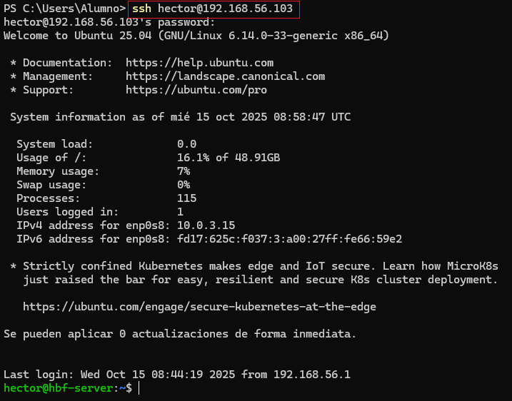

### Apartado 4
Para cambiar el hostname de nuestro equipo, es decir, si en mi máquina tengo al principio de la línea de comandos `hector@hbf-server:~$`, donde pone `hbf-server` se va a cambiar por el hostname que queramos. Donde pone `hector`, es el usuario con el que estamos conectados.  

Entonces, para cambiar el hostname, editamos el archivo con `sudo nano /etc/hostname`.

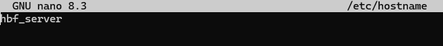

Para comprobarlo, ponemos el comando `sudo hostnamectl`.

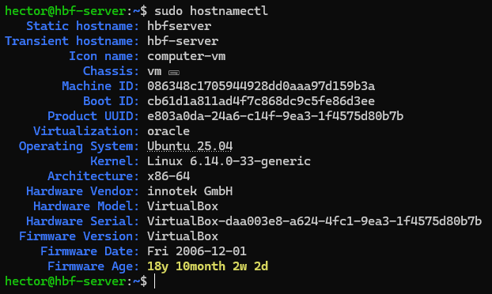

Como Linux no reconoce la barra baja **"_"** al ponerlo de hostname, simplemente la ignora y nos quedaría de hostname como `hbfserver`.

### Apartado 5
Para que resuelva localmente el nombre de nuestra máquina de **Ubuntu Server**, vamos a tener que ir al directorio en nuestra máquina anfitriona que es `C:\Windows\System32\drivers\etc` y editamos el archivo que es `host`. Ahí, pondremos la IP de la máquina y el hostname que tiene al final del documento como indica la siguiente captura.

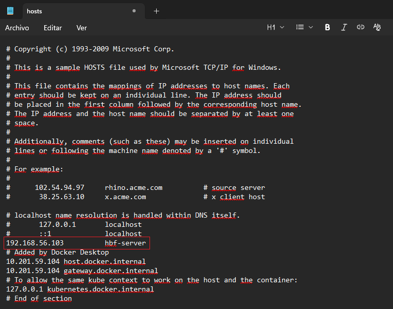

Ahora podemos entrar sin tener que poner la IP, ahora con poner el hostname, ya podemos acceder de manera remota. Puede existir que al guardarlo haya problemas de que el archivo es un archivo protegido y que al guardarlo, sea un archivo.txt. En mi caso lo he conseguido editar con el **Notepad++**.

## 📌 2. Creación del usuario y conexión SSH

### Apartado 1
Creamos el usuario con `sudo useradd -m -s /bin/bash "hbf_ssh"` y luego, le ponemos la contraseña con `sudo passwd hbf_ssh`.  

`-m` crea el directorio **/home** para los usuarios. `-s /bin/bash` añade **Bash** como línea de comandos.

### Apartado 2
Iniciamos sesión con el nuevo usuario que hemos creado, en este caso, `hbf_ssh`.

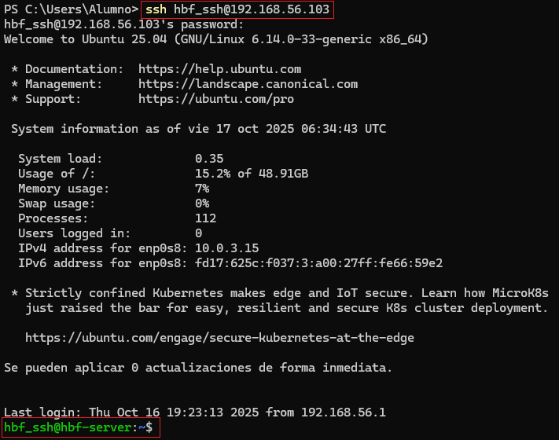

Si no llegase a funcionar, pondríamos los siguientes comandos.
- `sudo systemctl status ssh` → para comprobar el estado del servicio SSH.

- `sudo systemctl enable ssh` → para inicializar el servicio SSH cada vez que se encienda la máquina.

### Apartado 3
En nuestra máquina anfitriona, ponemos en la terminal el comando `ssh-keygen` y generará dos claves que se encuentran en el directorio `C:\Users\Alumno\.ssh`, una pública con la extensión **.pub** y otra privada. Tenemos que enviar la clave pública a nuestra máquina.

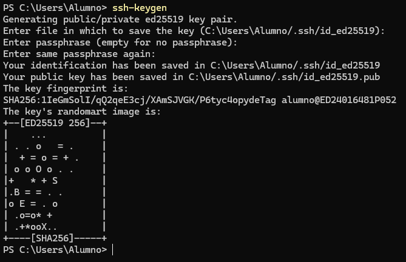

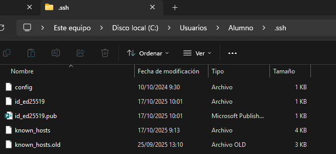

Los nombres de las claves son:
- **id_ed25519** → clave privada

- **id_ed25519.pub** → clave pública

Para enviar la clave, tenemos que poner el comando en nuestra terminal `scp .ssh\id_ed25519.pub hector@192.168.56.103:~`.

Luego ponemos `ls` para comprobar que se ha pasado correctamente y vemos que tenemos un directorio que se llama **.ssh**.

Ahora tenemos que añadir la clave hacia **authorized_keys** y para ello pondremos `cat id_ed25519.pub > .ssh\authorized_keys`. Si hubieran más claves, lo ideal sería en vez de poner el signo **">"**, es mejor **">>"** porque así no sobreescribimos y borramos las demás claves.

> 💡 Lo que se puede hacer es desactivar la contraseña cada vez que iniciemos sesión. Para ello tenemos que hacerlo desde `sudo nano /etc/ssh/sshd_config`. Tenemos que encontrar la línea que empieza comentada por **PasswordAunthentication**, quitamos el comentario y cambiamos el **"yes"** por **"no"**. Así, cada vez que vayamos a iniciar sesión de manera remota, no pedirá la contraseña porque va a revisar las claves públicas y privadas.

## 📌 3. Conexión transparente a Github
Entramos en GitHub, y en **Settings** de nuestra cuenta, vamos a **SSH and GPG keys**.

Como vamos a añadir una clave de SSH, en el apartado de **SSH keys** le damos al botón de **New SSH key**.

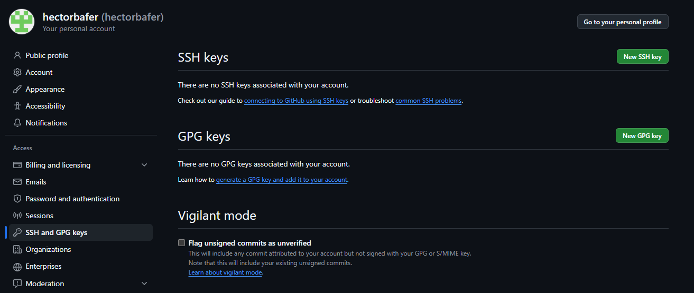

Ahora, en la clave pública, le damos a editar con el bloc de notas y copiamos todo el contenido que tiene y lo pegamos.

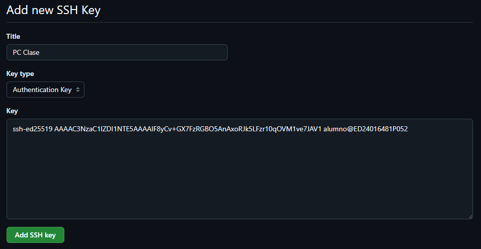

La añadimos y así se nos va a quedar cuando ya lo tengamos hecho.

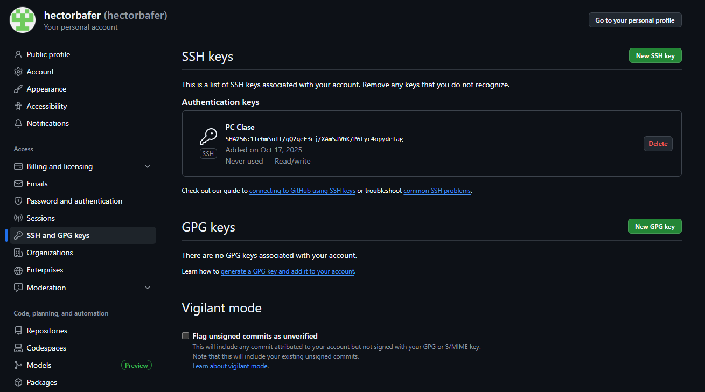

---
### [⬅️ Volver a UT02](../index.md)
---