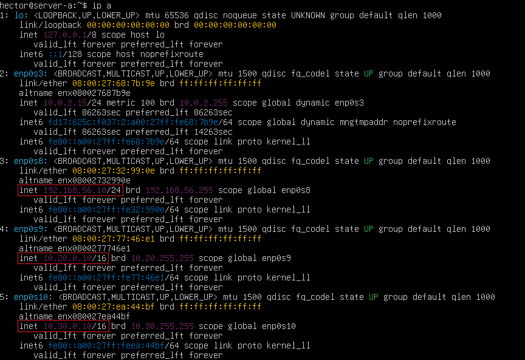

# 📄 PR0203: Conexión remota con SSH entre redes

## ✅ Objetivos
- Conectarse por **SSH** de manera transparente desde la máquina anfitriona hacia el **SERVER-A** con la cuenta de usuario creada.

- Conectarse por **SSH** de manera transparente desde la máquina **SERVER-A** hacia **SERVER-B** y **SERVER-C** con la cuenta de **sysadmin**.

## 📦 Creación de las máquinas
Creamos tres máquinas virtuales en **VirtualBox** de **Ubuntu Server 25.04** que serán las siguientes:

|                | SERVER-A   | SERVER-B   | SERVER-C   |
|:--------------:|:----------:|:----------:|:----------:|
| **Usuario**    | hector     | sysadmin   | sysadmin   |
| **Hostname**   | server-a   | server-b   | server-c   |

En la instalación, va a salir una ventana en si queremos instalar el servidor **SSH**, lo marcamos con **espacio** y después a **Hecho**.

Al **SERVER-A**, le ponemos **4** adaptadores de red, el primero en **NAT** y los demás en **Adaptador puente**.

Las otras dos máquinas vamos a ponerles el primer adaptador en **NAT** y el secundario en **Adaptador puente**.

## 🔧 Configurar red de las máquinas
Antes de todo, se pondrá en una tabla las direcciones IP y el adaptador de red que deberían de tener las máquinas.

| Adaptador    | SERVER-A           | SERVER-B      | SERVER-C      |
|:------------:|:------------------:|:-------------:|:-------------:|
| enp0s3       | NAT                | NAT           | NAT           |
| enp0s8       | 192.168.56.10/24   | 10.20.0.20/16 | 10.30.0.20/16 |
| enp0s9       | 10.20.0.10/16      | Ø             | Ø             |
| enp0s10      | 10.30.0.10/16      | Ø             | Ø             |

Cuando ya estemos dentro de SERVER-A, vamos a poner `ip a` para ver nuestros adaptadores de red y ver el nombre de adaptador para poder editarlos.

Vemos que solo el adaptador con el nombre **enp0s3** tiene IP y los demás no, esto es por lo que hicimos antes.

Para las demás máquinas, tendríamos lo mismo pero con solo 2 adaptadores.

Para editar la red para que los adaptadores tengan IP, tenemos que editar el archivo `sudo nano /etc/netplan/50-cloud-init.yaml`. Esto, hay que hacerlo en las tres máquinas.

En principio, tendríamos el archivo así:

Al editarlo ya con todas las IP en **SERVER-A**, debería de quedar así:

Guardamos el archivo y aplicamos los cambios con `sudo netplan apply`.

Ahora volvemos a poner `ip a` para ver que haya funcionado.

---
### [⬅️ Volver a UT02](../index.md)
---