# 📄 PR0203: Conexión remota con SSH entre redes

## ✅ Objetivos
- Conectarse por **SSH** de manera transparente desde la máquina anfitriona hacia el **SERVER-A** con la cuenta de usuario creada.

- Conectarse por **SSH** de manera transparente desde la máquina **SERVER-A** hacia **SERVER-B** y **SERVER-C** con la cuenta de **sysadmin**.

## 📦 Creación de las máquinas
Creamos tres máquinas virtuales en **VirtualBox** de **Ubuntu Server 25.04** que serán las siguientes:

|                | SERVER-A   | SERVER-B   | SERVER-C   |
|:--------------:|:----------:|:----------:|:----------:|
| **Usuario**    | hector     | sysadmin   | sysadmin   |
| **Hostname**   | server-a   | server-b   | server-c   |

En la instalación, va a salir una ventana en si queremos instalar el servidor **SSH**, lo marcamos con **espacio** y después a **Hecho**.

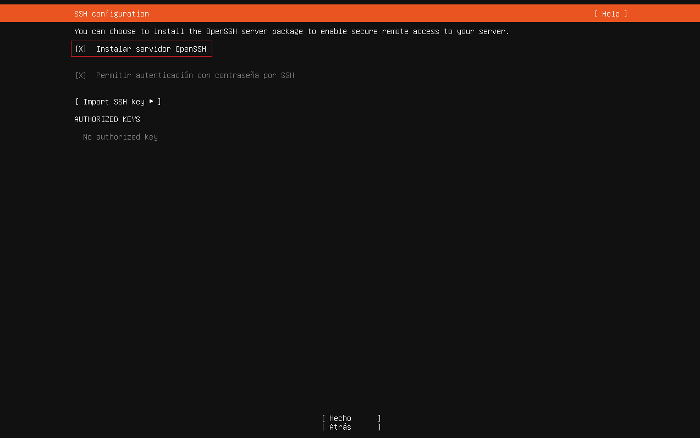

Al **SERVER-A**, le ponemos **4** adaptadores de red, el primero en **NAT** y los demás en **Adaptador solo anfitrión**.

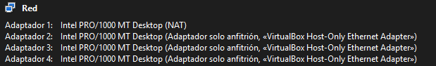

Las otras dos máquinas vamos a ponerles el primer adaptador en **NAT** y el secundario en **Adaptador solo anfitrión**.

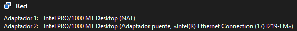

Antes de todo, se pondrá en una tabla las direcciones **IP** y el adaptador de red que deberían de tener las máquinas.

| Adaptador | SERVER-A         | SERVER-B      | SERVER-C      |
|:---------:|:----------------:|:-------------:|:-------------:|
| enp0s3    | NAT              | NAT           | NAT           |
| enp0s8    | 192.168.56.10/24 | 10.20.0.20/16 | 10.30.0.20/16 |
| enp0s9    | 10.20.0.10/16    | Ø             | Ø             |
| enp0s10   | 10.30.0.10/16    | Ø             | Ø             |

## 🔧 Configurar la red de **SERVER-A**

Dentro de SERVER-A, vamos a poner `ip a` para ver nuestros adaptadores de red y ver el nombre de adaptador para poder editarlos.

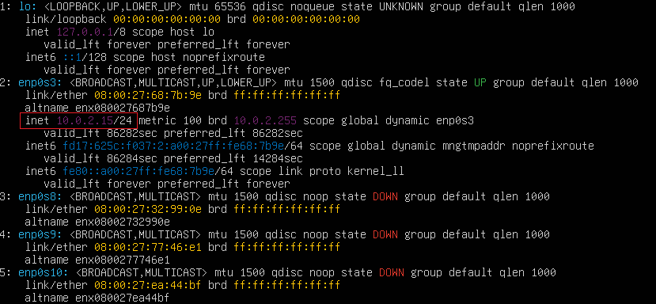

Vemos que solo el adaptador con el nombre **enp0s3** tiene IP y los demás no, esto es por lo que hicimos antes.

Para las demás máquinas, tendríamos lo mismo pero con solo 2 adaptadores.

Para editar la red para que los adaptadores tengan IP, tenemos que editar el archivo `sudo nano /etc/netplan/50-cloud-init.yaml`. Esto, hay que hacerlo en las tres máquinas.

En principio, tendríamos el archivo así:

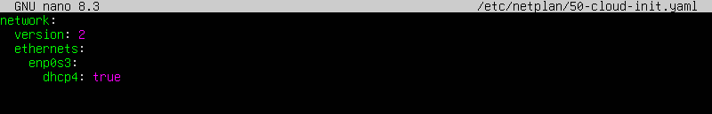

Para editarlo, tenemos que poner debajo del adaptador que ya tiene **IP**, por el que vamos a configurar, en este caso, será el **enp0s8** y debería de quedarnos de ésta manera:

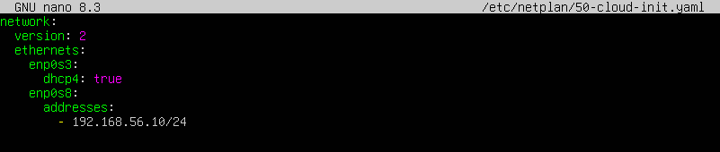

Ahora guardamos los cambios con `sudo netplan apply` y volvemos a poner `ip a`, veremos que el adaptador que hemos configurado ya tiene la IP de manera estática.

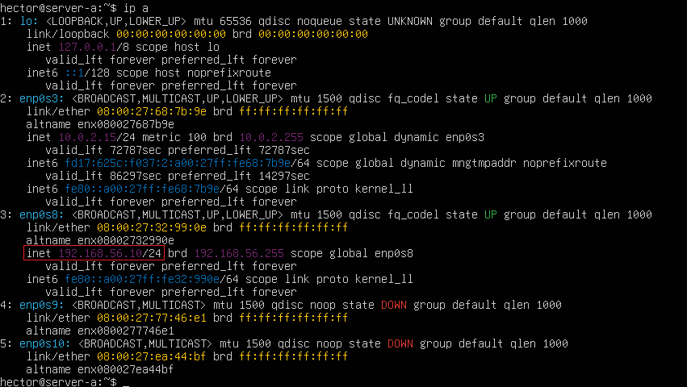

Para comprobar que todo haya funcionado, nos conectaremos por **SSH** desde nuestra máquina anfitriona al **SERVER-A**.

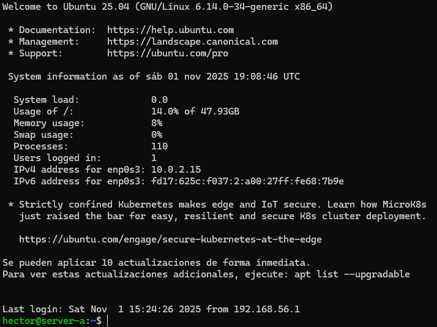

Ahora desde la terminal de nuestra máquina anfitriona configuramos las demás **IPs** para las demás máquinas. Volvemos a poner `sudo nano /etc/netplan/50-cloud-init.yaml` y pondremos las **IPs** que faltan en los adaptadores. Debería de quedar de ésta manera:

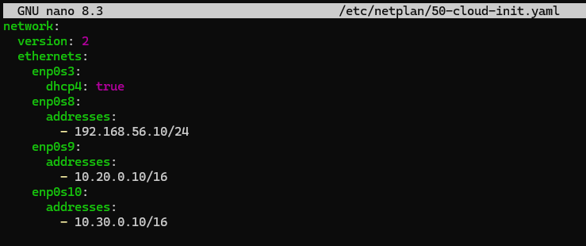

Volvemos a guardar los cambios con `sudo netplan apply` y ponemos `ip a` para ver los cambios guardados.

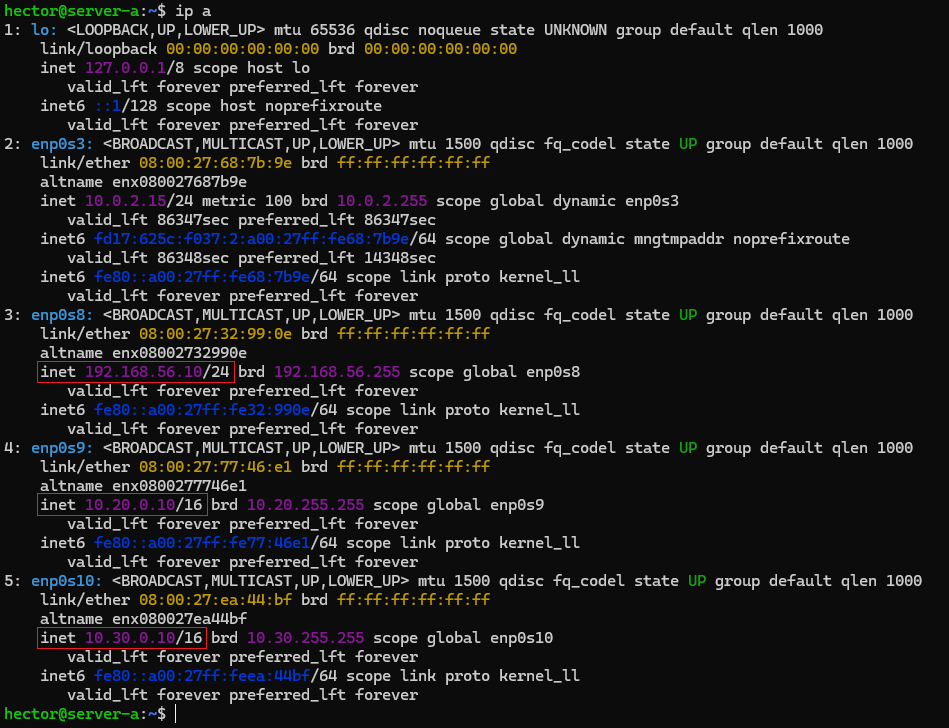

Ahora ya tenemos la red configurada para **SERVER-A**.

Ahora configuramos los adaptadores de las demás máquinas.

## 🔧 Configurar la red de **SERVER-B** y **SERVER-C**

Para configurar la red, va a ser lo mismo tanto para **SERVER-B** como **SERVER-C**. Como solamente tenemos un adaptador para configurar, vamos a tener que seguir los mismos pasos que hicimos en **SERVER-A**.

### 📦 SERVER-B

Ponemos `sudo nano /etc/netplan/50-cloud-init.yaml` y ponemos el adaptador y la **IP** de la tabla que viene más arriba anotada.

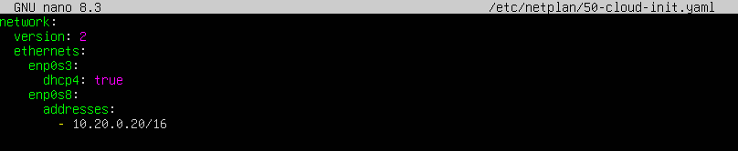

Guardamos con `sudo netplan apply` y comprobamos con `ip a`.

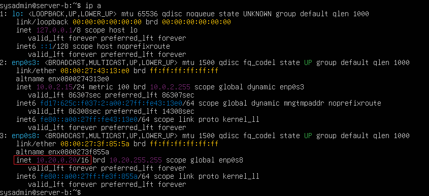

Ahora con la red configurada de **SERVER-B**, vamos a hacer `ping 10.20.0.10` que es el adaptador por el que está conectado **SERVER-A** a **SERVER-B** y comprobamos que haya conexión entre ellas.

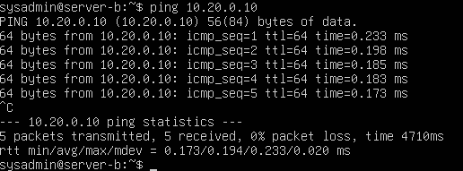

Si todo ha ido bien, vamos a intentar conectarnos por SSH desde la terminal anfitriona (no debería de dejar conectarnos). Al haber puesto `ssh sysadmin@10.20.0.20` y esperar un tiempo, sale este mensaje:

```
ssh: connect to host 10.20.0.20 port 22: Connection timed out
```

Eso significa que vamos por buen camino.

Ahora configuraremos **SERVER-C**.

### 📦 SERVER-C
Ponemos `sudo nano /etc/netplan/50-cloud-init.yaml` y ponemos el adaptador y la **IP** de la tabla que viene más arriba anotada.

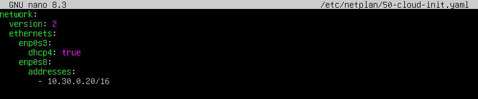

Guardamos con `sudo netplan apply` y comprobamos con `ip a`.

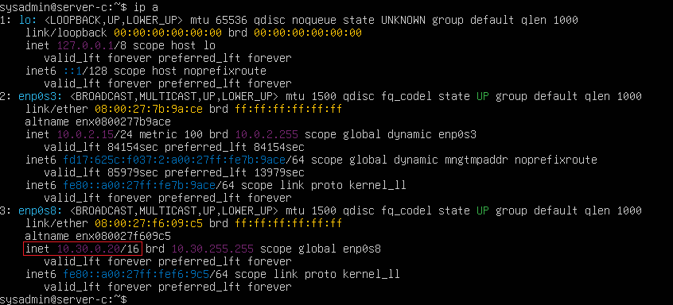

Ahora con la red configurada de **SERVER-C**, vamos a hacer `ping 10.30.0.10` que es el adaptador por el que está conectado **SERVER-A** a **SERVER-C** y comprobamos que haya conexión entre ellas.

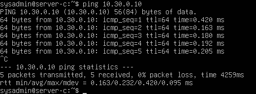

Si da `ping`, vamos a intentar conectarnos por **SSH** desde la terminal anfitriona (debería de pasar igual que en SERVER-B). Al haber puesto `ssh sysadmin@10.30.0.20` y esperar un tiempo, sale este mensaje:

```
ssh: connect to host 10.30.0.20 port 22: Connection timed out
```
Como igual que en **SERVER-B**, son buenas noticias y ya tenemos toda la red configurada.

## 🔑 Creación y configuración de claves **SSH**
Ahora crearemos las claves **SSH** para conectarnos sin la contraseña. Lo haremos conectados por **SSH** desde la terminal anfitriona a **SERVER-A, B y C** y lo configuraremos todo desde ahí.

### 🔗 Máquina anfitriona
Creamos la clave desde nuestra máquina anfitriona con `ssh-keygen`.

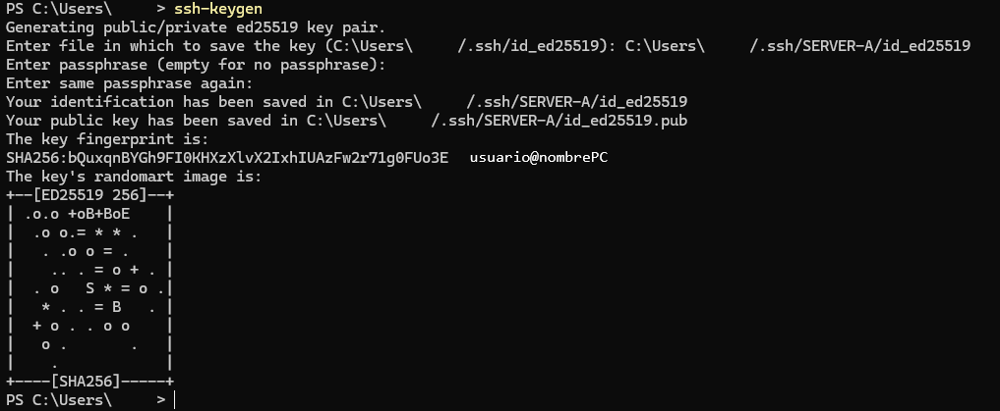

Ahora, usamos `scp` y copiamos la clave que acabamos de generar de ésta manera:
```
scp .\.ssh\id_ed25519.pub hector@192.168.56.10:~
```
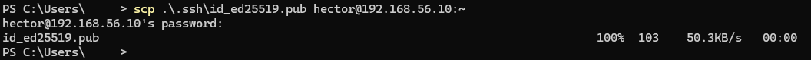

Nos conectamos por **SSH** a **SERVER-A** y movemos la clave pública que acabamos de pasar hacia el directorio `.ssh/authorized_keys`.

```
cat id_25519.pub >> .ssh/authorized_keys
```


Para comprobarlo, salimos y volvemos a entrar por **SSH**, y no nos pedirá la contraseña.

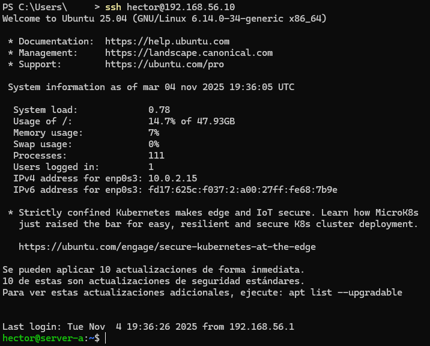

Podemos ver que todo ha ido bien.

### 🔗 SERVER-A
Ahora dentro de **SERVER-A**, generamos otra clave pero pondremos ésta vez `ssh-keygen -b 1024`. Y luego lo comprobamos con `ls`.

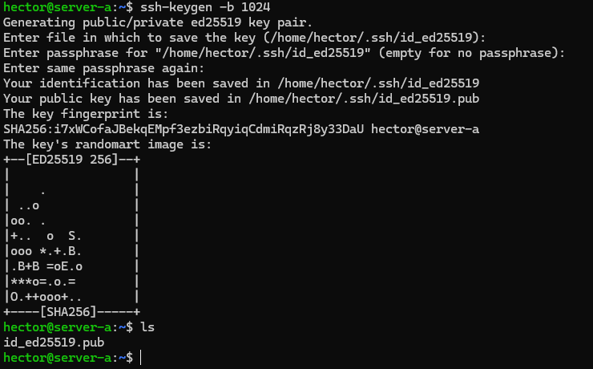

Genera dos claves al igual que en la anfitriona, una pública y la otra privada. La diferencia entre las dos, es que la pública tiene la extensión **.pub**.

Ahora copiamos la clave que hemos generado hacia **SERVER-B** y **SERVER-C**, igual que en los pasos anteriores.

```
scp .\.ssh\id_ed25519.pub sysadmin@10.20.0.20:~ (SERVER-B)
scp .\.ssh\id_ed25519.pub sysadmin@10.30.0.20:~ (SERVER-C)
```

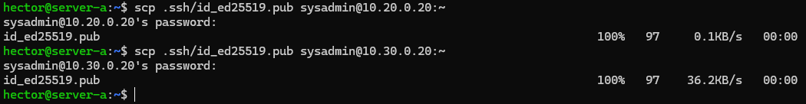

### 🔗 SERVER-B
Ahora entramos a **SERVER-B** desde **SERVER-A** y pasamos la clave a **authorized_keys**, igual que antes también.

```
cat id_25519.pub >> .ssh/authorized_keys
```


Salimos y volvemos a entrar por **SSH** y veremos que no nos pedirá la contraseña igual que cuando hicimos desde la anfitriona a SERVER-A.

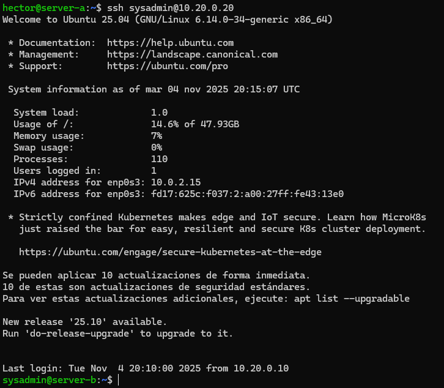

Al igual que antes, si no pide la contraseña, es que lo hemos hecho bien.

### 🔗 SERVER-C
Ahora entramos en **SERVER-C** y repetimos los mismos pasos.

```
cat id_25519.pub >> .ssh/authorized_keys
```


Salimos y volvemos a entrar por **SSH** y veremos que tampoco pide la contraseña.

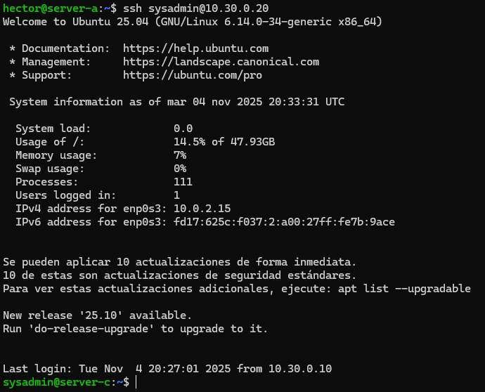

Y como antes, no pide la contraseña, todo correcto.

---
### [⬅️ Volver a UT02](../index.md)
---