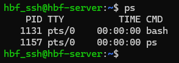
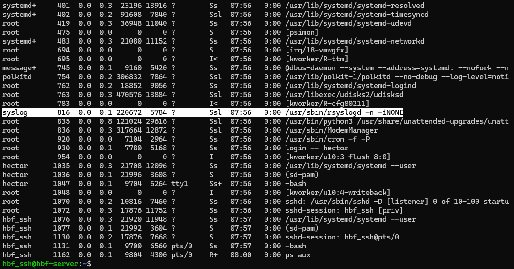
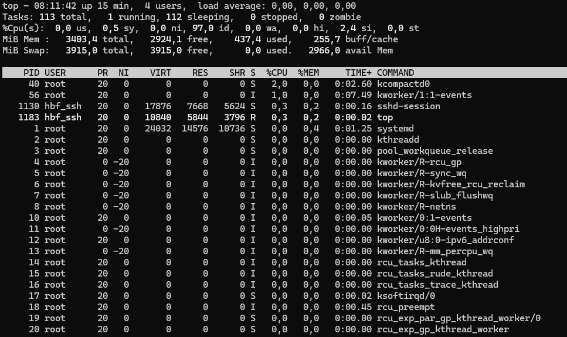

# 📄 PR0204: Gestión de procesos en Linux

## ✅ Objetivos
- Familiarizarse con los procesos en un sistema Linux, utilizando diversas herramientas y comandos para monitorizar, gestionar y manipular procesos.

## 📌 1. Exploración básica de procesos
- Como solo me aparecen dos procesos, apunto solo dos en vez de tres, que son: **1131** y **1157**.

- Pondré el PID de **syslog**  que es **816**.

- El comando `ps` muestra solo los procesos de la terminal del usuario actual, mientras que el comando `ps aux`, muestra todos los procesos en el sistema, incluyendo otros usuarios que no tienen una terminal asociada.

- Afecta en varias cosas.
  - **Acceso a recursos:** El proceso solo tiene permiso para leer y escribir en los archivos y directorios en los que el usuario pertenece o tiene acceso.
  
  - **Ejecución de acciones:** El proceso no puede realizar acciones privilegiadas que el usuario propietario no tenga.
  
  - **Seguridad del sistema:** Evita que procesos de usuarios no privilegiados causen daños en el sistema operativo o interfieran con otros usuarios.
  
  - **Gestión de procesos:** Permite a los usuarios gestionar sus propios procesos (por ejemplo, usando `ps -u "usuario"`) y a los administradores gestionar todos los procesos del sistema.
  
  - **Jerarquía de procesos:** Los procesos pueden crear nuevos procesos (hijos) que heredan algunas propiedades del proceso padre, pero también tendrán sus propias características en términos de permisos y recursos.

## 📌 2. Monitorización de procesos en tiempo real
- El proceso que consume más CPU, se encuentra en el primer lugar.
    - El PID es: **40**

## 📌 3. Detener y reanudar procesos

## 📌 4. Terminar procesos

## 📌 5. Prioridades de procesos

## 📌 6. Procesos en primer y segundo plano

## 📌 7. Uso de `pstree` y `htop`

## 📌 8. Matar procesos de manera forzosa

---
### [⬅️ Volver a UT02](../index.md)
---