# 📄 PR0204: Gestión de procesos en Linux

## ✅ Objetivos
- Familiarizarse con los procesos en un sistema Linux, utilizando diversas herramientas y comandos para monitorizar, gestionar y manipular procesos.

## 📌 1. Exploración básica de procesos

### Apartado 1
Como solo me aparecen dos procesos, apunto solo dos en vez de tres, que son **1666** y **1764**. Para que sean 3 habría que ejecutar uno más.

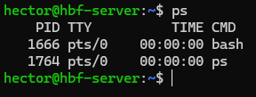

### Apartado 2
Ponemos `ps aux` y de toda la lista, pondré el PID de **syslog**  que es **816**.

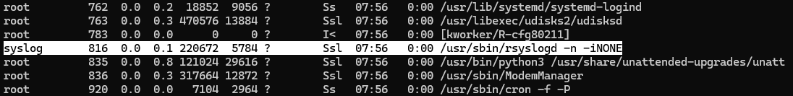

### Apartado 3

#### ¿Qué diferencia hay entre el comando `ps` y `ps aux`?
El comando `ps` muestra solo los procesos de la terminal del usuario que se esté usando en ese momento.  
Mientras que el comando `ps aux`, muestra todos los procesos en el sistema, incluyendo otros usuarios que no tienen una terminal asociada.

#### Cuando decimos que un proceso pertenece a un usuario, ¿qué implicaciones tiene? Es decir, ¿en qué afecta eso al proceso?
El usuario propietaro del proceso hace que ese usuario es el que ha ejecutado tal proceso. También, tiene los permisos del propietario, es decir, un proceso con otro usuario no puede eliminar directorios del directorio raíz por mucho que se intente ejecutar el proceso. Para ello, habría que usar el usuario `root`.

## 📌 2. Monitorización de procesos en tiempo real

### Apartado 1
El proceso que consume más **CPU**, se encuentra en el primer lugary cambia cada 5 segundos por defecto.

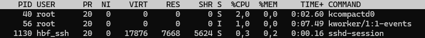

El PID, que es lo primero de la tabla, es **40**.

### Apartado 2
Cuando se haya ejecutado `top`, pulsamos la tecla **M** y se ordena tanto por el uso de la CPU como la memoria usada.

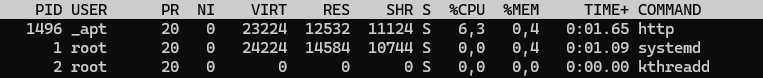

En este caso, el proceso que más consume es el **http**.

### Apartado 3

#### ¿Qué columnas de información se muestran en `top` y cuál es su significado?
- **PID:** Identificador del proceso.

- **USER:** Usuario propietario que ejecuta el proceso.

- **PR:** Prioridad con la que se ejecuta el proceso en el kernel.

- **NI:** Prioridad del proceso.

- **VIRT:** Cantidad de memoria virtual utilizada para este proceso.

- **RES:** Cantidad de memoria residente ocupada por este proceso.

- **SHR:** Cantidad de memoria compartida empleada para el proceso.

- **S:** Es el estado del proceso.

- **%CPU:** Porcentaje de CPU que ocupa el proceso.

- **%MEM:** Porcentaje de memoria que ocupa el proceso.

- **TIME+:** Tiempo que lleva ejecutandose el proceso.

- **COMMAND:** Nombre del proceso.

#### ¿Cómo puedes cambiar el intervalo de actualización de `top`?
Para cambiar el intervalo de actualización de `top`, ponemos el comando y después pulsamos la tacla **D**. Saldrá como un aviso con el texto **Change delay from** en el que muestra a cuantos segundos está y luego ponemos el número que queramos pero en segundos y después pulsamos **Enter**.

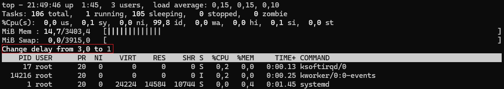

## 📌 3. Detener y reanudar procesos

### Apartado 1
Ponemos `sleep 300 &` y crearemos un proceso que durará **300** segundos.

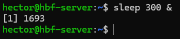

### Apartado 2
Si ponemos `jobs`, veremos todos los procesos en segundo plano, también aparece el proceso que hemos creado en el apartado anterior. Para que muestre el **ID**, ponemos el modificador `-l`, es decir, `jobs -l`. el proceso es: **1693**.

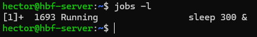

### Apartado 3
Para detener el proceso, ponemos `kill` y poniendo como modificador el número de la señal **SIGSTOP** que es el **20**. En este caso, pondríamos `kill -n 20 1963`.

### Apartado 4
Para reanudar el proceso, ponemos la señal **SIGCONT (18)** con `kill`. Quedaría `kill -n 18 1963`.

### Apartado 5

#### ¿Qué efecto tiene la señal SIGSTOP sobre un proceso?
Provoca que un proceso se detenga o se pause temporalmente, al igual que en **Ctrl+Z**. A diferencia de otras señales que un proceso puede ignorar o manejar de forma personalizada, `SIGSTOP` no se puede capturar, bloquear ni ignorar por el proceso. Esto significa que el sistema operativo la aplica de manera inmediata y forzosa. 

#### ¿Cómo puedo verificar si un proceso está detenido o en ejecución?
En los comandos tanto para `ps` como en `top`, hay una columna llamada **STATE** que es el estado del proceso y se representa con una letra que son las siguientes:
- **R:** *Running* (En ejecución).

- **S:** *Sleeping* (Durmiendo, inactivo pero ejecutable).

- **T:** *Stopped* (Detenido). Puede ser temporal, como Ctrl+Z.

- **Z:** *Zombie* (Zombi, ha terminado pero sigue en la tabla).

## 📌 4. Terminar procesos

### Apartado 1
Ponemos `sleep 600 &` y creamos un proceso que dura **600** segundos.

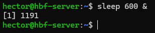

### Apartado 2
Ponemos `ps` y como tenemos muy pocos procesos en ejecución, podemos verlo fácilmente. El PID es **1191**.

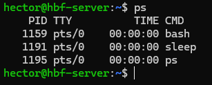

Si tenemos muchos procesos en ejecución, habrá que poner un comando para que busque concretamente el proceso, el comando es `ps aux | egrep "sleep 600"`.

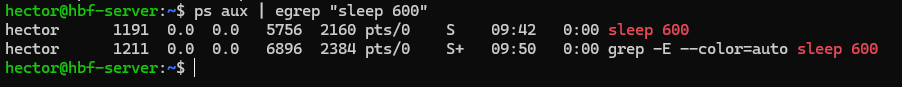

### Apartado 3
Para matar un proceso, se usa `kill` y la señal **SIGKILL** que su número es el **9**

### Apartado 4

#### ¿Qué diferencia hay entre las señales SIGTERM y SIGKILL?
Detiene temporalmente el proceso, como si hubiésemos pulsado Ctrl+Z mientras ejecutamos un proceso. Deja el proceso preparado para poder continuarlo en cualquier momento con la señal SIGCONT(18).

#### ¿Por qué es preferible utilizar SIGTERM antes que SIGKILL para terminar un proceso?
Es mejor usar `SIGTERM` en vez de `SIGKILL` para terminar un proceso porque `SIGTERM` sí que permite una terminación controlada, mientras que `SIGKILL` realiza una terminación forzada. 

## 📌 5. Prioridades de procesos

### Apartado 1
Ponemos `nice -n 10 sleep 300 &` para crear un proceso con prioridad baja.

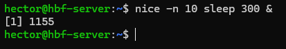

### Apartado 2
Ponemos `ps -l` para ver la prioridad del proceso. Nos fijamos en el valor de **NI**, en este caso, es el **10** aunque esté en el medio.

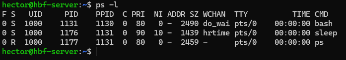

### Apartado 3
Para cambiar la prioridad del proceso, ponemos `renice` más el valor que queramos, que en este caso es el **5** y luego el **PID** del proceso. Sería `sudo renice "valor" "PID"` porque sin sudo sale acceso denegado.

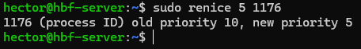

### Apartado 4

#### ¿Para qué sirve el comando nice?
El comando `nice` se usa para crear un proceso con prioridad baja.

#### ¿Qué rango de valores puede tomar la prioridad (nice value) de un proceso y qué significa cada extremo?
Los valores de prioridad comienzan en **-20** (máxima prioridad) y terminan en **19** (mínima prioridad).

#### ¿Qué ocurre si intentas cambiar la prioridad de un proceso que no te pertenece?
Daría error por falta de permisos. Si se quiere cambiar la prioridad, habría que hacerlo desde el usuario `root` o poniendo antes del comando `sudo`.

## 📌 6. Procesos en primer y segundo plano

### Apartado 1

### Apartado 2

### Apartado 3

### Apartado 4

## 📌 7. Uso de `pstree` y `htop`

### Apartado 1

### Apartado 2

### Apartado 3

### Apartado 4

## 📌 8. Matar procesos de manera forzosa

### Apartado 1

### Apartado 2

### Apartado 3

---
### [⬅️ Volver a UT02](../index.md)
---