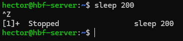
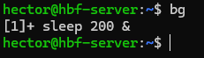
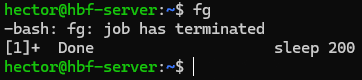
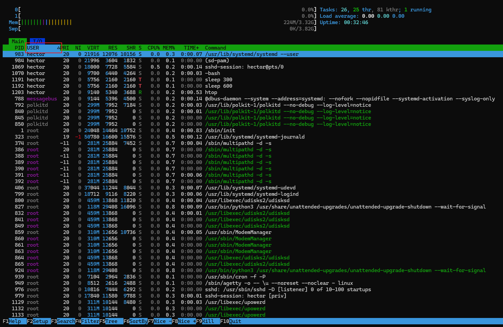
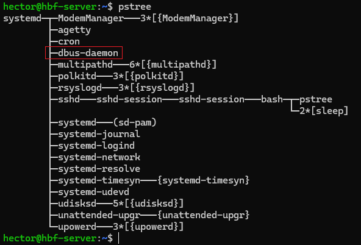
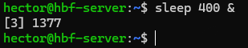
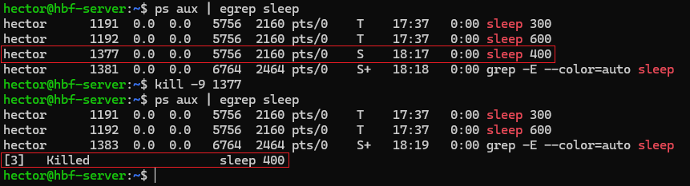

# 📄 PR0204: Gestión de procesos en Linux

## ✅ Objetivos
- Familiarizarse con los procesos en un sistema Linux, utilizando diversas herramientas y comandos para monitorizar, gestionar y manipular procesos.

## 📌 1. Exploración básica de procesos

### Apartado 1
Como solo me aparecen dos procesos, apunto solo dos en vez de tres, que son **1666** y **1764**. Para que sean 3 habría que ejecutar uno más.

### Apartado 2
Ponemos `ps aux` y de toda la lista, pondré el PID de **syslog**  que es **816**.

### Apartado 3

#### ¿Qué diferencia hay entre el comando `ps` y `ps aux`?
El comando `ps` muestra solo los procesos de la terminal del usuario que se esté usando en ese momento.  
Mientras que el comando `ps aux`, muestra todos los procesos en el sistema, incluyendo otros usuarios que no tienen una terminal asociada.

#### Cuando decimos que un proceso pertenece a un usuario, ¿qué implicaciones tiene? Es decir, ¿en qué afecta eso al proceso?
El usuario propietaro del proceso hace que ese usuario es el que ha ejecutado tal proceso.

También, tiene los permisos del propietario, es decir, un proceso con otro usuario no puede eliminar directorios del directorio raíz por mucho que se intente ejecutar el proceso. Para ello, habría que usar el usuario `root`.

## 📌 2. Monitorización de procesos en tiempo real

### Apartado 1
El proceso que consume más **CPU**, se encuentra en el primer lugar y cambia cada 5 segundos por defecto.

El PID, que es lo primero de la tabla, es **40**.

### Apartado 2
Cuando se haya ejecutado `top`, pulsamos la tecla **M** y se ordena tanto por el uso de la CPU como la memoria usada.

En este caso, el proceso que más consume es el **http**.

### Apartado 3

#### ¿Qué columnas de información se muestran en `top` y cuál es su significado?
- **PID:** Identificador único del proceso.

- **USER:** Nombre del usuario que ejecuta el proceso.

- **PR:** Prioridad del proceso del kernel.

- **NI:** Valor `nice`, que determina la prioridad del proceso (un valor más bajo significa mayor prioridad).

- **VIRT:** Memoria virtual total utilizada por el proceso.

- **RES:** Tamaño de la memoria física que está usando actualmente el proceso.

- **SHR:** Memoria compartida utilizada por el proceso.

- **S:** Estado del proceso.

- **%CPU:** Porcentaje de uso de la CPU que el proceso está consumiendo.

- **%MEM:** Porcentaje de memoria RAM física total utilizada por el proceso.

- **TIME+:** Tiempo total acumulado que el proceso ha estado ejecutándose.

- **COMMAND:** Nombre del comando que inició el proceso.

#### ¿Cómo puedes cambiar el intervalo de actualización de `top`?
Para cambiar el intervalo de actualización de `top`, ponemos el comando y después pulsamos la tacla **D**. Saldrá como un aviso con el texto **Change delay from** en el que muestra a cuantos segundos está y luego ponemos el número que queramos pero en segundos y después pulsamos **Enter**.

## 📌 3. Detener y reanudar procesos

### Apartado 1
Ponemos `sleep 300 &` y crearemos un proceso que durará **300** segundos.

### Apartado 2
Si ponemos `jobs`, veremos todos los procesos en segundo plano, también aparece el proceso que hemos creado en el apartado anterior. Para que muestre el **ID**, ponemos el modificador `-l`, es decir, `jobs -l`. el proceso es: **1693**.

### Apartado 3
Para detener el proceso, ponemos `kill` y poniendo como modificador el número de la señal **SIGSTOP** que es el **20**. En este caso, pondríamos `kill -n 20 1963`.

### Apartado 4
Para reanudar el proceso, ponemos la señal **SIGCONT** que su número es el **18** con `kill`. Quedaría `kill -n 18 1963`.

### Apartado 5

#### ¿Qué efecto tiene la señal SIGSTOP sobre un proceso?
Provoca que un proceso se detenga o se pause temporalmente, al igual que en **Ctrl+Z**. A diferencia de otras señales que un proceso puede ignorar o manejar de forma personalizada, `SIGSTOP` no se puede capturar, bloquear ni ignorar por el proceso. Esto significa que el sistema operativo la aplica de manera inmediata y forzosa. 

#### ¿Cómo puedo verificar si un proceso está detenido o en ejecución?
En los comandos tanto para `ps` como en `top`, hay una columna llamada **STATE** que es el estado del proceso y se representa con una letra que son las siguientes:
- **R:** *Running* (En ejecución).

- **S:** *Sleeping* (Durmiendo, inactivo pero ejecutable).

- **T:** *Stopped* (Detenido). Puede ser temporal, como Ctrl+Z.

- **Z:** *Zombie* (Zombi, ha terminado pero sigue en la tabla).

## 📌 4. Terminar procesos

### Apartado 1
Ponemos `sleep 600 &` y creamos un proceso que dura **600** segundos.

### Apartado 2
Ponemos `ps` y como tenemos muy pocos procesos en ejecución, podemos verlo fácilmente. El PID es **1191**.

Si tenemos muchos procesos en ejecución, habrá que poner un comando para que busque concretamente el proceso, el comando es `ps aux | egrep "sleep 600"`.

### Apartado 3
Para matar un proceso, se usa `kill` y la señal **SIGKILL** que su número es el **9** más el PID del proceso. El comando final sería `kill -9 1191`.

### Apartado 4

#### ¿Qué diferencia hay entre las señales SIGTERM y SIGKILL?
Detiene temporalmente el proceso, como si hubiésemos pulsado **Ctrl+Z** mientras ejecutamos un proceso. Deja el proceso preparado para poder continuarlo en cualquier momento con la señal **SIGCONT(18)**.

#### ¿Por qué es preferible utilizar SIGTERM antes que SIGKILL para terminar un proceso?
Es mejor usar `SIGTERM` en vez de `SIGKILL` para terminar un proceso porque `SIGTERM` sí que permite una terminación controlada, mientras que `SIGKILL` realiza una terminación forzada. 

## 📌 5. Prioridades de procesos

### Apartado 1
Ponemos `nice -n 10 sleep 300 &` para crear un proceso con prioridad baja.

### Apartado 2
Ponemos `ps -l` para ver la prioridad del proceso. Nos fijamos en el valor de **NI**, en este caso, es el **10** aunque esté en el medio.

### Apartado 3
Para cambiar la prioridad del proceso, ponemos `renice` más el valor que queramos, que en este caso es el **5** y luego el **PID** del proceso. Sería `sudo renice "valor" "PID"` porque sin sudo sale acceso denegado.

### Apartado 4

#### ¿Para qué sirve el comando `nice`?
El comando `nice` se usa para crear un proceso con prioridad baja.

#### ¿Qué rango de valores puede tomar la prioridad (nice value) de un proceso y qué significa cada extremo?
Los valores de prioridad comienzan en **-20** (máxima prioridad) y terminan en **19** (mínima prioridad).

#### ¿Qué ocurre si intentas cambiar la prioridad de un proceso que no te pertenece?
Daría error por falta de permisos. Si se quiere cambiar la prioridad, habría que hacerlo desde el usuario `root` o poniendo antes del comando `sudo`.

## 📌 6. Procesos en primer y segundo plano

### Apartado 1
Ponemos `sleep 200` y lo cancelamos con **Ctrl+Z**.

### Apartado 2
Ponemos `bg`, que significa *background*. Este comando mueve aquellos procesos que han sido detenidos a que se ejecuten en segundo plano. Al usarse, veremos que aparece el proceso que hemos cancelado en el ejercicio anterior.

### Apartado 3
Ponemos `fg`, que significa *foreground*. Este comando mueve todos aquellos procesos que están en segundo plano a primer plano.

### Apartado 4

#### ¿Qué significa que un proceso está en segundo plano?
Significa que el proceso se sigue ejecutando sin la necesidad de que el usuario interfiera.

#### ¿Qué comando utilizarías para mover un proceso detenido a segundo plano?
Antes tenemos que saber que se ha detenido con **Ctrl+Z**. Luego, lo movemos a segundo plano con `bg`.

#### ¿Cómo puedes traer un proceso de segundo plano a primer plano si tienes múltiples trabajos en segundo plano?
El comando para mover los procesos de segundo a primer plano es `fg`, entonces, para mover un proceso concreto a primer plano, tenemos que poner el comando `jobs` para saber cuántos procesos tenemos parados.

Podemos ver el identificador del proceso en primer lugar y tenerlo más fácil a la hora de manipularse. Ahora, ponemos el comando `jobs` más el modificador `%N`, donde **N** es el número del proceso. Un ejemplo puede ser este:

## 📌 7. Uso de `pstree` y `htop`

### Apartado 1
Ponemos `htop`. Si vemos que no funciona el comando, podemos instalarlo con `sudo apt install htop`. En mi caso ya venía instalado.

### Apartado 2
Al poner `htop`, vemos una tabla en la que podemos interactuar con ella.

Al hacer clic en una columna (fila verde de arriba), se va a filtrar por ello, aparece el bloque en color azul y a la derecha una flecha. Por ejemplo:

### Apartado 3
Al poner `pstree`, podemos ver en forma de árbol y estructurado con ramificaciones de que los procesos dependen de otros procesos.

Por poner un ejemplo, el proceso **dbus**, es el proceso padre, mientras que **daemon**, es el proceso hijo. 

### Apartado 4

#### ¿Qué ventaja tiene utilizar `pstree` frente a `ps` para visualizar procesos?
La ventaja principal es que se puede ver de manera directa y visual los procesos que dependen de otros. Así, si se van a tocar procesos, podremos sabes cuáles no deberíamos tocar para evitar que los procesos hijos se detengan.

#### ¿Cómo puedes filtrar procesos por usuario en htop?
Con `htop`, al ser interactivo, clicamos en una columna de arriba, en este caso en **USER** y podemos ver los usuarios en primer lugar y ordenados alfabéticamente.

## 📌 8. Matar procesos de manera forzosa

### Apartado 1
Creamos un proceso que dure 400 segundos con `sleep 400 &`.

### Apartado 2
Para matar un proceso, usamos `kill -9`, tenemos que ver el **PID** del proceso para poder ponerlo al final del propio comando. Para ello, pondremos `ps aux | egrep sleep`.

Para comprobar que se haya eliminado, volvemos a poner `ps aux | egrep sleep` y aparecerá el proceso como **Killed**.

### Apartado 3

#### ¿En qué casos sería necesario usar `kill -9` en lugar de `kill` sin opciones?
Se debería usar `kill -9` en lugar de `kill` sin modificadores cuando un proceso se ha quedado atascado, no responde y no puede terminarse de forma normal. El comando `kill` por defecto, envía una señal a `SIGTERM` con el número **15**, que hace si el proceso se puede terminar de manera segura.

#### ¿Qué riesgos implica usar SIGKILL para terminar un proceso?
Utilizar la señal `SIGKILL (9)` para terminar un proceso puede ser eficaz, pero fuerza la terminación inmediata sin dar tiempo al proceso para que realice una salida limpia.

---
### [⬅️ Volver a UT02](../index.md)
---