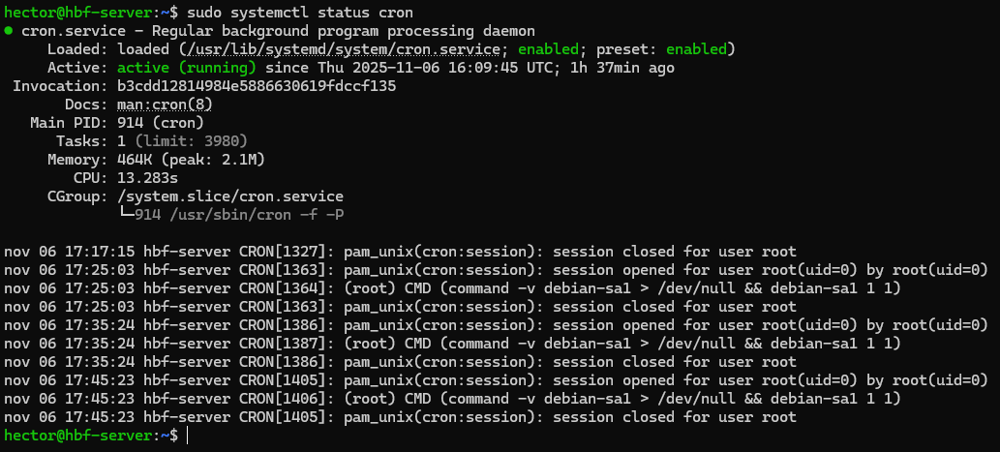
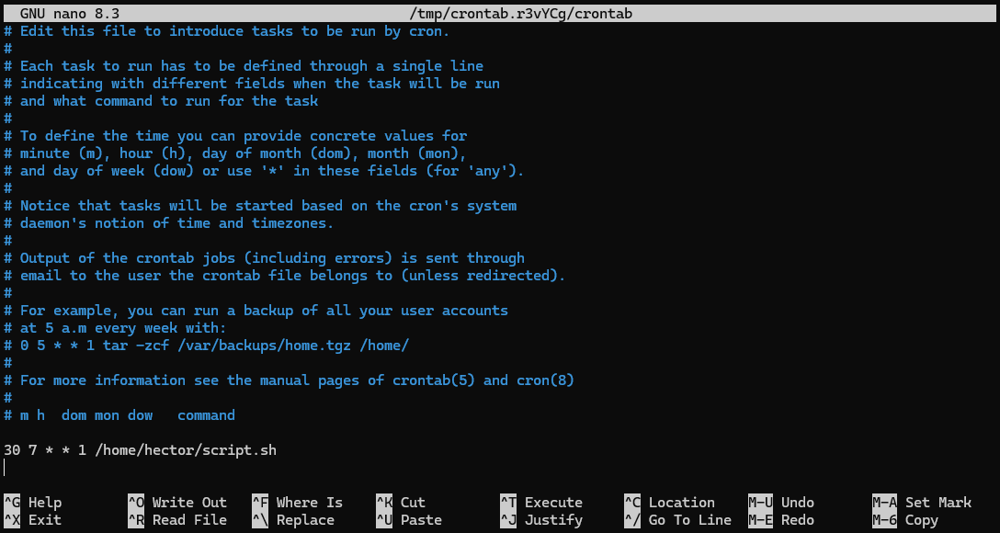
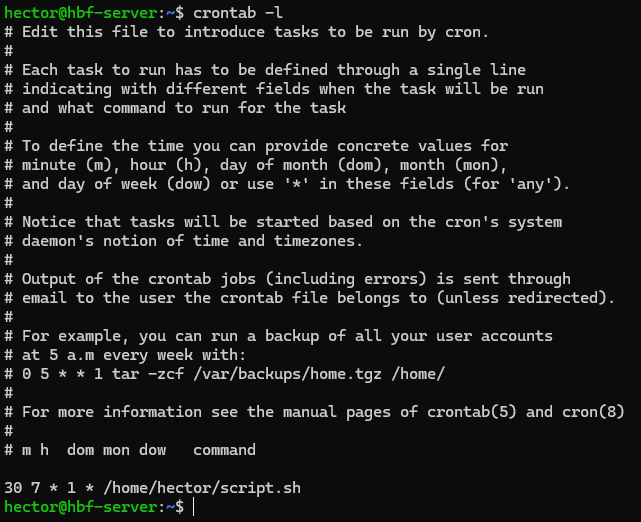
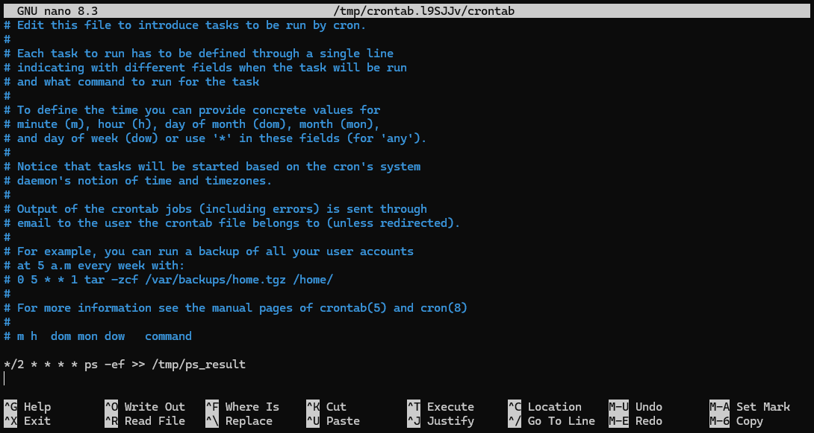
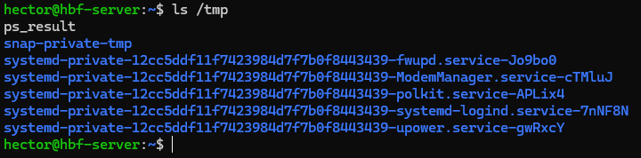
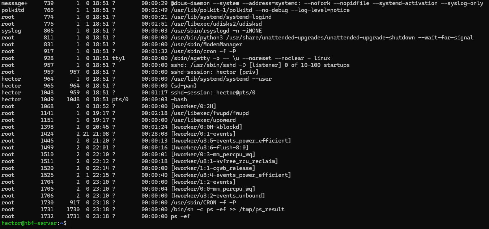
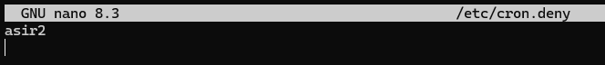
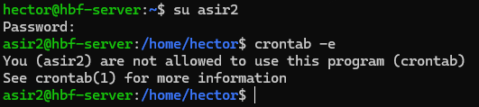
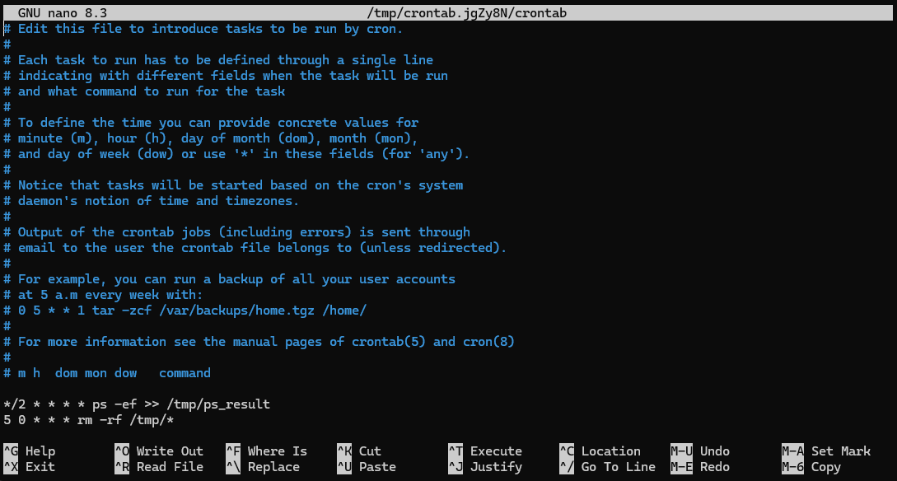

# 📄 PR0205: Programación de tareas con `cron`

## ✅ Objetivos
- Explorar las diferentes posibilidades de `cron` para crear tareas programadas en un entorno Linux.

## 🔎 Recursos
- [Crontab.guru](https://crontab.guru/)

### 📌 1. ¿Qué orden pondrías en crontab en los siguientes casos?
Para programar tareas con `cron`, tenemos que editar un archivo que se ejecuta con `crontab -e`, escogemos la opción de con qué editor queremos editar el archivo y ahí podemos programar las tareas.

- La tarea se ejecuta cada hora  
```
0 * * * * "comando"
```

- La tarea se ejecuta los domingos cada 3 horas  
```
0 */3 * * 0 "comando"
```

- La tarea se ejecuta a las 12 de la mañana los días pares del mes.  
```
0 12 2/2 * * "comando"
```

- La tarea se ejecuta el primer día de cada mes a las 8 de la mañana y a las 8 de la tarde  
```
0 8,20 1 * * "comando"
```

- La tarea se ejecuta cada media hora de lunes a viernes  
```
*/30 * * * 1-5 "comando"
```

- La tarea se ejecuta cada cuarto de hora, entre las 3 y las 8, de lunes a viernes, durante todo el mes de agosto  
```
*/15 3-8 * 8 1-5 "comando"
```

- La tarea se ejecuta cada 90 minutos

No se puede ejecutar en una sola línea porque supera los 59 minutos límites. Para ello habría que hacerlo en dos líneas diferentes para ejecutarlo. Serían las siguientes:
```
0 */3 * * * comando
*/30 1-23/3 * * * comando
```

### 📌 2. ¿Cómo compruebas si el servicio cron se está ejecutando?
Ponemos `sudo systemctl status cron`. Si en **Active:** se encuentra de color verde, se está ejecutando, pero si está en rojo, eso significa que el servicio está parado.



### 📌 3. ¿Cuál es el efecto de la siguiente línea crontab?
```
*/15 1,2,3 * * * who > /tmp/test
```

Esta programación indica que se va a ejecutar a las 1:15, 2:15 y 3:15 de todos los días, todos los días del mes y todos los días de la semana el comando `who` que muestra cuáles usuarios están conectados en ese momento en el sistema y esa muestra, se redirecciona a la ruta `/tmp/test` y como está con el signo **>**, sobreescribe lo anteriormente escrito.

### 📌 4. Indica la ruta del fichero crontab del sistema
La ruta del fichero de crontab es `/etc/crontab`.

Existe también otro fichero para cada usuario que se encuentra en `/var/spool/cron/crontabs/`. Pero lo recomendable es editar desde `crontab -e`.

### 📌 5. ¿Qué ficheros controlan los usuarios que pueden utilizar el `crontab`?
Los archivos que controlan el acceso son:
- `/etc/cron.allow`: Sirve para controlar a los usuarios autorizados a usar cron.

- `/etc/cron.deny`: Sirve para controlar a los usuarios no autorizados a usar cron.

No hace falta tener los dos archivos a la vez. Si ya tenemos solamente el archivo **cron.allow** por defecto, de manera automática aquel usuario que no esté en esa lista, no tiene permitido editar. Si tenemos solo el archivo **cron.deny** pasaría lo mismo pero del revés.

### 📌 6. Excepcionalmente se debe iniciar una tarea llamada `script.sh` todos los lunes a las 07:30h antes de entrar en clase ¿Cómo lo harías?
Ponemos `crontab -e` para abrir el menú de escoger el editor, en mi caso, escogo nano **(1)** porque es más sencillo y rápido.

Hacemos la programación que indica el ejercicio que es el siguiente junto a la ruta donde queramos que se ejecute y el archivo, que en este caso es **script.sh**:

```
30 7 * * 1 /home/hector/script.sh
```



> 💬 Las líneas que empiezan con **#**, son líneas comentadas y esas no se van a ejecutar.  
No se ejecutaría nada porque script.sh está vacío.  
Tampoco podemos verlo con `ls` porque no tenemos el archivo creado.


### 📌 7. Se ha cancelado la tarea. ¿Cómo listar y luego, suprimir la tarea?
Para listar las tareas ponemos `crontab -l`. Esto nos muestra las tareas que están activas en ese momento.



Para borrar las tareas, podemos editar el archivo con `crontab -e` o directamente con `crontab -r`, pero este último borra **TODAS** las tareas.

### 📌 8. Ejecuta el comando `ps -ef` para el usuario **root** cada 2 minutos y redirecciona el resultado a `/tmp/ps_result` sin sobrescribir los antiguos.
Para crear una tarea programada para **root**, sería ejecutar `crontab -e` pero con `sudo` al principio, es decir, `sudo crontab -e`.

La línea que se añade para la tarea es:

```
*/2 * * * * ps -ef >> /tmp/ps_result
```



### 📌 9. Verifica la lista de tareas en `crontab`
Para ver la lista de tareas, ponemos `crontab -l`, pero como va a ser para **root**, pondremos `sudo crontab -l`.

Hay otra manera, que es por filtrado de usuario y para ello ponemos `crontab -l root` para **root** y `crontab -l "usuario"` para el usuario que queramos. Al poner el modificador `-u`, pedirá privilegios, con lo que pondremos `sudo` al principio del comando.

### 📌 10. Espera unos minutos y comprueba el resultado en `/tmp`
Si ponemos `ls /tmp` vemos que el fichero ps_result existe y con diferente color.



Ahora ponemos `cat /tmp/ps_result` y podemos ver lo siguiente:



### 📌 11. Crea el usuario asir2 y prohíbele utilizar el crontab
Creamos el usuario **asir2** con `sudo adduser asir2`.

Vamos a editar el archivo **cron.deny** con `sudo nano /etc/cron.deny` y ahí añadimos al usuario **asir2**.



### 📌 12. Verifica que el usuario **asir2** realmente no puede utilizar `crontab`.
Para verificar que **asir2** no puede usar `crontab`, iniciamos sesion con `su asir2` y ponemos `crontab -e`.



### 📌 13. Programa `crontab` para que cada día a las 0:05 se eliminen todos los ficheros que se encuentran en el directorio `/tmp`
Para poner la tarea, pondremos la siguiente línea y la ponemos en `crontab -e`.

```
5 0 * * * rm -rf /tmp/*
```

Como `tmp` requiere de privilegios, lo haremos con `sudo crontab -e`.



### 📌 14. Programa una tarea en el sistema que se lance de lunes a viernes a las 9 de la mañana durante los meses de verano (julio, agosto y septiembre) que escriba en un fichero la hora actual (comando `date`) seguido del listado de usuarios que hay conectados en ese momento en el sistema (comando `who`)
La tarea que pide el ejercicio y que tenga algo de sentido es ésta:
```
0 9 * 7-9 1-5 date +"%H:%M:%S"; who
```

Para ver la información que se le pide, habría que ponerle a mayores un redireccionamiento hacia un archivo que queramos. Por ejemplo, **UsuariosConectados**.

Al final quedaría de ésta manera:
```
0 9 * 7-9 1-5 date +"%H:%M:%S"; who >> /home/hector/UsuariosConectados
```

### 📌 15. El servicio `cron` se ayuda de una serie de ficheros y directorios que se encuentran en el directorio `/etc`. Explica la función de cada uno de los siguientes ficheros/directorios:
- **cron.d:** Contiene los archivos de configuración adicionales de las tareas de `cron`.

- **cron.allow:** Permite utilizar crontab a los usuarios que pertenezcan a la lista.

- **cron.deny:** No permite utilizar crontab a los usuarios que pertenezcan a la lista.

- **cron.dialy:** Contiene los scripts que se ejecutan una vez al día de manera automática.

- **cron.hourly:** Contiene los scripts que se ejecutan una vez cada hora de manera automática.

- **cron.monthy:** Contiene los scripts que se ejecutan una vez al mes de manera automática, normalmente el primer día del mes.

---
### [⬅️ Volver a UT02](../index.md)
---