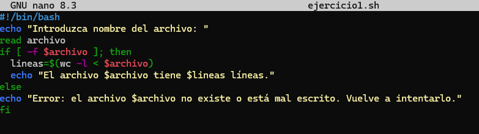
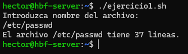
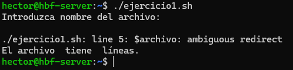
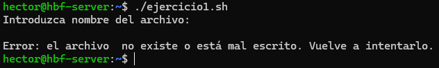

# 📄 PR0301: Condicional `if`

## 📌 Ejercicio 1: Contar líneas de un archivo
Creamos un archivo con `touch` y el nombre del archivo, que en este caso lo llamaré **ejercicio1.sh**. Luego le daremos los permisos totales con `sudo chmod 777 ejercicio1.sh` para que se ejecute correctamente.

Para ver que funciona, pondremos `./ejercicio1.sh` o el archivo que corresponda. Podemos poner directorios y el archivo dentro del directorio.

Pero si no ponemos nada, saldrá con una línea del script. Esto es porque las variables que están en rojo habría que meterlas entre comillas dobles **("")** o simples **('')** para que no saliese la línea e incluso que no lo detecte como una entrada de línea.

Ejemplo sin comillas en las variables:

Ejemplo con las comillas en las variables:

## 📌 Ejercicio 2: Verificación de archivo
Creamos otro archivo, le pondremos de nombre **ejercicio2.sh** y le damos los permisos.

## 📌 Ejercicio 3: Comparación de dos números

## 📌 Ejercicio 4: Validación de contraseña

## 📌 Ejercicio 5: Comprobación de directorio

## 📌 Ejercicio 6: Verificar si el usuario es `root`

## 📌 Ejercicio 7: Calificación de un examen

## 📌 Ejercicio 8: Comprobación del espacio en disco

## 📌 Ejercicio 9: Menú de opciones

## 📌 Ejercicio 10: Evaluación de edad

---
### [⬅️ Volver a UT03](../index.md)
---