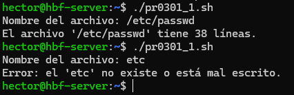
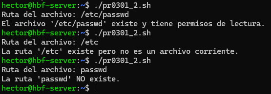
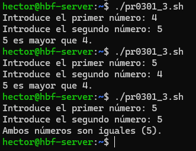
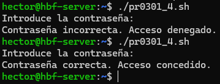
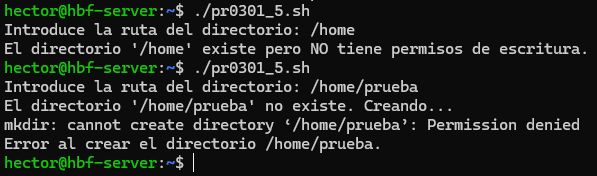
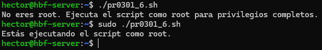
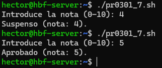
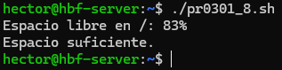
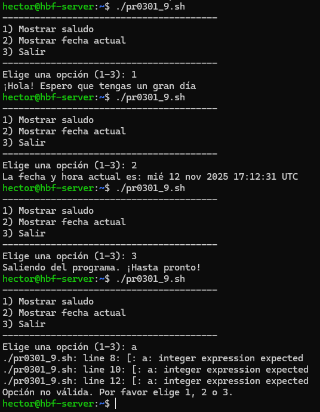
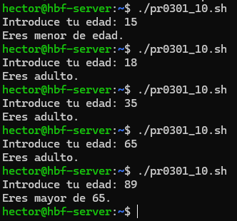

# 📄 PR0301: Condicional `if`

## 📌 Ejercicio 1: Contar líneas de un archivo
Creamos un script con el nombre **pr0301_1.sh** con `touch "archivo"` y le ponemos los permisos con `sudo chmod +x "archivo"` para ejecutarlo sin problemas. Los demás scripts tendrán la misma estructura del nombre pero con el número del ejercicio para diferenciarlo de los demás y no equivocarnos al editar o ejecutar los demás scripts.

- Script:
```
#!/bin/bash
read -p "Nombre del archivo: " archivo
if [ -f "$archivo" ]; then
  lineas=$(wc -l < "$archivo")
  echo "El archivo '$archivo' tiene $lineas líneas."
else
  echo "Error: el '$archivo' no existe o está mal escrito."
  exit 1
fi
```

- Resultado:



## 📌 Ejercicio 2: Verificación de archivo
Creamos un script con el nombre **pr0301_2.sh**.

- Script:
```
#!/bin/bash
read -p "Ruta del archivo: " ruta
if [ -e "$ruta" ]; then
  if [ -f "$ruta" ]; then
    if [ -r "$ruta" ]; then
      echo "El archivo '$ruta' existe y tiene permisos de lectura."
    else
      echo "El archivo '$ruta' existe pero NO tiene permisos de lectura."
    fi
  else
    echo "La ruta '$ruta' existe pero no es un archivo corriente."
  fi
else
  echo "La ruta '$ruta' NO existe."
fi
```

- Resultado:



## 📌 Ejercicio 3: Comparación de dos números
Creamos un script con el nombre **pr0301_3.sh**.

- Script:
```

```

- Resultado:



## 📌 Ejercicio 4: Validación de contraseña
Creamos un script con el nombre **pr0301_4.sh**.

- Script:
```

```

- Resultado:



## 📌 Ejercicio 5: Comprobación de directorio
Creamos un script con el nombre **pr0301_5.sh**.

- Script:
```

```

- Resultado:



## 📌 Ejercicio 6: Verificar si el usuario es `root`
Creamos un script con el nombre **pr0301_6.sh**.

- Script:
```

```

- Resultado:



## 📌 Ejercicio 7: Calificación de un examen
Creamos un script con el nombre **pr0301_7.sh**.

- Script:
```

```

- Resultado:



## 📌 Ejercicio 8: Comprobación del espacio en disco
Creamos un script con el nombre **pr0301_8.sh**.

- Script:
```

```

- Resultado:



## 📌 Ejercicio 9: Menú de opciones
Creamos un script con el nombre **pr0301_9.sh**.

- Script:
```

```

- Resultado:



## 📌 Ejercicio 10: Evaluación de edad
Creamos un script con el nombre **pr0301_10.sh**.

- Script:
```

```

- Resultado:



---
### [⬅️ Volver a UT03](../index.md)
---