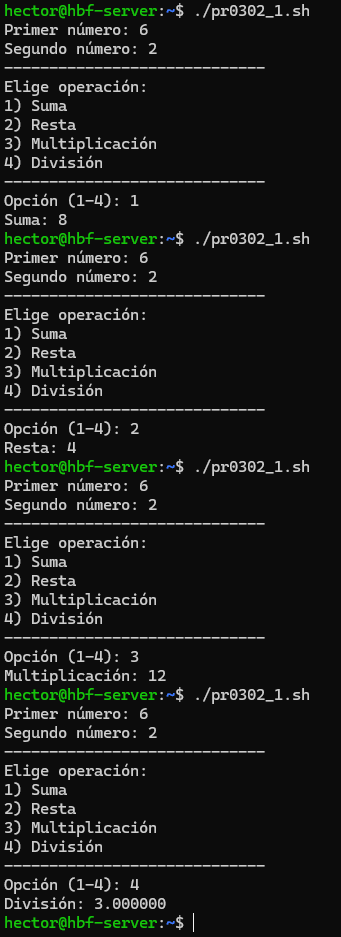
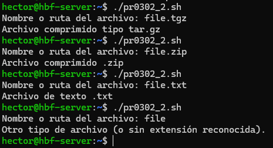
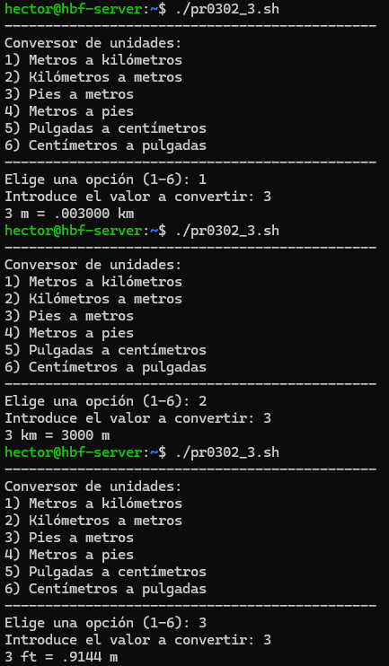
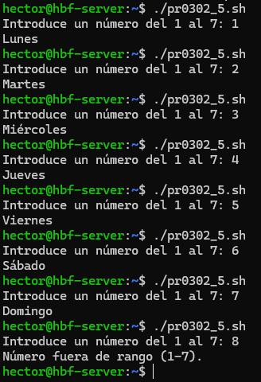
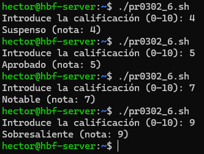
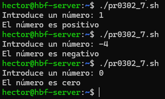
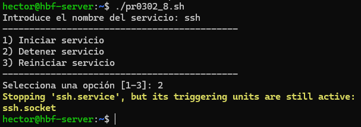

# 📄 PR0302: Comando `case`

## 📌 1. Menú de operaciones matemáticas
Creamos un script con el nombre **pr0302_1.sh** con `touch "archivo"` y le ponemos los permisos con `sudo chmod +x "archivo"` para ejecutarlo sin problemas. Los demás scripts tendrán la misma estructura del nombre pero con el número del ejercicio para diferenciarlo de los demás y no equivocarnos al editar o ejecutar los demás scripts.

- Script:
```
#!/bin/bash
read -p "Primer número: " a
read -p "Segundo número: " b
echo "-----------------------------"
echo "Elige operación:"
echo "1) Suma"
echo "2) Resta"
echo "3) Multiplicación"
echo "4) División"
echo "-----------------------------"
read -p "Opción (1-4): " op
case "$op" in
  1)
    resultado=$(echo "$a + $b" | bc -l)
    echo "Suma: $resultado"
    ;;
  2)
    resultado=$(echo "$a - $b" | bc -l)
    echo "Resta: $resultado"
    ;;
  3)
    resultado=$(echo "$a * $b" | bc -l)
    echo "Multiplicación: $resultado"
    ;;
  4)
    if [[ $(echo "$b == 0" | bc -l) -eq 1 ]]; then
      echo "Error: división por cero."
      exit 1
    fi
    resultado=$(echo "scale=6; $a / $b" | bc -l)
    echo "División: $resultado"
    ;;
  *)
    echo "Opción no válida."
    ;;
esac
```

- Resultado:



## 📌 2. Identificación de extensión de archivo
Creamos un script con el nombre **pr0302_2.sh**.

- Script:
```
#!/bin/bash
read -p "Nombre o ruta del archivo: " archivo
case "$archivo" in
  *.tar.gz|*.tgz)
    echo "Archivo comprimido tipo tar.gz"
    ;;
  *.zip)
    echo "Archivo comprimido .zip"
    ;;
  *.txt)
    echo "Archivo de texto (.txt)"
    ;;
  *)
    echo "Otro tipo de archivo (o sin extensión reconocida)."
    ;;
esac
```

- Resultado:



## 📌 3. Conversor de unidades
Creamos un script con el nombre **pr0302_3.sh**.

- Script:
```
#!/bin/bash
echo "----------------------------------------------"
echo "Conversor de unidades:"
echo "1) Metros a kilómetros"
echo "2) Kilómetros a metros"
echo "3) Pies a metros"
echo "4) Metros a pies"
echo "5) Pulgadas a centímetros"
echo "6) Centímetros a pulgadas"
echo "----------------------------------------------"
read -p "Elige una opción (1-6): " opt
read -p "Introduce el valor a convertir: " val

case "$opt" in
  1) # m -> km
    res=$(echo "scale=6; $val / 1000" | bc -l)
    echo "$val m = $res km"
    ;;
  2) # km -> m
    res=$(echo "scale=6; $val * 1000" | bc -l)
    echo "$val km = $res m"
    ;;
  3) # ft -> m (1 ft = 0.3048 m)
    res=$(echo "scale=6; $val * 0.3048" | bc -l)
    echo "$val ft = $res m"
    ;;
  4) # m -> ft
    res=$(echo "scale=6; $val / 0.3048" | bc -l)
    echo "$val m = $res ft"
    ;;
  5) # in -> cm (1 in = 2.54 cm)
    res=$(echo "scale=6; $val * 2.54" | bc -l)
    echo "$val in = $res cm"
    ;;
  6) # cm -> in
    res=$(echo "scale=6; $val / 2.54" | bc -l)
    echo "$val cm = $res in"
    ;;
  *)
    echo "Opción inválida."
    ;;
esac
```

- Resultado:




## 📌 4. Menú de configuración del sistema
Creamos un script con el nombre **pr0302_4.sh**.

- Script:
```
#!/bin/bash
echo "--------------------------------------------"
echo "Menú de configuración del sistema:"
echo "1) Apagar equipo"
echo "2) Reiniciar equipo"
echo "3) Cerrar sesión"
echo "--------------------------------------------"
read -p "Elige opción (1-3): " opcion

case "$opcion" in
  1)
    sudo shutdown -h now
    ;;
  2)
    sudo reboot
    ;;
  3)
    pkill -KILL -u "$USER"
    ;;
  *)
    echo "Opción no válida."; exit 1
    ;;
esac
```

- Resultado:

> 💬 No he puesto imágenes porque si no entre reiniciar y apagar tardaría demasiado tiempo, pero funciona.

## 📌 5. Día de la semana
Creamos un script con el nombre **pr0302_5.sh**.

- Script:
```
#!/bin/bash
read -p "Introduce un número del 1 al 7: " n
case "$n" in
  1) echo "Lunes" ;;
  2) echo "Martes" ;;
  3) echo "Miércoles" ;;
  4) echo "Jueves" ;;
  5) echo "Viernes" ;;
  6) echo "Sábado" ;;
  7) echo "Domingo" ;;
  *) echo "Número fuera de rango (1-7)." ;;
esac
```

- Resultado:



## 📌 6. Clasificación de notas
Creamos un script con el nombre **pr0302_6.sh**.

- Script:
```
#!/bin/bash
read -p "Introduce la calificación (0-10): " nota
case $nota in
  10|9)
    echo "Sobresaliente (nota: $nota)"
    ;;
  8|7)
    echo "Notable (nota: $nota)"
    ;;
  6|5)
    echo "Aprobado (nota: $nota)"
    ;;
  4|3|2|1|0)
    echo "Suspenso (nota: $nota)"
    ;;
  *)
    echo "Nota fuera de rango esperado (0-10)."
    ;;
esac
```

- Resultado:



## 📌 7. Clasificación de números
Creamos un script con el nombre **pr0302_7.sh**.

- Script:
```
#!/bin/bash
read -p "Introduce un número: " num
  if [ $num -gt 0 ]; then
  echo "El número es positivo"
  elif [ $num -lt 0 ]; then
  echo "El número es negativo"
  else
  echo "El número es cero"
  fi
```

- Resultado:



## 📌 8. Control de servicios en Linux
Creamos un script con el nombre **pr0302_8.sh**.

- Script:
```
#!/bin/bash
read -p "Introduce el nombre del servicio: " servicio
echo "--------------------------------------------"
echo "1) Iniciar servicio"
echo "2) Detener servicio"
echo "3) Reiniciar servicio"
echo "--------------------------------------------"
read -p "Selecciona una opción [1-3]: " opcion

case $opcion in
  1) sudo systemctl start $servicio
  ;;
  2) sudo systemctl stop $servicio
  ;;
  3) sudo systemctl restart $servicio
  ;;
  *) echo "Opción no válida"; exit 1 ;;
esac
```

- Resultado:



> 💬 No deja apagarlo porque se está usando.

---
### [⬅️ Volver a UT03](../index.md)
---