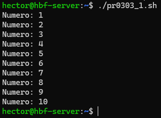
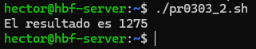
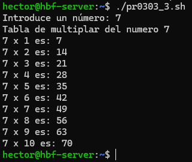
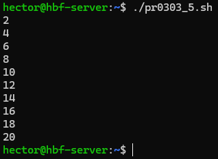
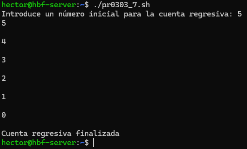
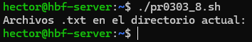
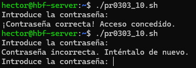

# 📄 PR0303: Ejercicios sobre los comandos `while`, `until` y `for`

## 📌 1. Contar hasta 10 con `for`
Creamos un script con el nombre **pr0303_1.sh** con `touch "archivo"` y le ponemos los permisos con `sudo chmod +x "archivo"` para ejecutarlo sin problemas. Los demás scripts tendrán la misma estructura del nombre pero con el número del ejercicio para diferenciarlo de los demás y no equivocarnos al editar o ejecutar los demás scripts.

- Script:
```

```

- Resultado:



## 📌 2. Sumar los primeros 50 numeros
Creamos un script con el nombre **pr0303_2.sh**.

- Script:
```

```

- Resultado:



## 📌 3. Tabla de multiplicar
Creamos un script con el nombre **pr0303_3.sh**.

- Script:
```

```

- Resultado:



## 📌 4. Imprimir cada letra
Para este ejercicio requiere de dividir una cadena en subcadenas. Todavía no se ha dado en clase. 

## 📌 5. Contar números pares del 1 al 20 con `while`
Creamos un script con el nombre **pr0303_5.sh**.

- Script:
```

```

- Resultado:



## 📌 6. Sumar dígitos
Para este ejercicio requiere de dividir una cadena en subcadenas. Todavía no se ha dado en clase. 

## 📌 7. Cuenta regresiva
Creamos un script con el nombre **pr0303_7.sh**.

- Script:
```

```

- Resultado:



## 📌 8. Imprimir solo archivos `.txt`
Creamos un script con el nombre **pr0303_8.sh**.

- Script:
```

```

- Resultado:



## 📌 9. Factorial de un número
Creamos un script con el nombre **pr0303_9.sh**.

- Script:
```

```

- Resultado:


## 📌 10. Verificar contraseña
- Creamos un script con el nombre **pr0303_10.sh**.

Script:
```

```

- Resultado:



---
### [⬅️ Volver a UT03](../index.md)
---