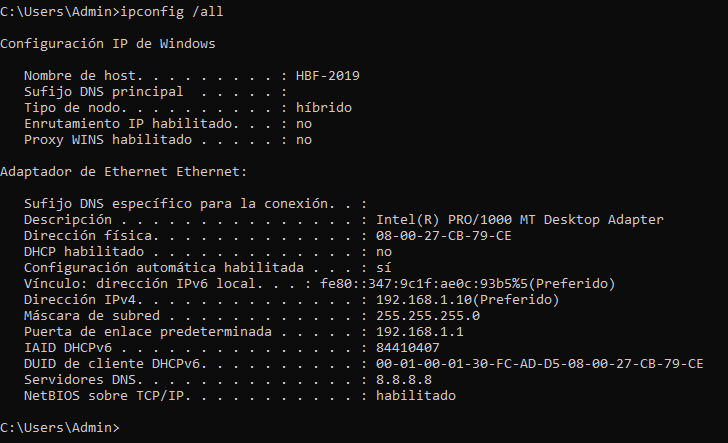

# 📄 PR0401: Administración remota en Windows

## 📌 1. Entorno virtualizado y preparación de las máquinas
Para hacer la práctica, necesitaremos las siguientes máquinas en **VirtualBox**:
- Windows Server 2019 Datacenter con experiencia de escritorio  (o GUI para abreviar)
- Windows Server 2019 Datacenter en modo Core
- Windows Server 2016 Datacenter en modo Core

Todas las máquinas tienen solamente un adaptador de red en **puente** para tener acceso a Internet y no requerir de un adaptador secundario.

Vamos a ponerle los siguientes nombres de **Host** a las máquinas.
- Windows Server 2019 Datacenter GUI: **HBF-2019**
- Windows Server 2019 Datacenter Core: **HBF-CORE-2019**
- Windows Server 2016 Datacenter Core: **HBF-CORE-2016**

Para cambiar el nombre de la máquina tanto en la versión **GUI** como la **CORE**, podemos usar el mismo comando que es el siguiente:
```powershell
Rename-Computer -NewName HBF-2019 -Restart
```

Pero para que funcione correctamente, tendremos que hacerlo desde `Powershell`, porque desde el propio CMD no funciona.  
En la versión **GUI**, tendremos que abrir Powershell como **Adminstrador**, y en las versiones **CORE**, podremos hacerlo al escribir `powershell` y luego ejecutar el comando. Se nos reiniciarán las máquinas de manera automática al haber puesto `-Restart`.

Ahora, tendremos que añadirles una IP estática. Esta va a ser una tabla de qué IPs van a tener las máquinas:

|Host         |IP          |Máscara de subred  |Puerta de enlace|Servidor DNS|
|:-----------:|:----------:|:-----------------:|:--------------:|:----------:|
|HBF-2019     |192.168.1.10|255.255.255.0 /24  |192.168.1.1     |8.8.8.8     |
|HBF-CORE-2019|192.168.1.20|255.255.255.0 /24  |192.168.1.1     |8.8.8.8     |
|HBF-CORE-2016|192.168.1.30|255.255.255.0 /24  |192.168.1.1     |8.8.8.8     |

>💬 El DNS es opcional pero me apetecía ponerlo.

### Versión GUI
Podemos cambiar la **IP** haciendo la combinación de teclas `Win+R` y escribimos `ncpa.cpl`, con esto nos ahorramos algo de tiempo y es más directo.  
Ahora, hacemos clic derecho en el adaptador de red y clicamos en `Propiedades`. Luego, clicamos en `Protocolo de Internet versión 4 (TCP/IPv4)`. Lo dejamos tal cual está en la captura.


Podemos comprobarlo abriendo la terminal y escribiendo `ipconfig /all`.



Editamos el archivo `hosts` que se encuentra en `C:\Windows\System32\drivers\etc\hosts` para habilitar la resolución local de nombres entre las demás máquinas.  
Para editar este archivo, podemos hacerlo directamente entrando en el diretorio y editandolo con el **bloc de notas** y pondremos lo siguiente al final del documento:
```
192.168.1.10 HBF-2019
192.168.1.20 HBF-CORE-2019
192.168.1.30 HBF-CORE-2016
```

Y al guardar el archivo, lo más seguro es que tengamos problemas al guardarlo por falta de permisos, nos recomienda guardarlo como un archivo `.txt` y guardarlo en `Documents`. Podemos quitarle la extensión y reemplazar el archivo viejo.

Por último, desactivamos el Firewall desde el **Panel de control** yendo hacia `Sistema y seguridad → Firewall de Windows Defender` y en la parte de la izquierda, clicamos en `Activar o desactivar el Firewall de Windows Defender`. Clicamos en `Desactivar Firewall de Windows Defender` tanto en `Redes privadas` como en `Redes públicas o invitadas`, aceptamos y ya está desactivado el Firewall.


### Versión CORE
Para cambiar la IP, tenemos que poner el comando `New-NetIPAddress` para cambiar la IP y `Set-DnsClientServerAddress` para poner un servidor DNS. Pondremos lo siguiente con `Powershell`:

- **HBF-CORE-2019**
```powershell
New-NetIPAddress `
 -InterfaceAlias "Ethernet" `
 -IPAddress 192.168.1.20 `
 -PrefixLength 24 `
 -DefaultGateway 192.168.1.1

Get-WmiObject Win32_NetworkAdapterConfiguration | Where-Object {$_.IPEnabled -eq $true} | ForEach-Object { $_.SetDNSServerSearchOrder(@("8.8.8.8"))}
```

> 💬 Para poder poner el DNS no funcionaba con el comando `Set-DnsClientServerAddress`, la única solución para poder ponerlo ha sido así. Esto solo ha sido en la versión de 2019, en la de 2016 no hay problema ninguno.

Comprobamos la configuración poniendo el comando `Get-NetIPconfiguration`.


- **HBF-CORE-2016**
```powershell
New-NetIPAddress `
 -InterfaceAlias "Ethernet" `
 -IPAddress 192.168.1.30 `
 -PrefixLength 24 `
 -DefaultGateway 192.168.1.1

Set-DnsClientServerAddress `
 -InterfaceAlias "Ethernet" `
 -ServerAddresses 8.8.8.8
```

Comprobamos la configuración poniendo el comando `Get-NetIPconfiguration`.


Para editar el archivo **hosts**, pondremos el comando `notepad C:\Windows\System32\drivers\etc\hosts` y se nos abrirá el **Bloc de notas** y lo dejaremos exactamente igual que en la versión **GUI**, es decir, al final del documento pondremos esto:
```
192.168.1.10 HBF-2019
192.168.1.20 HBF-CORE-2019
192.168.1.30 HBF-CORE-2016
```

Para desactivar el **Firewall** en ambas máquinas, pondremos lo siguiente:
```powershell
Set-NetFirewallProfile `
-Profile Domain,Public,Private `
-Enabled False

Get-NetFirewallProfile | Select-Object Name, Enabled
```
- **HBF-CORE-2019**


- **HBF-CORE-2016**


Por último para acabar la configuración de las máquinas, comprobaremos que se hagan ping entre ellas, he puesto el comando `ping` más el nombre del Host de las máquinas para que aparezcan tanto el nombre y la IP que tienen.

- **HBF-2019**


- **HBF-CORE-2019**


- **HBF-CORE-2016**


## 📌 2. Configuración del acceso remoto al nuevo equipo


## 📌 3. Configuración del acceso remoto sobre HTTPS


## 📌 4. Configuración remota con Windows Admin Center


---
### [⬅️ Volver a UT04](../index.md)
---