# 📄 PR0401: Implantación del dominio

## ✅ Objetivos
Eres el nuevo administrador de sistemas del **IES San Andrés**. El centro ha decidido centralizar la gestión de usuarios y equipos, y tu primera tarea es implantar un dominio de Active Directory.

El nombre de dominio interno será: **`iessanandres.local`**

El centro tiene una estructura organizativa que debe reflejarse en el directorio activo para facilitar la gestión. La estructura académica se divide en:

- **Familia de Administración:**
  - Ciclo Superior de Administración y Finanzas (AFI)
  - Ciclo Superior de Asistencia a la Dirección (GAD)
  - Ciclo Medio de Gestión Administrativa (SCO)
- **Familia de Informática:**
  - Ciclo Superior de Desarrollo de Aplicaciones Multiplataforma (DAM)
  - Ciclo Superior de Desarrollo de Aplicaciones Web (DAW)
  - Ciclo Superior de Administración de Sistemas (ASIR)
  - Ciclo Medio de Sistemas Microinformáticos y Redes (SMR)
  - Curso de Especialización en Inteligencia Artificial y Big Data (IAyBD)

Además de los alumnos y profesores de estas familias, también existe el personal de administración y servicios (PAS).

## 📌 1. Promoción del controlador de dominio
En nuestra máquina de **Windows Server 2025**, pondremos la **IP estática** en nuestro adaptador de **sólo anfitrión** en **VirtualBox**. Vamos al **CMD** y ponemos `ipconfig`. Luego, vamos a **`Panel de control → Redes e internet → Centro de redes y recursos compartidos`** y en el menú de la izquierda clicamos en **`Cambiar configuración del adaptador`**. Clicamos en nuestro adaptador y pondremos la IP. En este caso la IP será de la siguiente manera:

Ahora, instalamos el servicio de Active Directory **(AD)**. Para ello, vamos al apartado de **Herramientas** y luego en **Agregar roles y características**.

En el siguiente punto de la instalación seleccionamos **Servicios de dominio de Active Directory** y añadimos las características que nos saldrá en una ventana al seleccionarlo.

Ahora, en este apartado, seleccionamos la casilla para que se reinicien los servicios en caso necesario y le damos a **Instalar**.

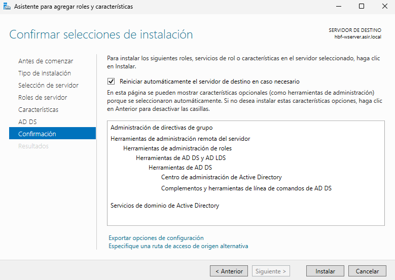

Una vez instalado, tendremos que ir al apartado de notificaciones (porque nos saldrá con un signo de peligro) y clicaremos en **Promover este servidor a controlador de dominio**.

Cuando hayamos clicado, nos saldrá una ventana para configurar el dominio.

En la primera ventana, para crear un nuevo dominio, seleccionamos **Agregar un nuevo bosque** y le pondremos el nombre de `iessanandres.local`.

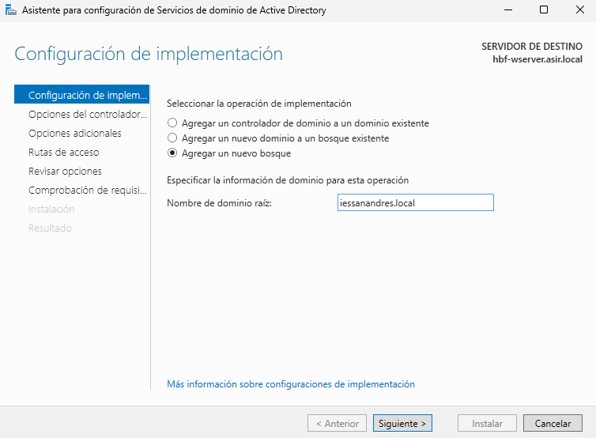

Pondremos la contraseña para nuestro nuevo bosque, dejamos el nivel funcional tal cual está, si lo cambiamos de versión, se quedará con las funciones de esa versión.

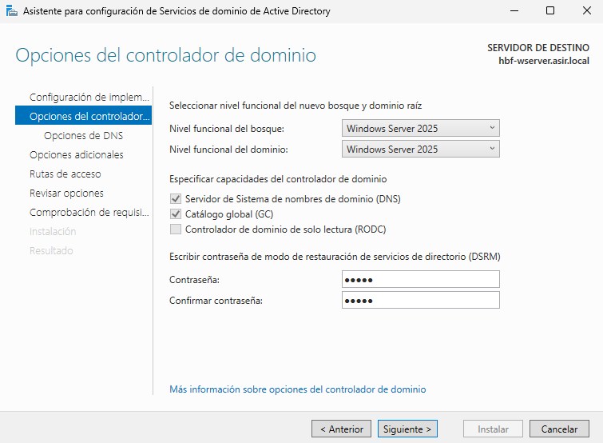

Aquí, solamente clicamos en Siguiente, no podemos hacer clic en **Crear delegación DNS**.

En esta parte, nos sale el nombre que tendrá el dominio cuando se vaya a iniciar sesión. Si es un usuario que ya está dentro, cuando vaya a iniciar sesión, en vez de `"usuario"`, aparecerá como `"IESSANANDRES\'usuario'"`. En mi caso, lo dejaré como viene por defecto.

En este apartado, será para saber dónde se va a encontrar las rutas de configuración y del dominio. Podemos dejarlo como viene.

En la siguiente ventana, nos aparecerá un resumen de lo que hayamos configurado antes de crear el controlador de dominio.

Aquí, se hará una comprobación antes de instalarlo todo. Vemos que al final de la comprobación, tenenemos un ✅. Ahora procedemos a instalarlo.

Cuando se haya instalado, se reiniciará el equipo de manera automática cuando haya acabado.  
Podemos ver ahora que al iniciar sesión, podemos ver el dominio.

## 📌 2. Diseño de la Estructura de Unidades Organizativas (UO)
Estructura que se va a seguir:

---

- **`IES San Andres`**
  - **`Alumnado`**
    - `Informatica`
      - `DAM`
      - `DAW`
      - `ASIR`
      - `SMR`
      - `IAyBD`
    - `Administracion`
      - `AFI`
      - `GAD`
      - `SCO`
  - **`Profesorado`**
    - `Informatica`
    - `Administracion`
  - **`Personal_PAS`**
  - **`_Grupos`**
  - **`_Equipos`**
    - `Aulas_Informatica`
    - `Aulas_Administracion`
    - `Despachos`

---

> 💬 En el ejercicio, aparece que `Profesorado` aparece al lado de `SCO`. Tendría que estar como en `Alumnados` para tener dentro a los grupos de `Informatica` y `Administracion`.

Para hacer todo esto, vamos a ir a **Herramientas** y **Usuarios y equipos de Active Directory**.

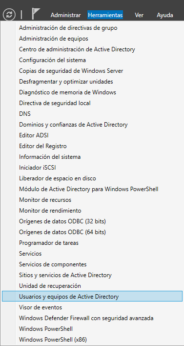

Una vez dentro, haremos clic derecho en nuestro dominio y ahí crearemos a la unidad organizativa principal.

Creamos la **Unidad Organizativa principal**, que será `IES San Andres`.

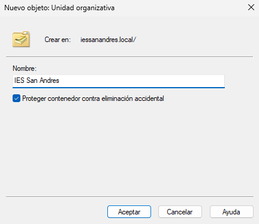

Ahora, crearemos lo que queda de la estructura dentro de esta Unidad Organizativa haciendo más Unidades Organizativas para meter más adelante grupos o usuarios.

Cuando tengamos toda la estructura, nos quedará de la siguiente manera:

Todas se han creado como la Unidad Organizativa principal, con la opción de **Proteger contenedor contra eliminación accidental** que en caso de borrarla sin querer, nos salga un aviso.

## 📌 3. Creación de Usuarios y Grupos
### 1. Crear Usuarios:
Para este ejercicio, crearemos usuarios para los grupos, es decir, poblar la Unidad Organizativa.  
Vamos a crear los siguientes usuarios:  
- Dos usuarios para `ASIR` (alu_asir_1, alu_asir_2)
- Dos usuarios para `AFI` (alu_afi_1, alu_afi_2)
- Un usuario para `Profesorado/Informatica` (prof_info_1)
- Un usuario para `Personal_PAS` (pas_1)

Creamos a los usuarios dentro de las Unidades Organizativas que pide el ejercicio.  
Hacemos clic derecho `Nuevo → Usuario`.  
Pondremos los siguientes datos para crearlos. Todos los usuarios van a tener de contraseña **`Admin2025`**.

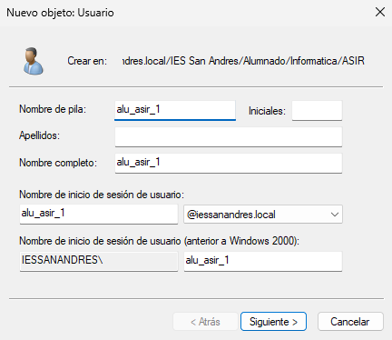

En este apartado, se muestra un resumen de cómo quedaría nuestro usuario antes de crearlo.

Cuando tengamos a los usuarios creados, tendremos lo siguiente:

- ASIR

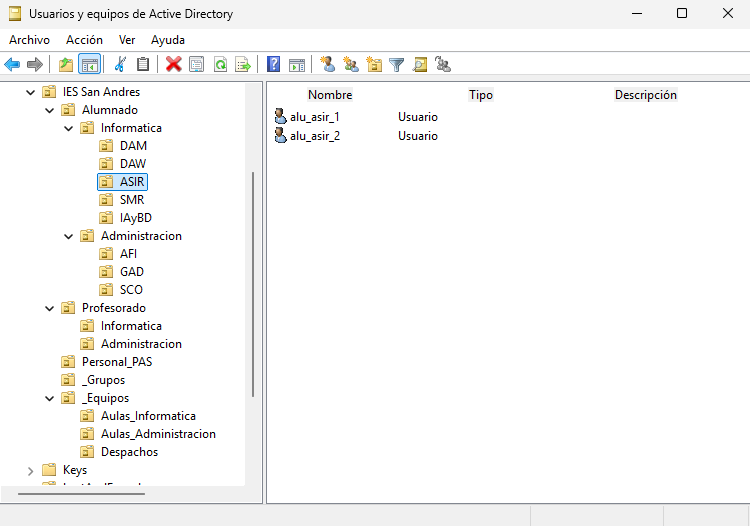

- AFI

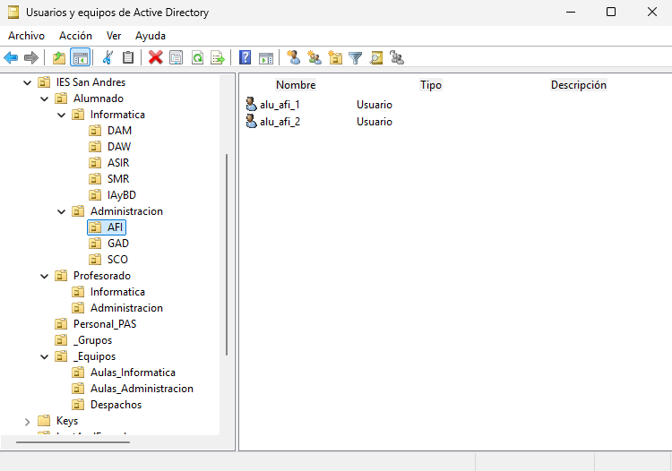

- Profesorado/Informatica

- Personal_PAS

### 2. Crear grupos de Seguridad:
Vamos a crear los siguientes grupos de seguridad dentro de la Unidad Organizativa de `_Grupos`.  
Los grupos que vamos a añadir son:  
- GRP_Alumnos_DAM
- GRP_Alumnos_AFI
- GRP_Profesores_Informatica
- GRP_Personal_PAS
- GRP_Alumnos_General (Un grupo que contendrá a todos los alumnos)
- GRP_Profesores_General (Un grupo que contendrá a todos los profesores)

Para crear grupos, hacemos clic derecho `Nuevo → Grupo`.

Solo tendremos que poner un nombre y poner la siguiente configuración:

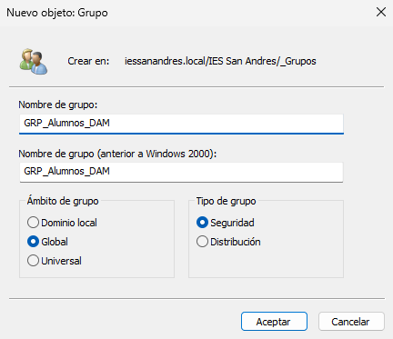

Al final, tendremos lo siguiente:

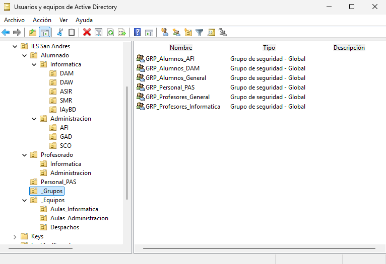

### 3. Asignar Miembros:
- Añadimos a los usuarios que hemos creado a sus respectivos grupos.
- Hacer que `GRP_Alumnos_DAM` y `GRP_Alumnos_AFI` pertenezcan al grupo de `GRP_Alumnos_General`.

Para añadir a un usuario, podemos hacer doble clic y vemos directamente las propiedades del usuario, vamos a la pestaña de **Miembro de** y en **Agregar...** podemos hacer clic en **Opciones avanzadas** y buscar entre todo o poner directamente el nombre del grupo.

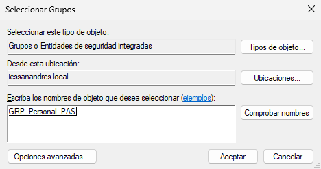

Cuando lo tengamos añadido, tendremos lo siguiente:

Ahora metemos el resto de usuarios creados en sus grupos.  
Cuando los tengamos a todos, podemos ir a los grupos y hacer doble clic para ver las propiedades del grupo e ir a la pestaña de **Miembros** y vemos los miembros que contiene.  
Solo se pondrán capturas de los grupos donde hayan usuarios añadidos.

- AFI

- Profesores_Informatica

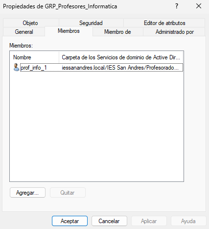

- Personal_PAS

- Alumnos_General

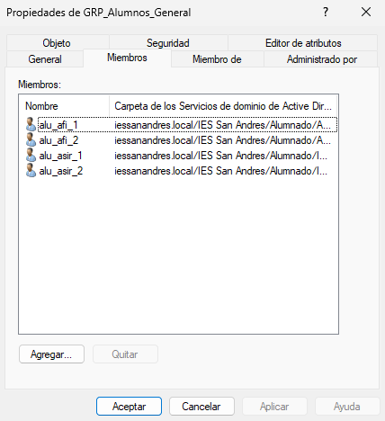

- Profesores_General

Ahora, vamos a añadir los grupos de `GRP_Alumnos_DAM` y `GRP_Alumnos_AFI` para que sean miembros del grupo `GRP_Alumnos_General`.  
Para ello, tenemos que hacer igual que con los usuarios.

Cuando ya tengamos los grupos añadidos, volvemos a `Propiedades → Miembros` y veremos que se han añadido los grupos.

## 📌 4. Restricción de Horas de Inicio de Sesión
Para que un usuario tenga un uso limitado durante cierto tiempo. Tenemos que ir a `"Propiedades del usuario" → Cuenta → Horas de inicio de sesión` y ahí pondremos manualmente las horas que queramos que el usuario esté conectado. En este caso, será de los usuarios que hemos creado que tengan un horario **de 8:00 a 15:00 de lunes a viernes**.

Pondremos un ejemplo pero se aplicará a todos los usuarios.  
> 💬 Tengo que ir uno por uno porque al seleccionar varios usuarios no aparece la opción deseada.

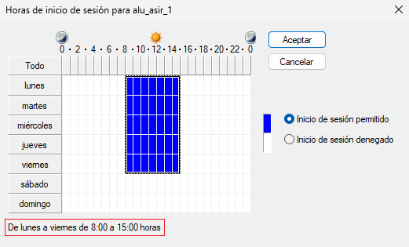

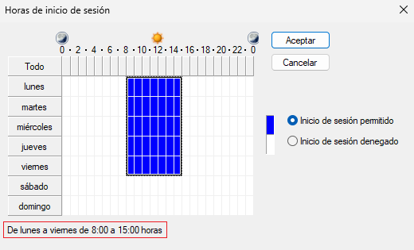

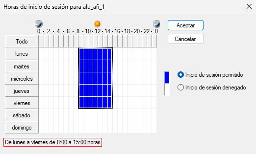

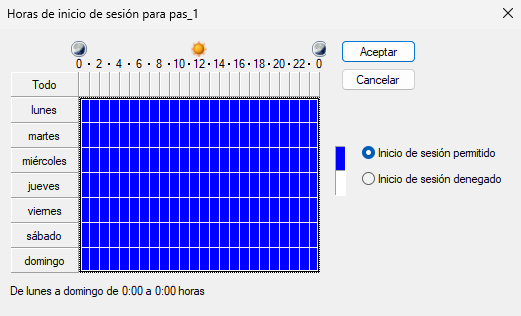

---
### [⬅️ Volver a UT04](../index.md)
---