# 📄 PR0401: Administración remota en Windows

## 📌 1. Entorno virtualizado y preparación de las máquinas
Para hacer la práctica, necesitaremos las siguientes máquinas en **VirtualBox** con este hostname:
- Windows Server 2019 con experiencia de escritorio  (o GUI): **HBF-2019**
- Windows Server 2019 en modo Core: **HBF-CORE-2019**
- Windows Server 2016 en modo Core: **HBF-CORE-2016**

Todas las máquinas tienen solamente un adaptador de red en **puente** para tener acceso a Internet y no requerir de un adaptador secundario. Todo se realizará desde **Powershell**, en el que en la versión **GUI** lo ejecutamos como Administrador y en la versión **CORE** solo basta con poner `powershell`.

Para cambiar el nombre de la máquina tanto en la versión **GUI** como la **CORE**, podemos usar el mismo comando que es el siguiente:
```powershell
Rename-Computer -NewName <nuevo nombre> -Restart
```

> 💬 Se nos reiniciarán las máquinas al instante por haberle puesto `-Restart`.

Ahora, tendremos que añadirles una IP estática. Esta va a ser una tabla de qué IPs van a tener las máquinas:

| Host          | IP           | Máscara de subred | Puerta de enlace | Servidor DNS |
| ------------- | ------------ | ----------------- | ---------------- | ------------ |
| HBF-2019      | 192.168.1.10 | 255.255.255.0 /24 | 192.168.1.1      | 8.8.8.8      |
| HBF-CORE-2019 | 192.168.1.20 | 255.255.255.0 /24 | 192.168.1.1      | 8.8.8.8      |
| HBF-CORE-2016 | 192.168.1.30 | 255.255.255.0 /24 | 192.168.1.1      | 8.8.8.8      |

> 💬 El DNS es opcional pero me apetecía ponerlo.

### Versión GUI
Podemos cambiar la **IP** haciendo la combinación de teclas `Win+R` y escribimos `ncpa.cpl`, con esto nos ahorramos algo de tiempo y es más directo.  
Ahora, hacemos clic derecho en el adaptador de red y clicamos en `Propiedades`. Luego, clicamos en `Protocolo de Internet versión 4 (TCP/IPv4)`. Lo dejamos tal cual está en la captura.

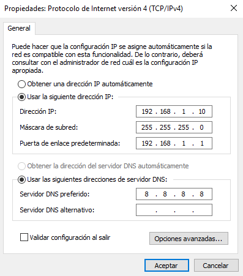

Podemos comprobarlo abriendo la terminal y escribiendo `ipconfig /all`.

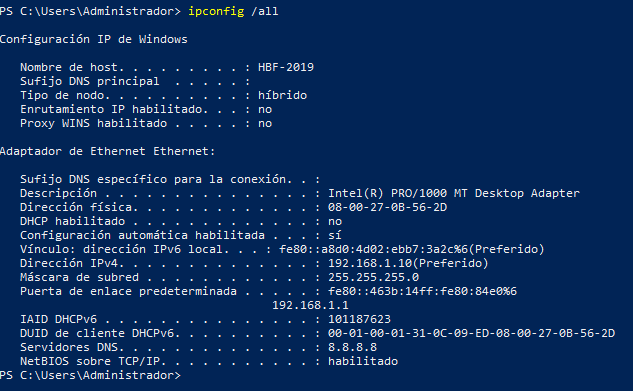

Editamos el archivo `hosts` que se encuentra en `C:\Windows\System32\drivers\etc\hosts` para habilitar la resolución local de nombres entre las demás máquinas. Lo editamos con el **bloc de notas** pondremos lo siguiente al final del documento:
```
192.168.1.10 HBF-2019
192.168.1.20 HBF-CORE-2019
192.168.1.30 HBF-CORE-2016
```

Por último, desactivamos el Firewall desde el **Panel de control** yendo hacia `Sistema y seguridad → Firewall de Windows Defender` y en la parte de la izquierda, clicamos en `Activar o desactivar el Firewall de Windows Defender`. Clicamos en `Desactivar Firewall de Windows Defender` tanto en `Redes privadas` como en `Redes públicas o invitadas`, aceptamos y ya está desactivado el Firewall.

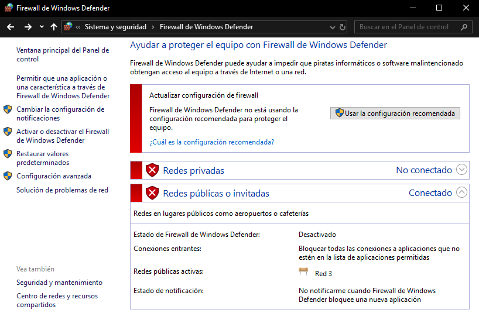

### Versión CORE
Para cambiar la IP, tenemos que poner el comando `New-NetIPAddress` y `Set-DnsClientServerAddress` para poner un servidor DNS. Pondremos lo siguiente con `Powershell`:

- **HBF-CORE-2019**

```powershell
New-NetIPAddress `
 -InterfaceAlias "Ethernet" `
 -IPAddress 192.168.1.20 `
 -PrefixLength 24 `
 -DefaultGateway 192.168.1.1

Set-DnsClientServerAddress `
 -InterfaceAlias "Ethernet" `
 -ServerAddresses 8.8.8.8
```

Comprobamos la configuración poniendo el comando `Get-NetIPconfiguration`.

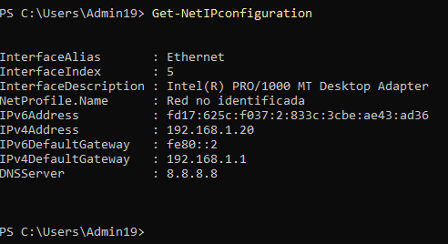

- **HBF-CORE-2016**

```powershell
New-NetIPAddress `
 -InterfaceAlias "Ethernet" `
 -IPAddress 192.168.1.30 `
 -PrefixLength 24 `
 -DefaultGateway 192.168.1.1

Set-DnsClientServerAddress `
 -InterfaceAlias "Ethernet" `
 -ServerAddresses 8.8.8.8
```

Comprobamos la configuración poniendo el comando `Get-NetIPconfiguration`.

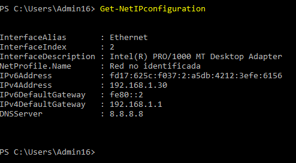

Para editar el archivo `hosts` en **CORE**, pondremos el comando `notepad C:\Windows\System32\drivers\etc\hosts`, se nos abrirá el **Bloc de notas** y lo dejaremos exactamente igual que en la versión **GUI**, es decir, al final del documento pondremos esto:
```
192.168.1.10 HBF-2019
192.168.1.20 HBF-CORE-2019
192.168.1.30 HBF-CORE-2016
```

Para desactivar el **Firewall** en ambas máquinas, pondremos lo siguiente:
```powershell
Set-NetFirewallProfile `
-Profile Domain,Public,Private `
-Enabled False

Get-NetFirewallProfile | Select-Object Name, Enabled
```
- **HBF-CORE-2019**

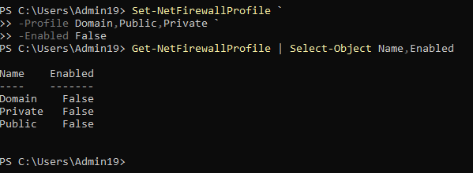

- **HBF-CORE-2016**

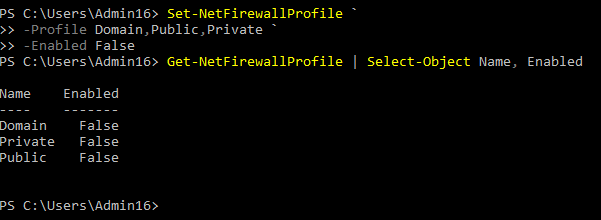

### Comprobación con `ping`
Para acabar con la configuración inicial, comprobamos que se hagan ping entre ellas, he puesto el comando `ping` + el nombre del **Host** de las máquinas para que aparezcan tanto el nombre y la IP que tienen.

- **HBF-2019**

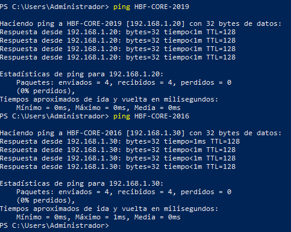

- **HBF-CORE-2019**

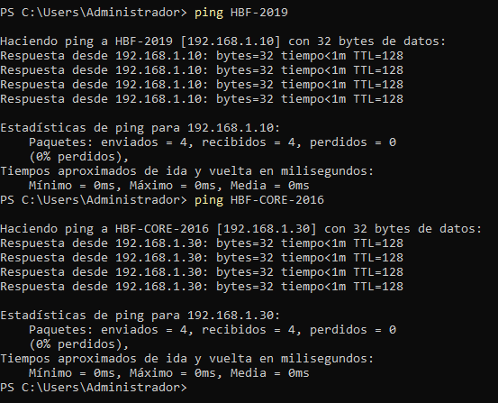

- **HBF-CORE-2016**

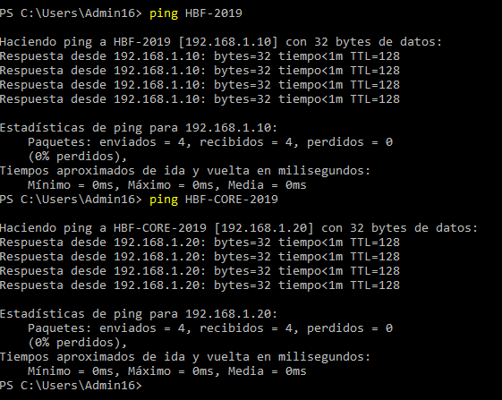

## 📌 2. Configuración del acceso remoto al nuevo equipo
### Lista TrustedHosts
En nuestra máquina cliente, que va a ser la versión **GUI**, añadimos los servidores a la lista **TrustedHosts**. Esto permite conectarnos a los servidores. Ponemos los siguientes comandos:
```powershell
set-Item WSMan:\localhost\CLient\TrustedHosts -Value "192.168.1.20, 192.168.1.30"
  # Tecleamos "S" para aceptar
winrm get winrm/config/client
```

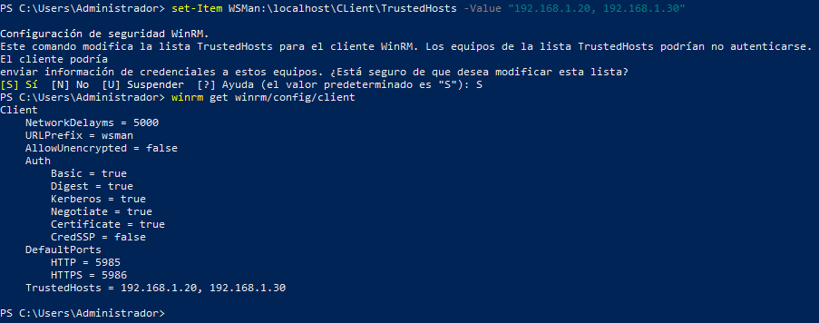

Ahora haremos lo mismo para los **servidores**, pero antes, tenemos que ejecutar este comando en ambas máquinas para habilitar el acceso remoto:
```powershell
Enable-PSRemoting -Force
```

Ahora, procedemos a poner **TrustedHosts** en los servidores.

- **HBF-CORE-2019**

```powershell
set-Item WSMan:\localhost\CLient\TrustedHosts -Value "192.168.1.10, 192.168.1.30"
  # Tecleamos "S" para aceptar
winrm get winrm/config/client
```

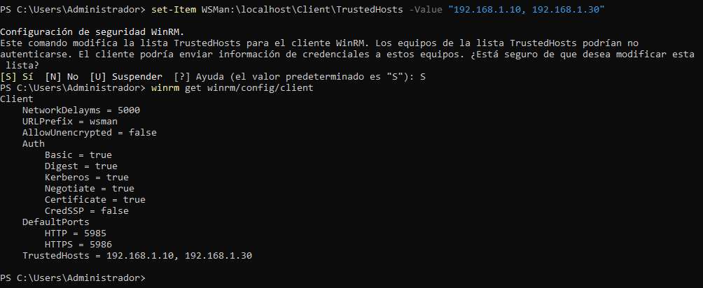

- **HBF-CORE-2016**

```powershell
set-Item WSMan:\localhost\CLient\TrustedHosts -Value "192.168.1.10, 192.168.1.20"
  # Tecleamos "S" para aceptar
winrm get winrm/config/client
```

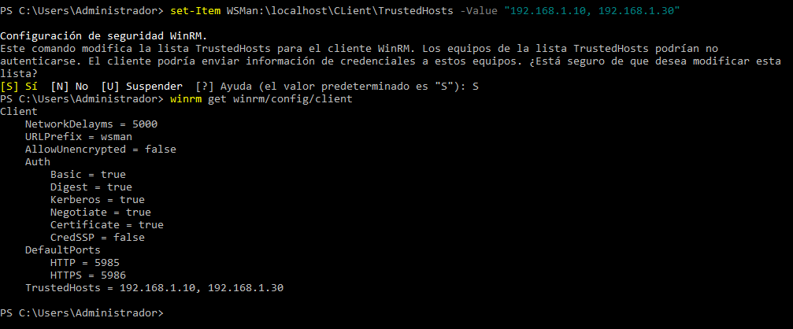

### Acceso remoto
Para poder tener todos los permisos para acceder por remoto, tenemos que poner el siguiente comando en los dos servidores:
```powershell
New-ItemProperty -Path HKLM:\SOFTWARE\Microsoft\Windows\CurrentVersion\Policies\System -Name LocalAccountTokenFilterPolicy -Value 1 -Force
```

Ahora podemos ejecutar comandos de nuestra máquina cliente hacia los servidores. El ejercicio pide que hagamos un usuario que sea `admin-hbf`. Para ello, pondremos el siguiente comando:
```powershell
Invoke-Command -ComputerName 192.168.1.20 -Credential $cred -ScriptBlock {
New-LocalUser -Name "admin-hbf"
Add-LocalGroupMember -Group "Administrators" -Member "admin-hbf"
}
```

Nos pedirán las credendiales de la máquina servidor, tendremos que poner la **IP** con el **usuario** y la **contraseña**.


Tendremos que volver a repetir la contraseña y veremos que sí ha creado al usuario.


Repetimos lo mismo pero para el servidor **HBF-CORE-2016**.

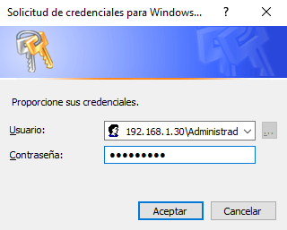

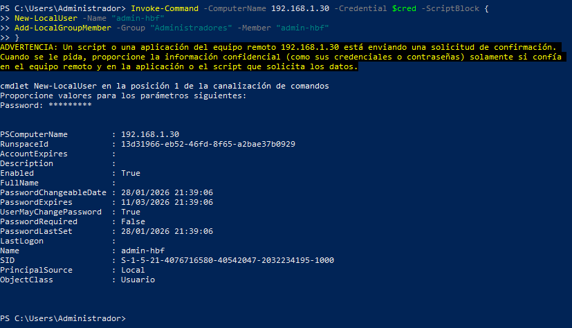

## 📌 3. Configuración del acceso remoto sobre HTTPS
### Crear Certificado Autofirmado
Para conseguir que sea `HTTPS`, es necesario que tengamos un certificado. Al no conseguir uno de terceros, creamos uno que sea autofirmado. Vamos a una máquina servidor, que en mi caso usaré `HBF-CORE-2016` porque le he instalado las **GuestAddition** y es mejor para copiar y pegar. Ponemos el siguiente comando:
```powershell
New-SelfSignedCertificate `
 -DnsName "HBF-CORE-2016" `
 -CertStoreLocation Cert:\LocalMachine\My `
 -KeyLength 2048
```

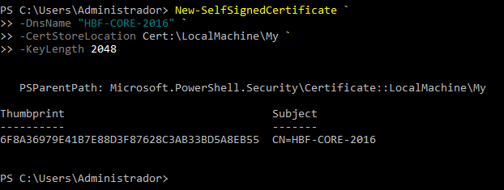

### Listeners
Tenemos que eliminar el Listener actual para crear uno nuevo para el certificado. Para ello ponemos lo siguiente:
```powershell
Remove-Item -Path WSMan:\localhost\Listener\Listener* -Recurse
```

Volvemos a crearlo con las especificaciones que vayamos a necesitar con el siguiente comando:
```powershell
New-Item -Path WSMan:\localhost\Listener -Transport HTTPS -Address * -CertificateThumbPrint <hash del certificado>
  # Tecleamos "S" para aceptar
```

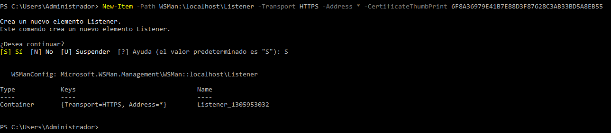

### Crear reglas de Firewall
Creamos una regla de Firewall para permitir acceso por el puerto necesario con el siguiente comando:
```powershell
netsh advfirewall firewall add rule name="WinRM HTTPS" protocol=TCP dir=in localport=5986 action=allow
```

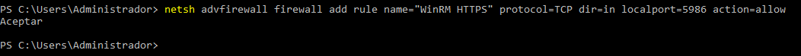

### Exportación del certificado
Exportamos el certificado que hemos creado en la ruta que hemos especificado con el siguiente comando:
```powershell
Export-Certificate -Cert Cert:\LocalMachine\My\<hash del certificado> -FilePath C:\servercert.cer
```

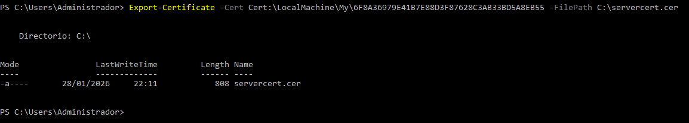

### Uso de carpetas compartidas
Vamos a tener que crear una carpeta compartida en nuestro cliente para que sea accesible pasar el certificado del servidor al cliente.

Creamos una carpeta en `C:` con el nombre de `Compartir`.  
Vamos a `Propiedades → Compartir → Uso compartido avanzado`.

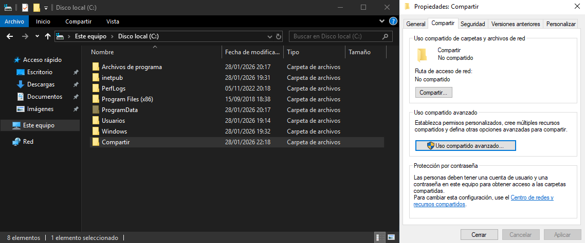

Marcamos la opción de Compartir esta carpeta y pondremos el nombre de la carpeta.

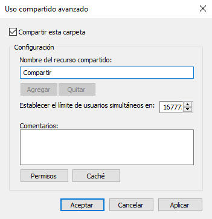

Clicamos en `Permisos` y en el grupo de **Todos**, le damos `Control Total`.

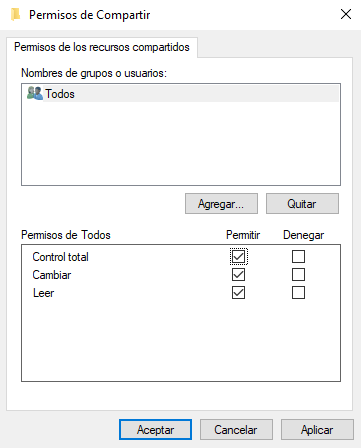

Para que sea más seguro, volvemos a Propiedades y vamos a Seguridad. Añadimos al grupo Todos y le damos Control Total

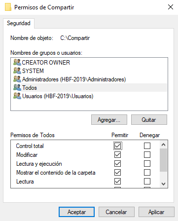

### Copia del certificado
Copiamos el certificado en la carpeta compartida con el siguiente comando:
```powershell
Copy-Item -Path C:\servercert.cer -Destination "\\<ip del cliente\carpeta>"
```

> 💬 Me daba error el comando y no he encontrado una solución para ello, pongo una captura del error.
>
> 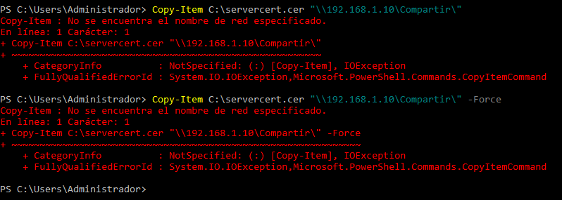

El siguiente paso es comprobar el certificado en la carpeta desde el cliente. Pondremos lo siguiente:
```powershell
cd C:\Compartir\

dir
  # Veremos que tiene el certificado
```

### Importar certificado y acceso remoto por `HTTPS`
Desde el cliente importamos el certificado con el siguiente comando:
```powershell
Import-Certificate -FilePath C:\Compartir\servercert.cer -CertStoreLocation Cert:\LocalMachine\Root
```

Para verlo mejor, con la combinación de teclas de `Win+R` ponemos `certmgr.msc` y veremos el certificado con el nombre del **Host** del servidor.

Probamos a conectarnos desde el cliente hacia el servidor con el siguiente comando:
```powershell
Enter-PSSession -ComputerName HBF-CORE-2016 -Credential Administrador -UseSSL
```

> 💬 Esto tampoco puedo probarlo porque necesitaría el certificado sí o sí.

Hacemos lo mismo pero ahora para el servidor HBF-CORE-2019.

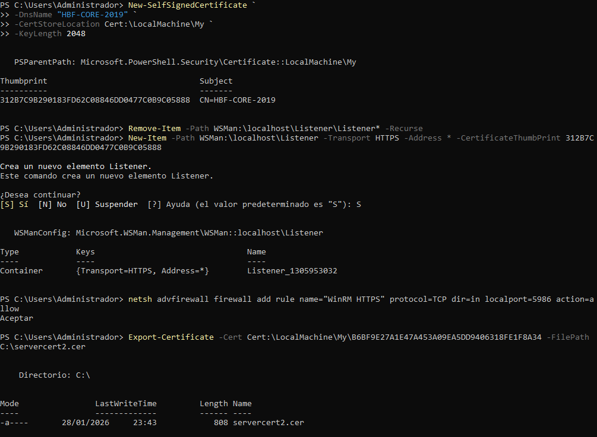

> 💬 También me ha dado error. No puedo terminar de comprobarlo.
>
> 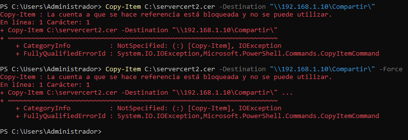

## 📌 4. Configuración remota con Windows Admin Center
Descargamos **Windows Admin Center** del enlace https://www.microsoft.com/es-es/windows-server/windows-admin-center. Cuando lo tengamos descargado, procedemos a realizar exactamente los siguientes pasos de la instalación:

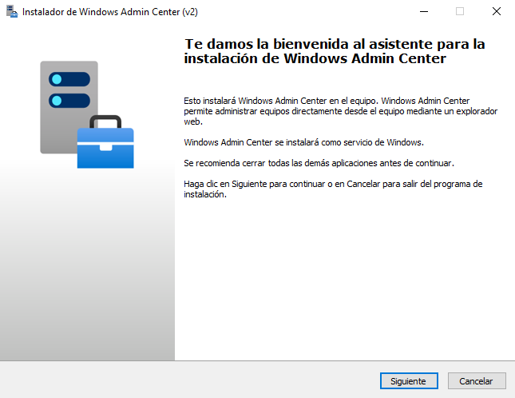

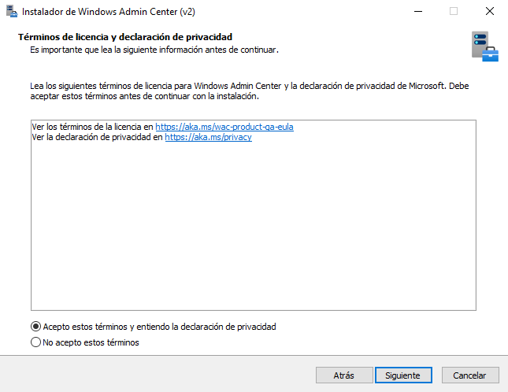

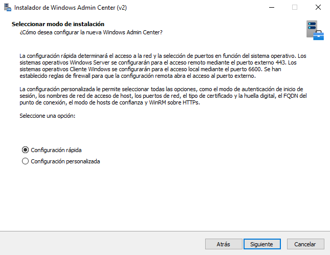

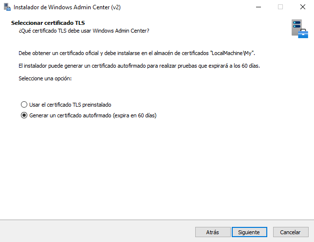

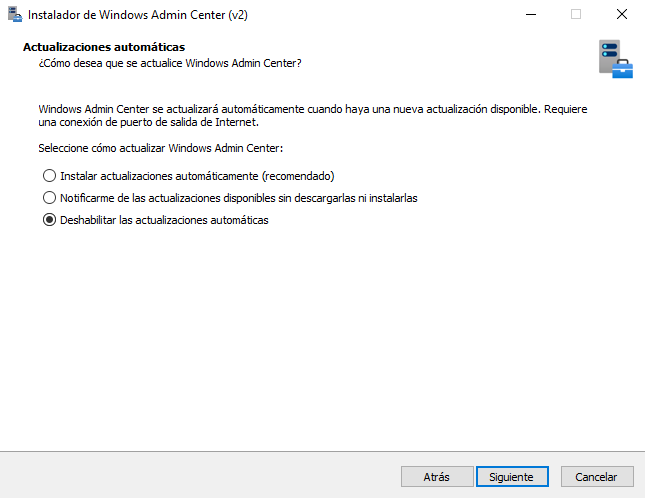

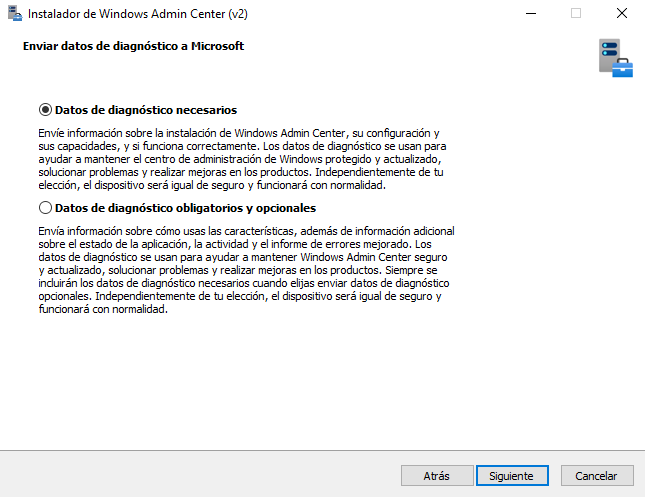

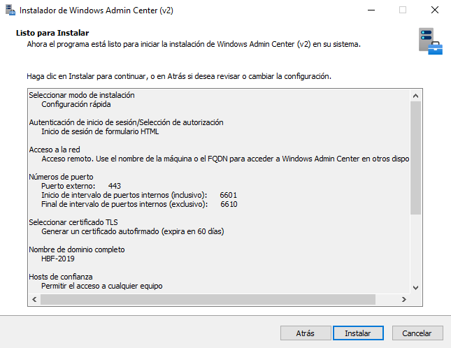

En el último paso, lo que nos sale es un resumen de lo que va a hacer **Windows Admin Center**, podemos ver que el puerto que va a usar es el `443`.

El siguiente paso es quitar la `Configuración mejorada de Internet Explorer`. Desde el **Administrador del servidor**, clicamos en **Servidor local** y vemos que en **Propiedades**, la configuración de **IE** está activado, esto significa que en cada página que entremos desde Internet Explorer nos la bloquea.

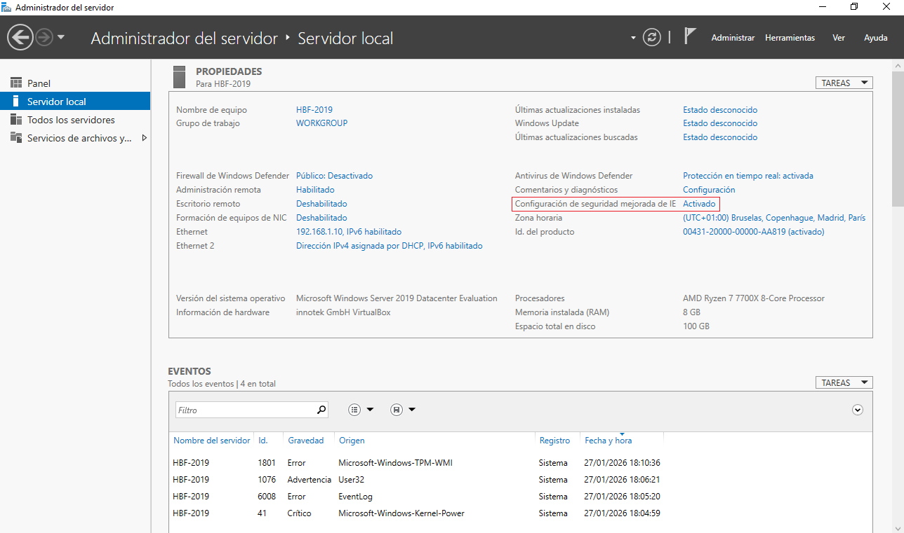

Para desactivarlo, clicamos en **Activado** y seleccionamos lo siguiente:

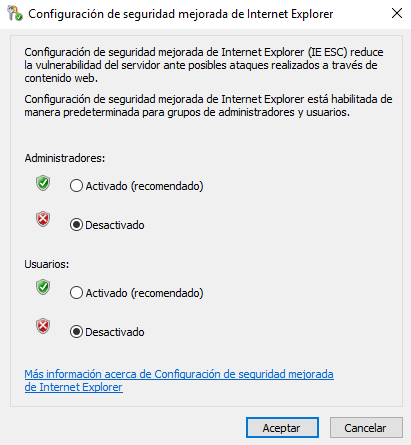

Luego, reiniciamos la máquina para que se apliquen los cambios. Si volvemos, veremos que pone **Desactivado**, ahora ya no nos bloqueará ninguna página.

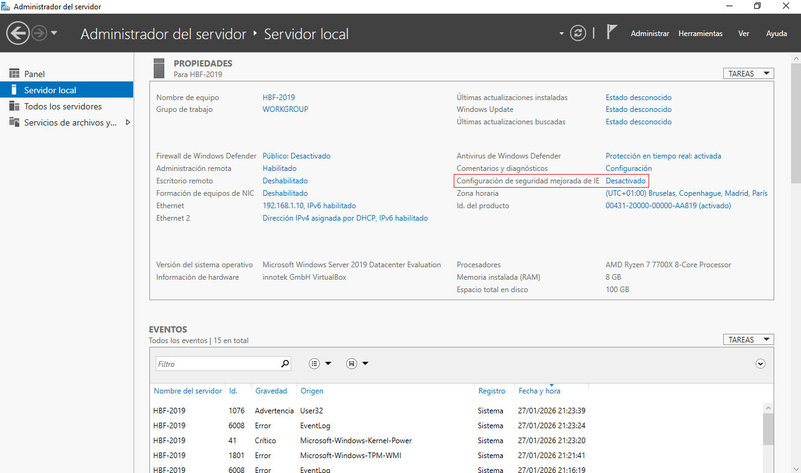

Cuando hayamos reiniciado la máquina, accedemos al enlace de `https://hbf-2019/` y veremos el mensaje de que esa página no es segura. Clicamos en `Más información` y luego a `Continuar en la página web (no recomendado)`.

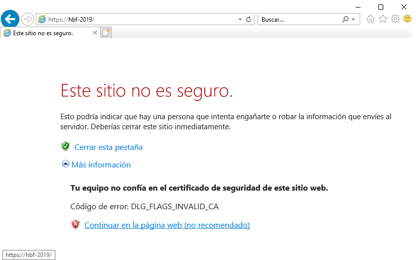

Ahora nos aparecerá la siguiente página:

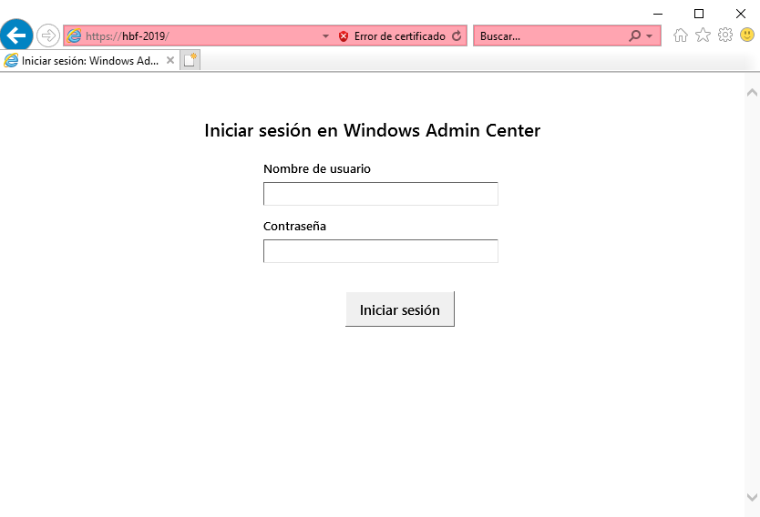

Ya tenemos instalado Windows Admin Center, lo malo es que ya no tiene soporte para Internet Explorer, con lo que no nos dejará iniciar sesión. Hay dos opciones por las que se puede resolver esto:
1. Descargar otro navegador.
2. Acceder por remoto desde otra máquina.

Para esta práctica, hay que hacer el paso 2.

Desde un Windows 10, añadimos en el fichero hosts los servidores, es decir, pondremos esto al final:
```
192.168.1.20 HBF-CORE-2019
192.168.1.30 HBF-CORE-2016
```

Guardamos el archivo. Ahora tendríamos que acceder desde el navegador poniendo `https://"ip-servidor"`.

> 💬 Como no he conseguido hacer los certificados en el ejercicio anterior, no puedo acceder. Pero con esto ya podríamos conectarnos por remoto hacia **Windows Admin Center**.
>
> 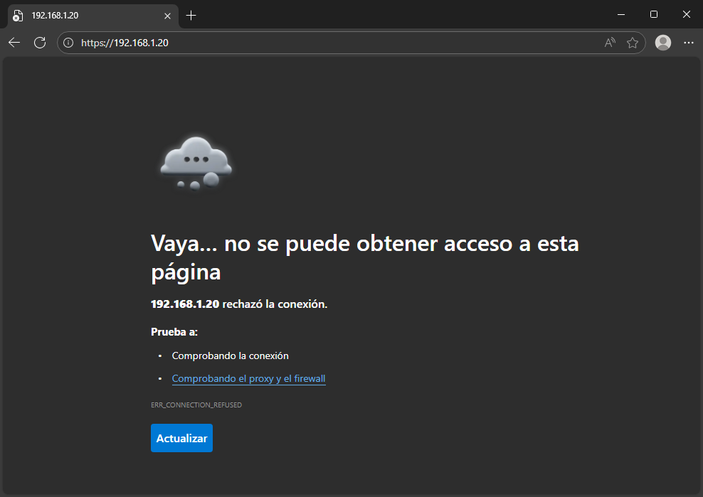

---
### [⬅️ Volver a UT04](../index.md)
---