# 📄 PR0501: Implantación del dominio

## ✅ Objetivos
Eres el nuevo administrador de sistemas del **IES San Andrés**. El centro ha decidido centralizar la gestión de usuarios y equipos, y tu primera tarea es implantar un dominio de Active Directory.

El nombre de dominio interno será: **`iessanandres.local`**

El centro tiene una estructura organizativa que debe reflejarse en el directorio activo para facilitar la gestión. La estructura académica se divide en:

- **Familia de Administración:**
  - Ciclo Superior de Administración y Finanzas (AFI)
  - Ciclo Superior de Asistencia a la Dirección (GAD)
  - Ciclo Medio de Gestión Administrativa (SCO)
- **Familia de Informática:**
  - Ciclo Superior de Desarrollo de Aplicaciones Multiplataforma (DAM)
  - Ciclo Superior de Desarrollo de Aplicaciones Web (DAW)
  - Ciclo Superior de Administración de Sistemas (ASIR)
  - Ciclo Medio de Sistemas Microinformáticos y Redes (SMR)
  - Curso de Especialización en Inteligencia Artificial y Big Data (IAyBD)

Además de los alumnos y profesores de estas familias, también existe el personal de administración y servicios (PAS).

## 📌 1. Promoción del controlador de dominio
En nuestra máquina de **Windows Server 2025**, pondremos la **IP estática** en nuestro adaptador de **sólo anfitrión** en **VirtualBox**. Vamos al **CMD** y ponemos `ipconfig`. Luego, vamos a **`Panel de control → Redes e internet → Centro de redes y recursos compartidos`** y en el menú de la izquierda clicamos en **`Cambiar configuración del adaptador`**. Clicamos en nuestro adaptador y pondremos la IP. En este caso la IP será de la siguiente manera:

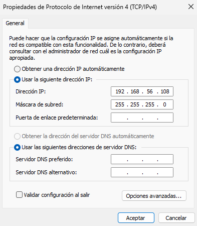

Ahora, instalamos el servicio de Active Directory **(AD)**. Para ello, vamos al apartado de **Herramientas** y luego en **Agregar roles y características**.

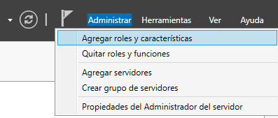

En el siguiente punto de la instalación seleccionamos **Servicios de dominio de Active Directory** y añadimos las características que nos saldrá en una ventana al seleccionarlo.

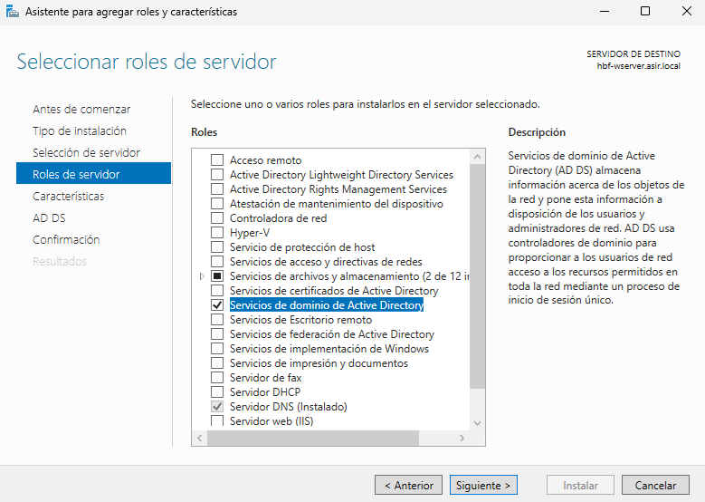

Ahora, en este apartado, seleccionamos la casilla para que se reinicien los servicios en caso necesario y le damos a **Instalar**.

Una vez instalado, tendremos que ir al apartado de notificaciones (porque nos saldrá con un signo de peligro) y clicaremos en **Promover este servidor a controlador de dominio**.

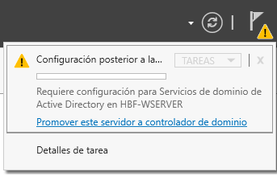

Cuando hayamos clicado, nos saldrá una ventana para configurar el dominio.

En la primera ventana, para crear un nuevo dominio, seleccionamos **Agregar un nuevo bosque** y le pondremos el nombre de `iessanandres.local`.

Pondremos la contraseña para nuestro nuevo bosque, dejamos el nivel funcional tal cual está, si lo cambiamos de versión, se quedará con las funciones de esa versión.

Aquí, solamente clicamos en Siguiente, no podemos hacer clic en **Crear delegación DNS**.

En esta parte, nos sale el nombre que tendrá el dominio cuando se vaya a iniciar sesión. Si es un usuario que ya está dentro, cuando vaya a iniciar sesión, en vez de `"usuario"`, aparecerá como `"IESSANANDRES\'usuario'"`. En mi caso, lo dejaré como viene por defecto.

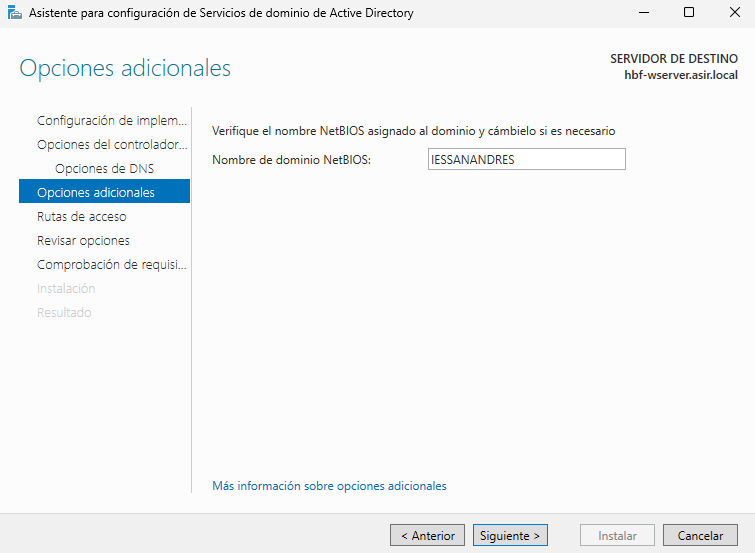

En este apartado, será para saber dónde se va a encontrar las rutas de configuración y del dominio. Podemos dejarlo como viene.

En la siguiente ventana, nos aparecerá un resumen de lo que hayamos configurado antes de crear el controlador de dominio.

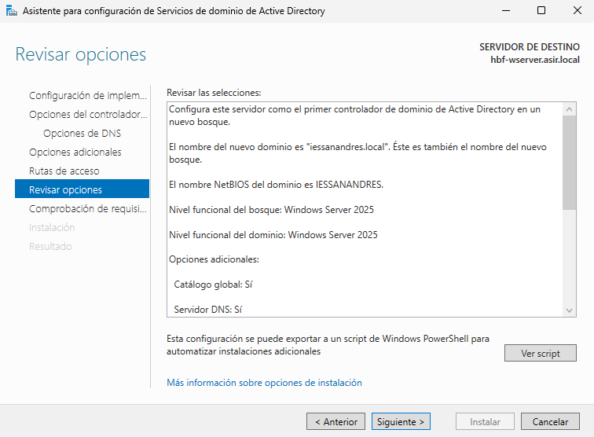

Aquí, se hará una comprobación antes de instalarlo todo. Vemos que al final de la comprobación, tenenemos un ✅. Ahora procedemos a instalarlo.

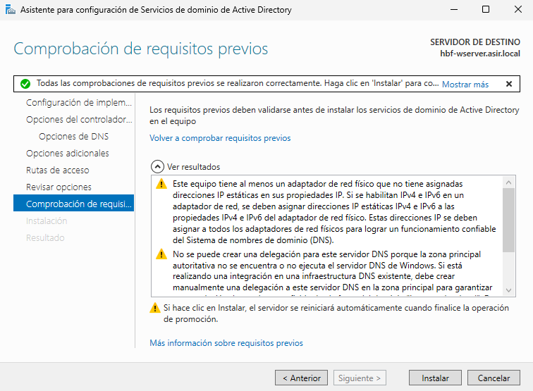

Cuando se haya instalado, se reiniciará el equipo de manera automática cuando haya acabado.  
Podemos ver ahora que al iniciar sesión, podemos ver el dominio.

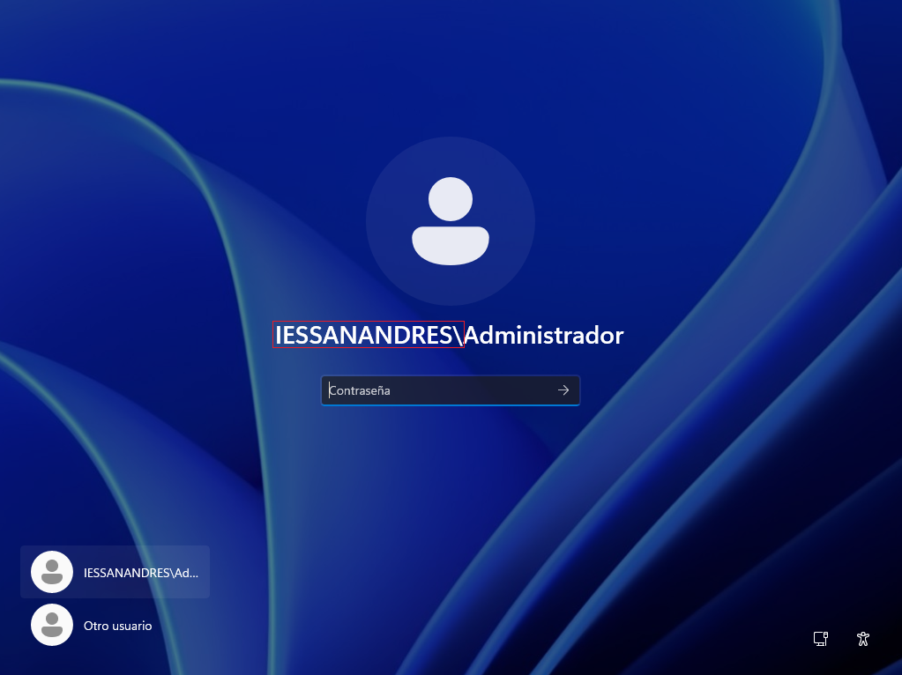

## 📌 2. Diseño de la Estructura de Unidades Organizativas (UO)
Estructura que se va a seguir:

---

- **`IES San Andres`** (UO Raíz para la gestión del centro)
  - **`Alumnado`**
    - `Informatica`
      - `DAM`
      - `DAW`
      - `ASIR`
      - `SMR`
      - `IAyBD`
    - `Administracion`
      - `AFI`
      - `GAD`
      - `SCO`
  - **`Profesorado`**
    - `Informatica`
    - `Administracion`
  - **`Personal_PAS`** (Personal de Administración y Servicios)
  - **`_Grupos`** (UO para almacenar todos los grupos de seguridad)
  - **`_Equipos`** (UO para los equipos del dominio)
    - `Aulas_Informatica`
    - `Aulas_Administracion`
    - `Despachos`

---

> 💬 En el ejercicio, aparece que `Profesorado` aparece al lado de `SCO`. Tendría que estar como en `Alumnados` para tener dentro a los grupos de `Informatica` y `Administracion`.

Para hacer todo esto, vamos a ir a **Herramientas** y **Usuarios y equipos de Active Directory**.

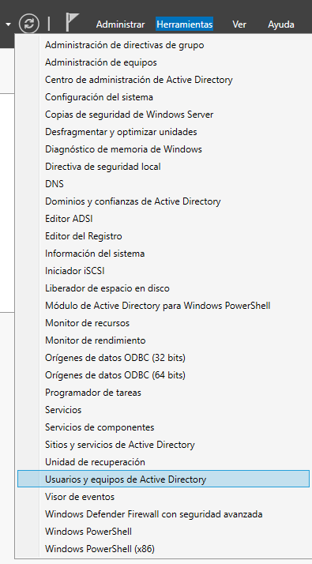

Una vez dentro, haremos clic derecho en nuestro dominio y ahí crearemos a la unidad organizativa principal.

Creamos la **Unidad Organizativa principal**, que será `IES San Andres`.

Ahora, crearemos lo que queda de la estructura dentro de esta unidad organizativa haciendo clic derecho y crear a los grupos y demás unidades organizativas.

Creamos al grupo de Alumnado.

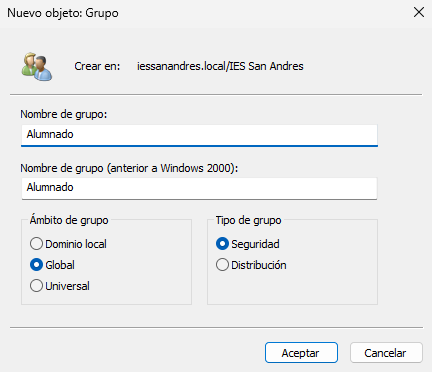

Seguimos haciendo grupos y Unidades Organizativas porque no hay usuarios específicos todavía. Luego, añadiremos esos grupos a otros grupos para tener la estructura deseada.

Al terminar, nos quedará más o menos de la siguiente manera:

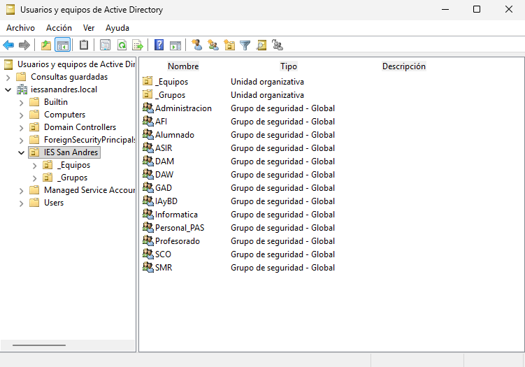

Hay una Unidad Organizativa que tiene otros grupos dentro:

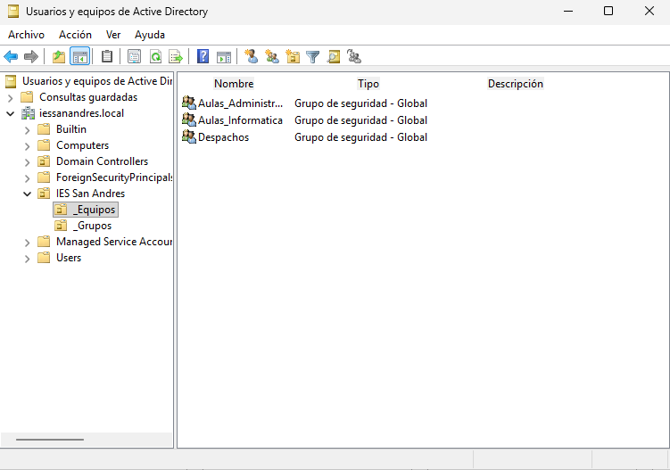

Ahora, agregamos los grupos a otros grupos para que quede todo como en la estructura. En este caso he elegido al grupo de `ASIR` para ponerlo de ejemplo.  
Para añadir un grupo a otro, tenemos que ir al grupo deseado y hacer clic derecho y **Propiedades**. Luego, vamos a la pestaña de **Miembros de** y **Agregar...**. En el cuadro, podemos poner directamente el nombre y luego en Comprobar nombres y si existe, se pone de manera automática.

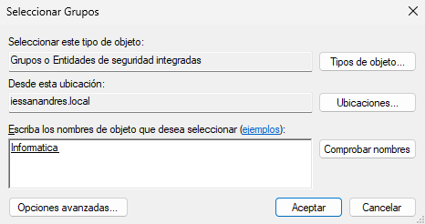

Cuando lo hayamos agregado, nos aparecerá de la siguiente manera:

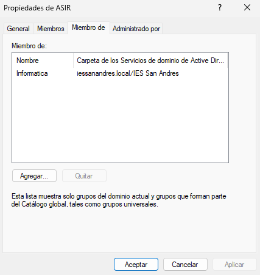

Haremos lo mismo para los demás grupos para tener la estructura.  
Imagenes para ver cómo ha quedado:

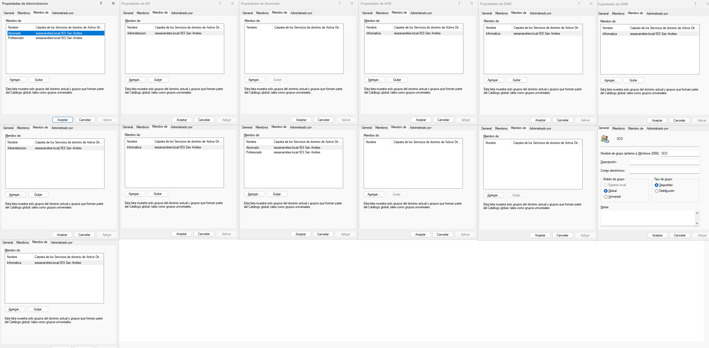
> 💬 Para ver la imagen más grande, puedes hacer clic derecho y **Abrir imagen en pestaña nueva**.

Los que están dentro de la Unidad Organizativa de `_Equipos`, no están asignados a otros grupos.

## 📌 3. Creación de Usuarios y Grupos
### 1. Crear Usuarios:
Para este ejercicio, crearemos usuarios para los grupos, es decir, poblar la Unidad Organizativa.  
Vamos a crear los siguientes usuarios:  
- Dos usuarios para el grupo de `ASIR`
- Dos usuarios para el grupo de `AFI`
- Un profesor para `Profesorado/Informatica`
- Un usuario para `Personal_PAS`

### 2. Crear grupos de Seguridad:
Vamos a crear los siguientes grupos de seguridad dentro de la Unidad Organizativa de `_Grupos`, tal y como hemos hecho en los ejercicios anteriores.  
Los grupos que vamos a añadir son:  
- GRP_Alumnos_DAM
- GRP_Alumnos_AFI
- GRP_Profesores_Informatica
- GRP_Personal_PAS
- GRP_Alumnos_General (Un grupo que contendrá a todos los alumnos)
- GRP_Profesores_General (Un grupo que contendrá a todos los profesores)

### 3. Asignar Miembros:
- Añadimos a los usuarios que hemos creado a sus respectivos grupos.
- Hacer que `GRP_Alumnos_DAM` y `GRP_Alumnos_AFI` pertenezcan al grupo de `GRP_Alumnos_General`.

## 📌 4. Restricción de Horas de Inicio de Sesión

---
### [⬅️ Volver a UT05](../index.md)
---