# 📄 PR0502: Carpetas personales y compartidas por un grupo

## 📌 1. Creación de usuarios y grupos
- Crea una carpeta personal para todos los alumnos de ASIR.

Creamos una carpeta para los alumnos de ASIR en `C:`. Le pondre el nombre de `ASIR_Alumnos`.

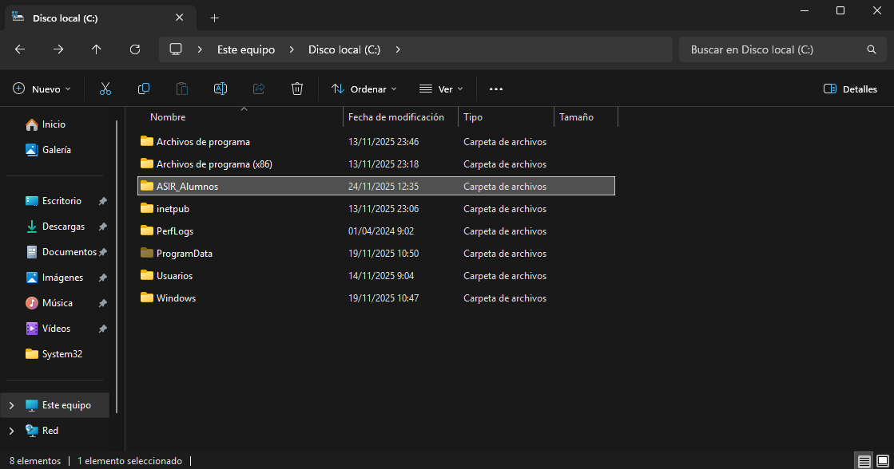

Configuramos la carpeta para que solo los alumnos de **ASIR** puedan acceder a ella.  
Vamos a `Propiedades → Compartir → Uso compartido avanzado`.  
Activamos la casilla de **Compartir esta carpeta** y en **Permisos**, agregamos a los **alumnos de ASIR** y **Administradores** para que nosotros tengamos permisos. Ponemos a los dos con **Control total**.

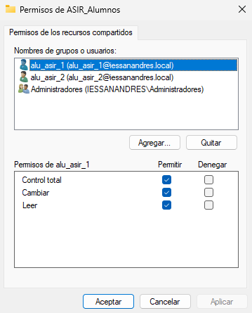

Una vez aplicado y guardado los cambios, en la carpeta nos aparecerá una ruta que en mi caso es `\\HBF-WSERVER\ASIR_Alumnos`.

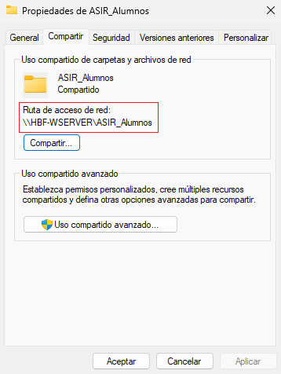

Ya teniendo esto, clicamos en **Compartir...** y compartimos la carpeta con los **alumnos de ASIR** y les pondremos los permisos de **Lectura y escritura**.

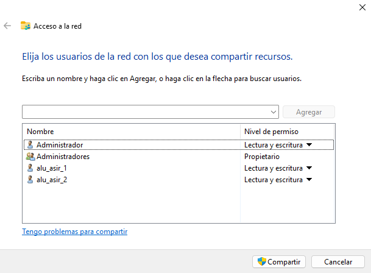

Nos vamos a `Herramientas → Usuarios y equipos de Active Directory`, buscamos a los alumnos, hacemos una seleccióon múltiple y vamos a las **Propiedades** con clic derecho.  
En la pestaña de **Perfil**, marcamos el checkbox de **Carpeta particular** y seleccionamos la opción de **Ruta al acceso local** y pondremos la ruta absoluta de la carpeta, en mi caso es `C:\ASIR_Alumnos`.

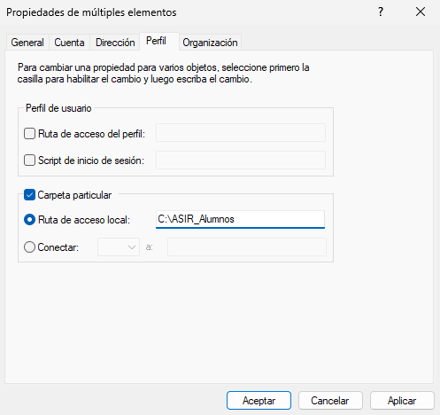

Así ya tendremos la carpeta compartida con los **alumnos de ASIR**.

## 📌 2. Carpetas personales
- Instala el *Administrador de recursos del servidor de archivos* que está dentro del rol *Servicios de archivos y almacenamiento*.
- Utilizando la herramienta *Servicios de archivos y de almacenamiento* del *Administrador del servidor*, crea una carpeta para cada usuario dentro de `C:\shares` y realiza los pasos necesarios para que ambos usuarios puedan ver esta carpeta como una unidad de red identificada con la letra `H:`.
- Comprueba que la carpeta de cada usuario solo pueda ser accedida por él mismo.

Vamos a `Administrar → Agregar roles y características` y en los roles, desplegamos el rol de **Servicios de archivos y almacenamiento**. Luego, desplegamos en **Servicios de ISCSI y archivo** y por último, seleccionaremos para instalar `Administrador de recursos del servidor de archivos`.


Le damos todo a **Siguiente** y seleccionamos la opción de **Reiniciar servicios en caso necesario**.  
Cuando ya lo tengamos instalado, en el menú de la izquierda del **Administrador del servidor**, tenemos una nueva sección llamada **Servicio de archivos y almacenamiento**.

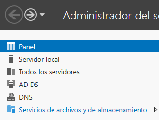

Al hacer clic, se abre otro menú al lado en el que clicaremos en **Recursos compartidos**. Ahora, para añadir un recurso compartido, hacemos clic derecho y **Nuevo recurso compartido**.

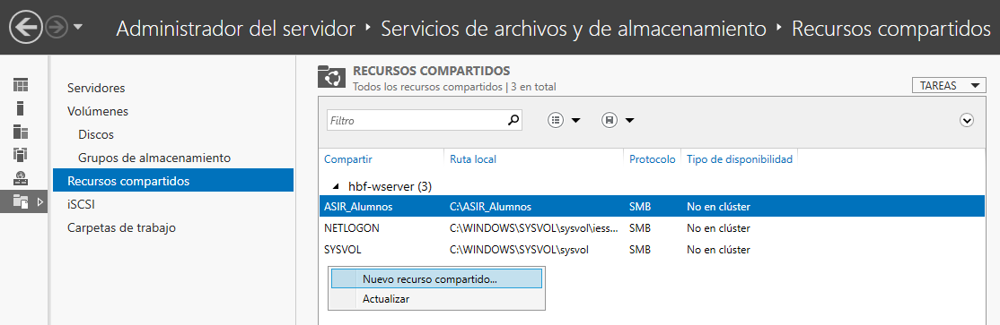

Dejamos los valores por defecto excepto en ponerle el nombre, en mi caso, le pondré el nombre de **Compartir** porque el servicio utiliza de forma automática la carpeta `C:\shares`.

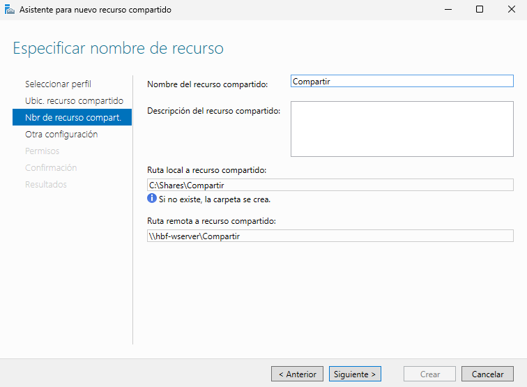

Cuando le demos a **Crear**, si no ha habido errores, nos aparecerán dos tareas con el progreso completado.

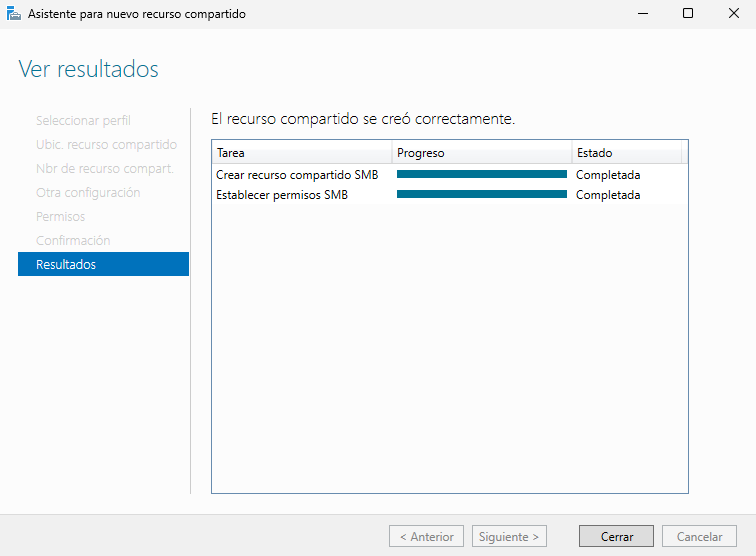

Para crear una carpeta que pertenezca a cada alumno, en vez de tener que crearlo manualmente, podemos hacer lo siguiente:  
Vamos a **Usuarios y equipos de Active Directory**, escogemos al alumno `alu_asir_1` y con doble clic vamos a las `Propiedades → Perfil`. En **Carpeta particular**, clicamos en la opción de **Conectar:**, pondremos la unidad `H:` y pondremos la ruta que en mi caso es `\\HBF-WSERVER\Compartir\%username%`.

> 💬 `%username%` es el usuario que se va a utilizar, se pone así en vez de poner el usuario completo.

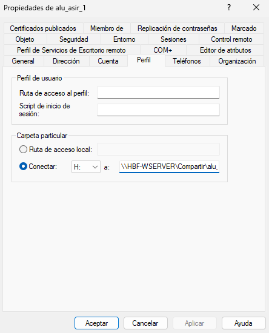

Hacemos lo mismo para `alu_asir_2`.

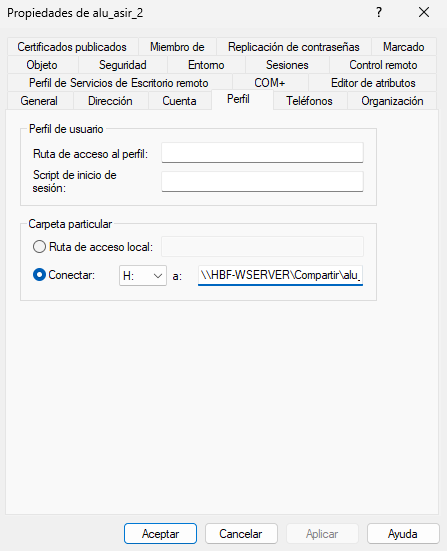

Cuando ya lo tengamos, vamos a la carpeta que hemos creado y podremos ver las carpetas de los alumnos.

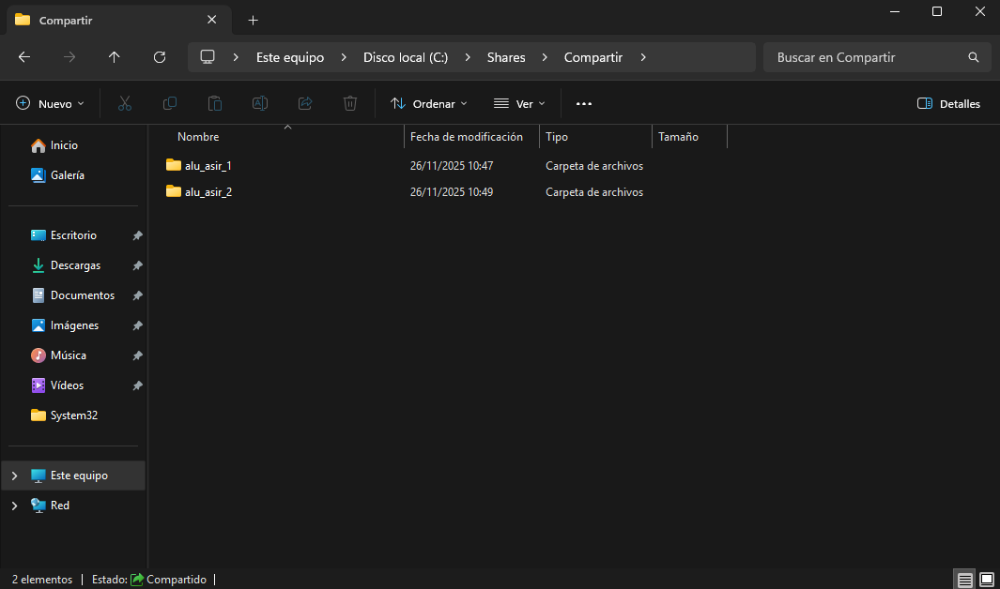

### ✅ Comprobación
Para comprobar que haya funcionado correctamente, conectaremos un equipo Windows 10 (con un adaptador de red en *Host Only* y otro adaptador en *NAT*) a nuestro dominio. Primero comprobaremos que desde el equipo, hace `ping` al servidor, si lo hace, podremos conectarlo.  
Para conectarlo al dominio, vamos a tener que ir hacia `Configuración → Sistema → Acerca de` y en el menú de la derecha, clicamos en **Configuración avanzada del sistema**. Vamos a la pestaña de **Nombre de equipo** y clicamos en **Cambiar...**, ahí clicaremos en **Dominio:** y pondremos nuestro dominio que es `iessanandres.local`.

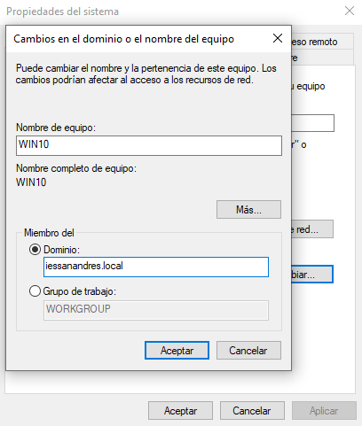

Al hacer clic, nos pedirá unas credenciales, que son las del *administrador del servidor*. Cuando ya lo tengamos, tenemos que reiniciar el equipo.  
Una vez reiniciado el equipo, vamos a entrar con los alumnos `alu_asir_1` y `alu_asir_2`.

- alu_asir_1:


- alu_asir_2:

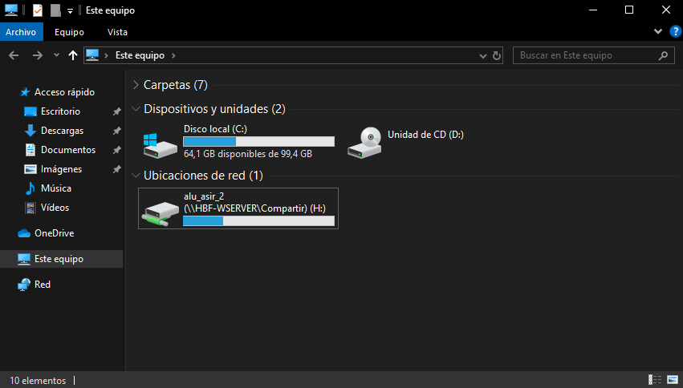

Para ver realmente si se ha conectado el equipo, vamos a **Usuarios y equipos de Active Directory** y en el dominio, al hacer clic en la carpeta de **Computers**, vemos que se ha conectado el equipo.

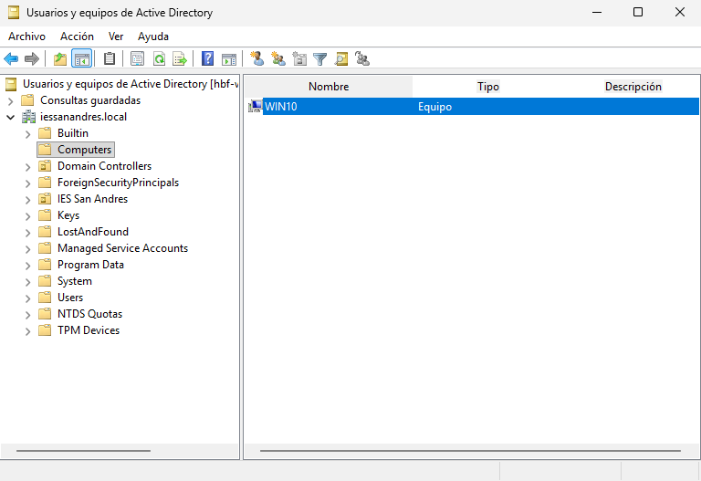

## 📌 3. Carpetas compartidas por un grupo
- Crea en `C:\shares` una carpeta llamada `apuntes` y realiza las tareas necesarias para que los alumnos de ASIR puedan acceder a ella como un espacio de almacenamiento compartido con permiso de lectura.
- Luego crea otra llamada `práctica` en la que tengan permiso de lectura y escritura.

Dentro de la carpeta localizada en `C:\Shares`, creamos una carpeta llamada `Apuntes`. Vamos a las **Propiedades** de la carpeta, luego, a la pestaña de **Compartir**, clicamos en **Compartir...** y añadimos el grupo `GRP_Alumnos_ASIR` en el que tiene los alumnos como miembros del grupo.

> 💬 Si el grupo no existe, lo creamos y metemos a los alumnos de ASIR.

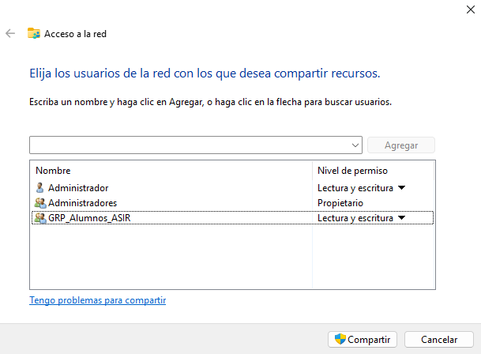

Para hacer que se automonte, tenemos que crear un archivo `.bat` que lo haremos en `\\localhost\NETLOGON`.

> 💬 Podemos poner la dirección en la barra de arriba y entraríamos directamente.

El archivo contiene la siguiente línea:
```
net use I: \\HBF-WSERVER\Apuntes
```

> 💬 Hay que poner una letra distinta porque si se vuelve a poner `H:` habría conflicto y daría error.

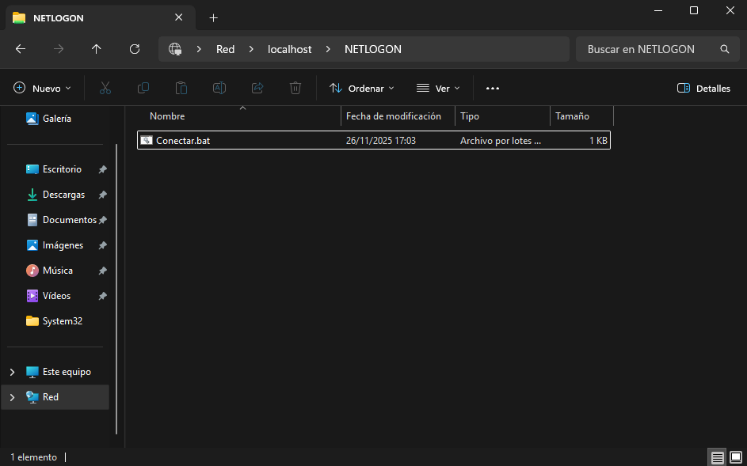

Ahora, vamos a **Usuarios y equipos de Active Directory** y entramos en las **Propiedades** de los dos alumnos de `ASIR` e iremos a **Perfil**. En **Script de inicio de sesión:**, pondremos el archivo `.bat` que hemos creado para que se automonte la carpeta para los alumnos.

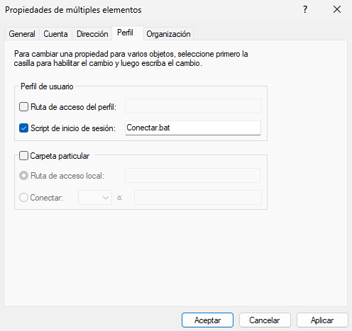

Iniciamos sesión con un usuario, por ejemplo, `alu_asir_1` y vamos al **Explorador de archivos** para ver si nos aparece la carpeta.

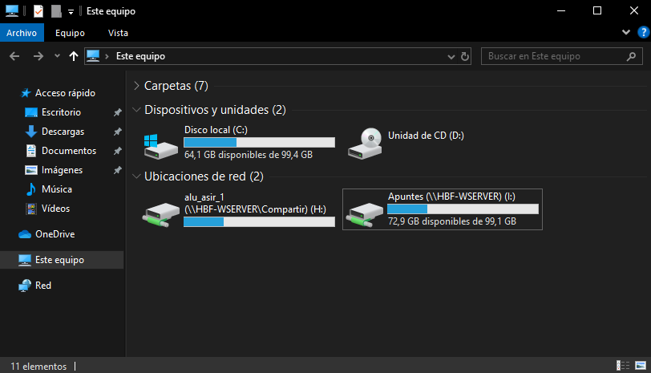

Creamos una nueva carpeta que se llamará `Practica` y haremos lo mismo, menos en el **Script de inicio de sesión** porque se va a usar el mismo, y en el archivo `.bat` pondremos:
```
net use J: \\HBF-WSERVER\Practica
```

Y sí, se puede usar el mismo archivo.

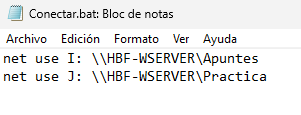

> 💬 En el ejercicio al crear la carpeta pone que se tiene que llamar `práctica` pero al poner comandos no se reconocen las tildes.

Cuando ya tengamos todo configurado, nos quedará el Explorador de Archivos de la siguiente manera:

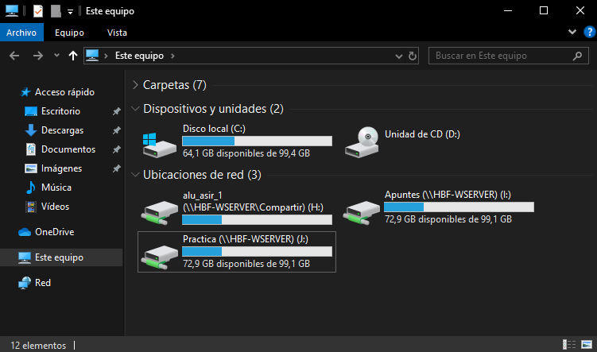

---
### [⬅️ Volver a UT05](../index.md)
---