# 📄 PR0503: Aplicación de GPOs y Seguridad

## 📁 Parte `I`: Configuración de políticas de usuario
### 📌 1.1: Creación del GPO "Restricciones Alumnos"
Desde **Herrmientas**, clicamos en **Administración de directivas de grupo**.  
Desplegamos nuestro dominio y y buscamos la UO de **Alumnado**.  
Hacemos clic derecho y elegimos **Crear un GPO...**:

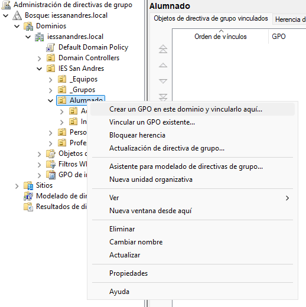

Le ponemos el nombre de `GPO_ALU_RESTRICCIONES`.  
Cuando lo tengamos creado, nos aparecerá así:

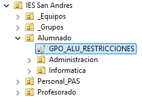

Para asignarle las directivas al GPO, hacemos clic derecho y Editar. Se nos abrirá una ventana donde podremos buscar las directivas que nos pide el ejercicio.

- Bloqueo del Panel de control: Navega a **Plantillas administrativas → Panel de control**. Habilita la política *"Prohibir el acceso al Panel de control y a la configuración del equipo"*.

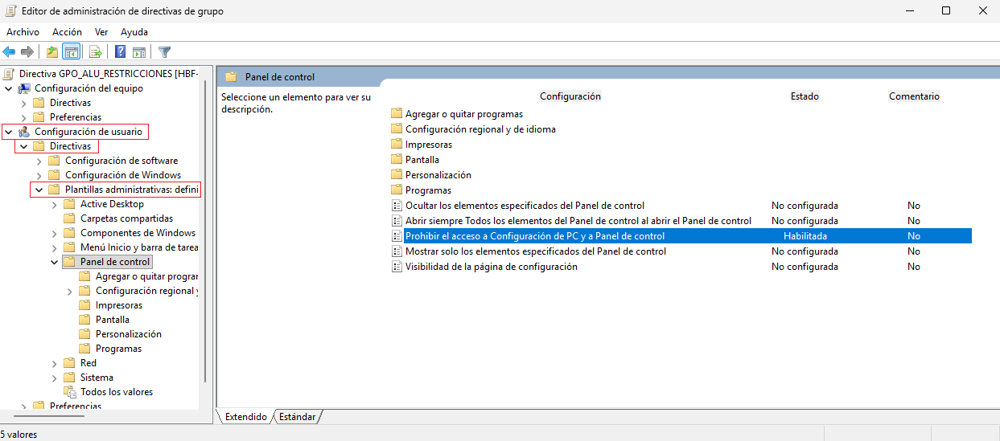

- Establecer fondo de Escritorio: Navega a **Plantillas administrativas → Escritorio → Escritorio**. Habilita la política *"Fondo de escritorio"* y establece una ruta de red válida (ej. `\servidor_dc\recursos\fondo.jpg`).

Para hacer esto, necesitaremos hacer la configuración necesaria para que todos aquellos usuarios puedan acceder. Primero, crearemos la carpeta con la imagen dentro y después, haremos el recurso compartido desde el **Administrador de servidor → Servicios de archivos y de almacenamiento → Recursos compartidos**.

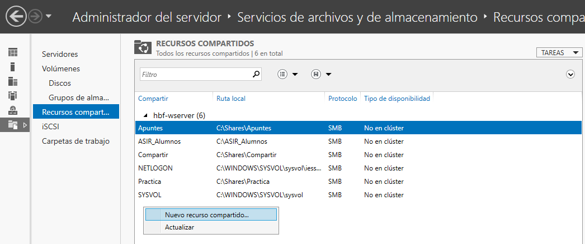

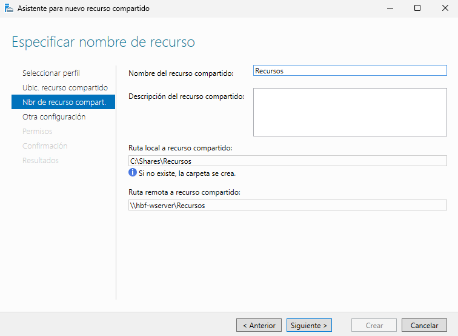

Ahora configuramos la directiva. Tendremos que habilitar **Active Desktop** y **Tapiz del escritorio**, y dentro de ello, pondremos la ruta de la imagen.

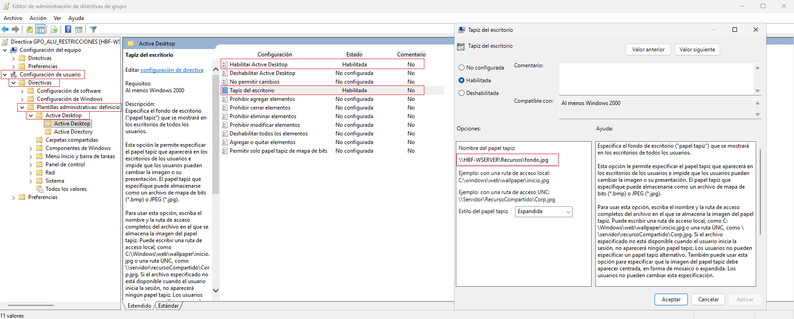

- Ocultar unidades de disco: navega a **Plantillas administrativas → Componentes de Windows → Explorador de archivos**. Habilita la política *"Ocultar estas unidades específicas en Mi PC"* y selecciona la opción *"Restringir las unidades A, B, C y D"*.

Iremos a las direcciones que vienen en la imagen:

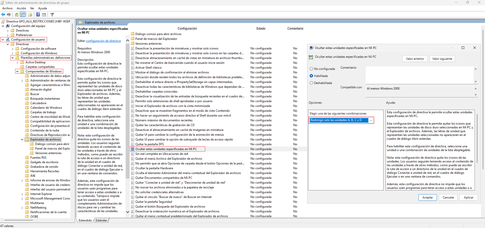

### 📌 1.2: Verificación de un usuario
Para hacer la comprobación, iniciaremos sesión con un alumno, en mi caso será con alu_asir_1.  
Cuando hayamos iniciado sesión, abrimos el CMD para ejecutar el comando `gpupdate /force`. Esto nos permite aplicar de manera forzosa los cambios de las directivas.

Observamos lo siguiente:
- Intentar abrir el Panel de control.
- Mirar el fondo de pantalla (he descargado una imagen).

## 📁 Parte `II`: Políticas de equipo y acceso a recursos
### 📌 2.1: Política de seguridad (UO `_Equipos`)
Creamos el GPO con el nombre de `GPO_SEG_BASE` y lo creamos directamente en la UO de `Aulas_Informatica`.

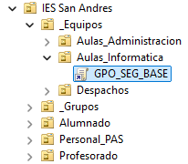

- Le ponemos la directiva de seguridad: **Configuración de seguridad → Directivas de cuentas → Directiva de contraseña → Longitud mínima de la contraseña**: 8 caracteres.

Seguimos las direcciones de la imagen.

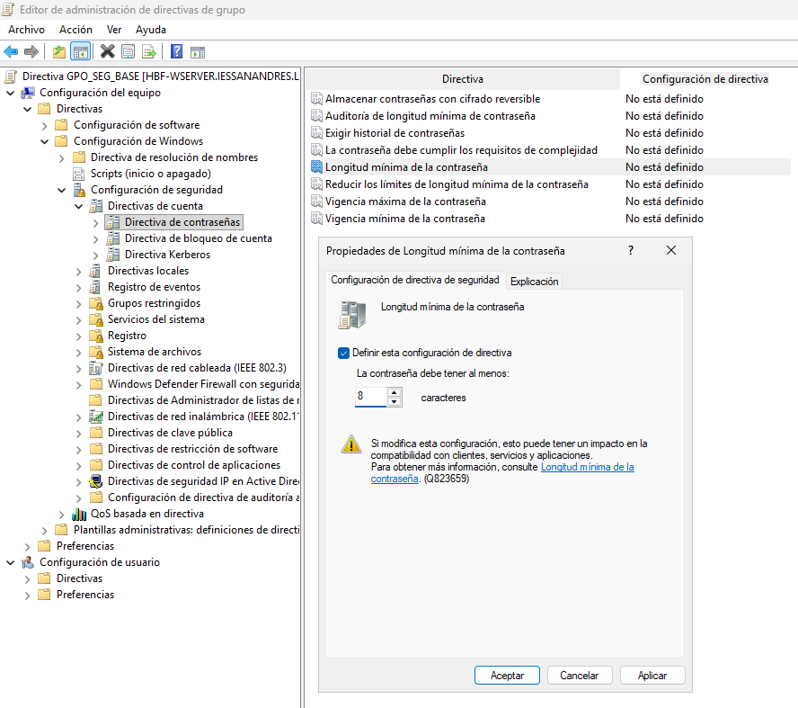

- Le ponemos la directiva de **Configuración de seguridad > Directivas locales > Opciones de seguridad**. Establece *"Cuentas: Cambiar nombre de la cuenta de administrador"* a `AdministradorLocal1`.

Seguimos las direcciones de la imagen.

### 📌 2.2: Mapeo de unidad específica (UO `Administracion`)
Creamos el GPO con el nombre de `GPO_ADM_UNIDAD_Z` en **Alumnado → Administracion**.

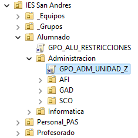

- Le ponemos la directiva: **Configuración de Usuario > Preferencias > Configuración de Windows > Asignaciones de Unidad** con las siguientes especificaciones:
  - **Acción:** crea una nueva **Asignación de Unidad**.
  - **Ubicación:** `\\HBF-WSERVER\Compartir\Administracion` (Asume que esta ruta existe).
  - **Etiqueta:** `Recursos_ADM`.
  - **Letra de Unidad:** `Z:`.

> 💬 Tenemos que crear el recurso compartido para que no de errores. Luego de crearla, configuramos la directiva.

Seguimos las indicaciones de las imagenes:

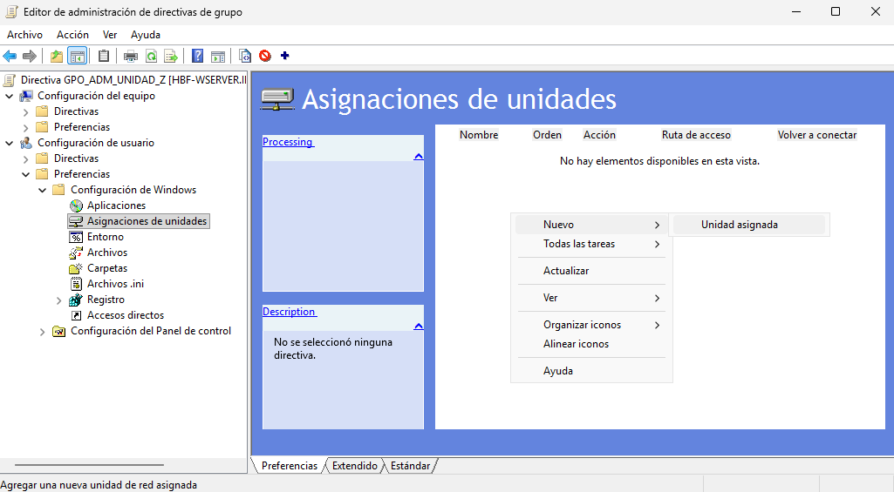

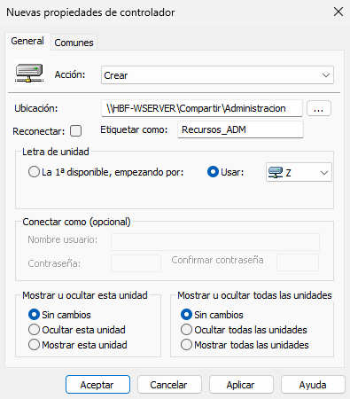

### 📌 2.3: Verificación de recurso
Iniciamos sesión con un usuario, en mi caso será otra vez `alu_asir_1` y vemos si podemos ver los discos o no.

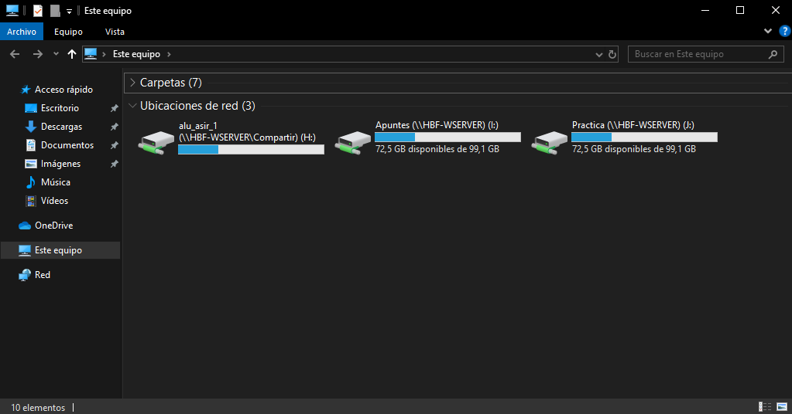

Ahora comprobamos con el usuario `alu_afi_1`.

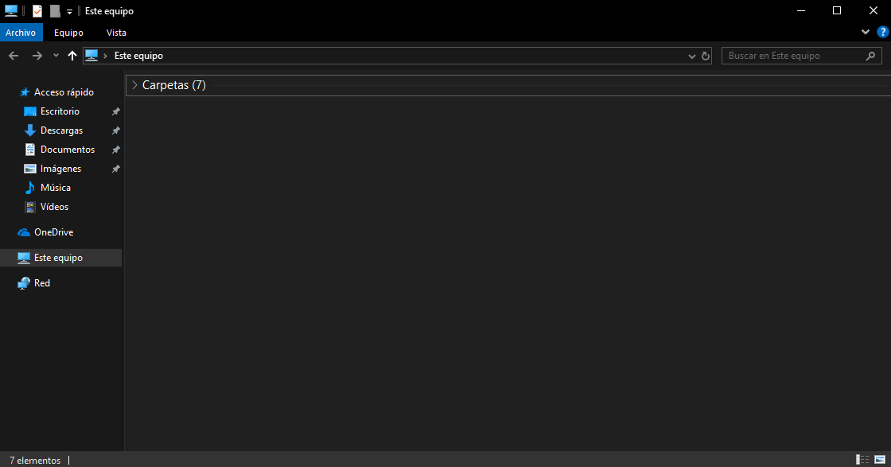

---
### [⬅️ Volver a UT05](../index.md)
---