# 📄 PR0504: Directivas de seguridad, GPP y Filtros WMI

## 📁 Parte 1: Endurecimiento de la seguridad
Creamos el GPO con el nombre de `GPO_Harden_Security_Equipos` en la UO de `_Equipos`.

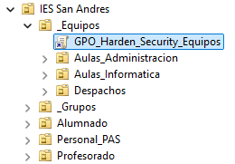

Para hacer los ejercicios, haremos clic derecho y luego en **Editar**.

### 📌 1.1. Protección de cuentas y acceso
- **Renombrar cuenta de administrador:** por seguridad, la cuenta local `Administrador` es un objetivo común de ataques. Configura la directiva para que esta cuenta se renombre a `Admin_Local_IES`.

Seguimos las rutas de la imagen:

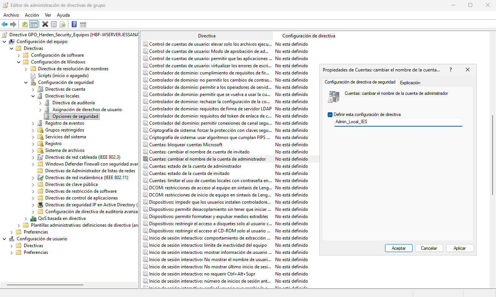

- **Inicio de sesión interactivo:** configura el equipo para que no requiera pulsar `Ctrl+Alt+Supr` para iniciar sesión.

Seguiremos la ruta de la imagen:

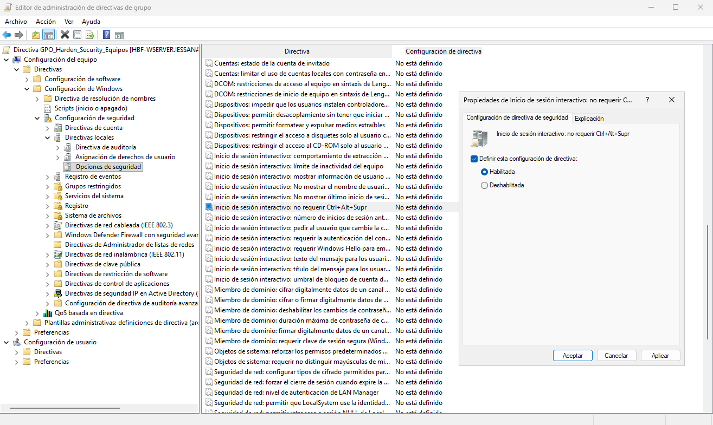

### 📌 1.2. Aviso legal (Consentimiento informado)
Configura el sistema para que, antes de iniciar sesión, muestre un mensaje legal a los usuarios.

- Título del mensaje: `Aviso de Seguridad del IES San Andrés`

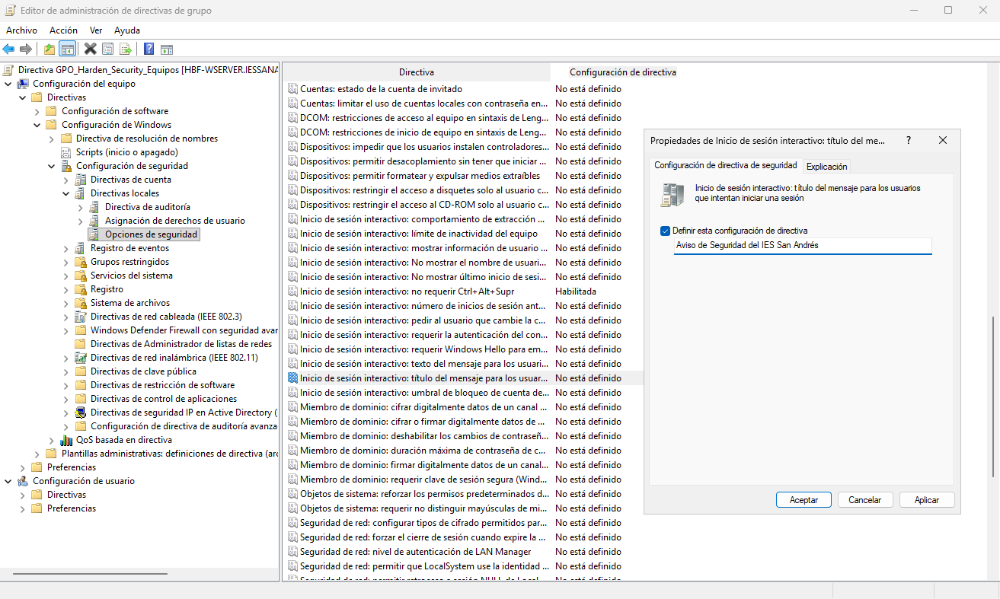

- Texto del mensaje: `El uso de este equipo está monitorizado. El acceso está restringido únicamente a personal y alumnado autorizado.`

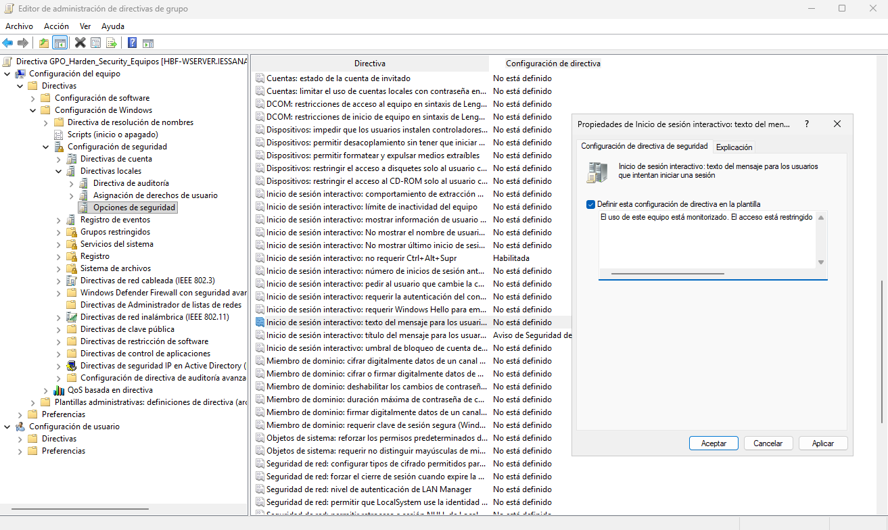

### 📌 1.3. Privacidad y apagado
- **Privacidad:** Configura el inicio de sesión interactivo para que **no muestre el último nombre de usuario** que inició sesión.

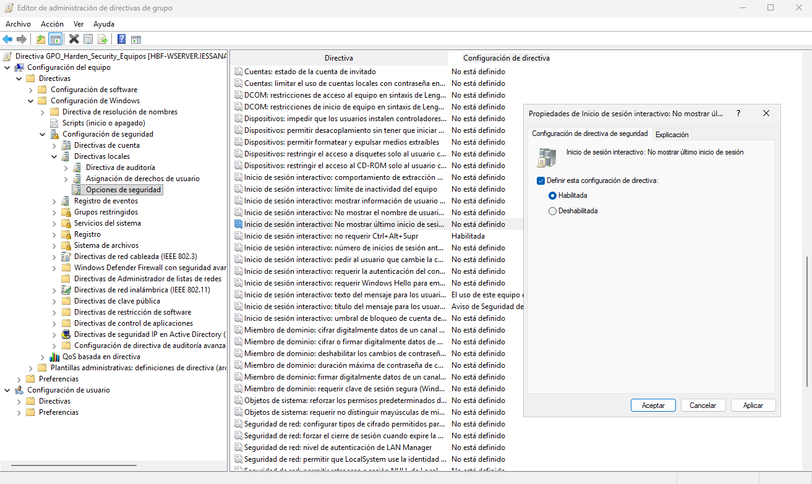

- **Apagado:** Deshabilita la opción que permite **apagar el sistema sin tener que iniciar sesión**.

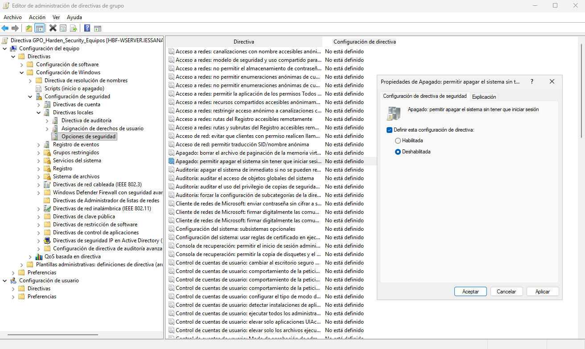

## 📁 Parte 2: Preferencias de grupo (GPP) y segmentación
Las GPP funcionan igual que las GPO pero, en vez de escoger las directivas en la estructura de carpetas cuando se le va a asignar algo a una GPO, vamos a la carpeta de Preferencias y haremos los ejercicios desde ahí.  
Creamos una GPO con el nombre de `GPO_Configuracion_Usuario_Dinamica` que estará vinculada a la UO de todo nuestro dominio.

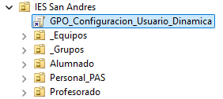

### 📌 2.1. Mapeo de unidades de red (Drive Maps)
- Crea una unidad de red mapeada (letra `P:`) que apunte a una carpeta compartida llamada `Recursos_Profesores`.
- **Requisito:** Usa **Item-Level Targeting (Destinatarios)** para que esta unidad **SOLO** se monte si el usuario pertenece al grupo `GRP_Profesores_General`.

Lo primero que haremos es crear una carpeta llamada `Recursos_Profesores` dentro de `C:\Shares`. En las Propiedades, vamos a la pestaña de **Compartir** y luego al botón de **Configuración avanzada**. Metemos al grupo `GRP_Profesores_General`, le damos Control total y quitamos al resto de usuarios y grupos.

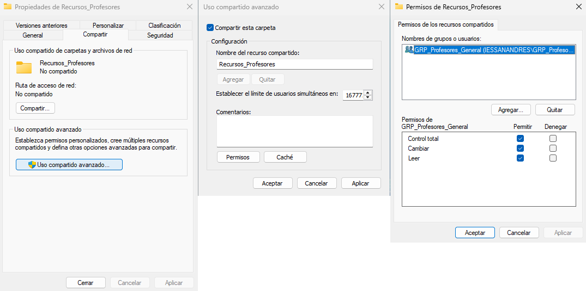

La ruta será `\\HBF-WSERVER\Recursos_Profesores`.

Cuando lo tengamos, tendremos que ir a la ventana donde configuramos anteriormente los GPO, hacemos clic derecho y **Editar** en el GPO que hemos creado para el ejercicio.  
Se abrirá un menú como en los ejercicios anteriores donde hemos trabajado con las directivas, pero esta vez desplegamos en **Configuración de usuario → Preferencias → Configuración de Windows** y buscamos la opción de **Asignaciones de unidades**. Hacemos primero clic izquierdo y después clic derecho sobre el espacio en blanco y clicamos en **Nueva propiedad de controlador**.

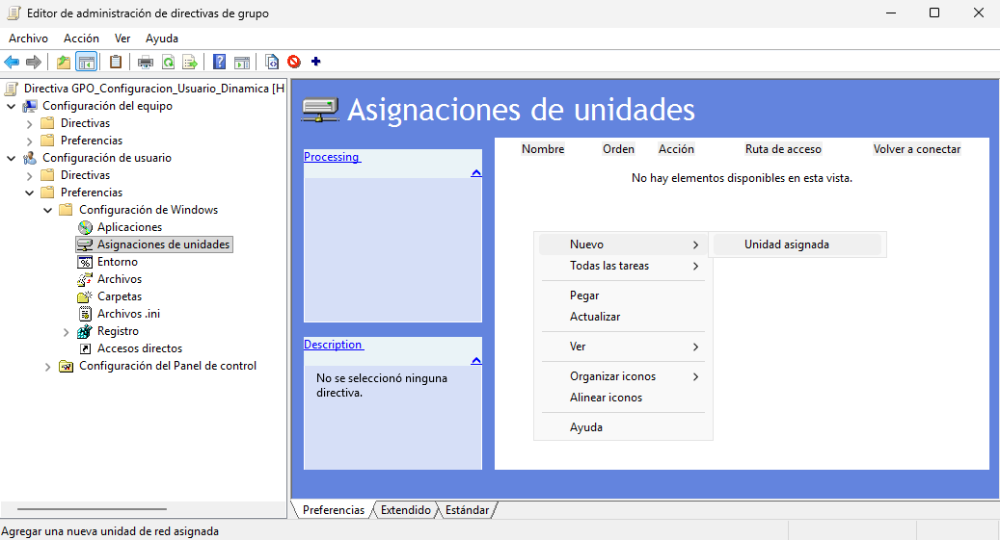

Se abrirá una ventana a la que tendremos que dejarla como en la imagen.

Para ponerle el requisito para que solo afecte al grupo de `GRP_Profesores_General`, tenemos que ir a la pestaña **Comunes**, marcamos el último "checkbox" que viene y clicamos en el botón de **Destinatarios...** para elegir a que objeto queremos que haga referencia.

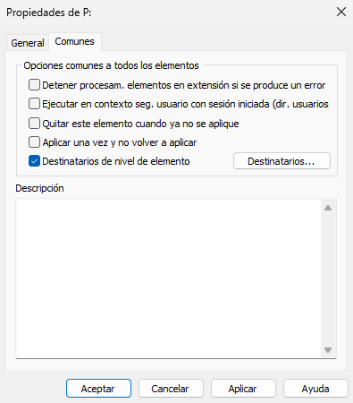

Se abrirá una ventana en la que debemos darle al desplegable de la parte superior izquierda que se llama **Nuevo elemento**. Se desplegará una lista y tenemos que seleccionar **Grupos de seguridad** que tiene el icono de dos cabezas.

Añadimos el grupo clicando en los tres puntos y le damos a **Aplicar**.

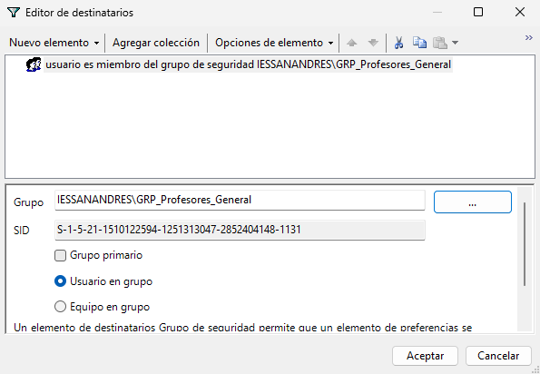

### 📌 2.2. Accesos Directos (Shortcuts)
- Crea un acceso directo en el Escritorio que apunte a `http://intranet.iessanandres.local` (puedes inventar la URL).
- **Requisito:** Usa **Item-Level Targeting** para que este acceso directo **SOLO** aparezca a los miembros del grupo `GRP_Alumnos_DAM`.

Estando en el mismo lugar que en el ejercicio anterior, vamos ahora hacia **Accesos directos**. Hacemos clic derecho en **Nuevo → Acceso directo**.

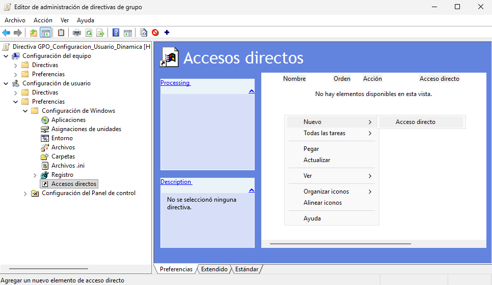

Rellenamos la ventana que nos ha salido de manera que quede como en la de la imagen:

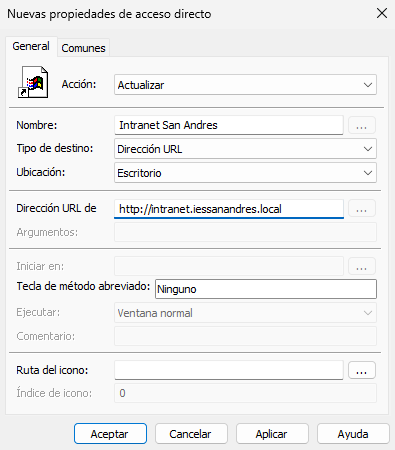

Ahora, para conectarlo al grupo de `GRP_Alumnos_DAM`, haremos exactamente lo mismo que en el ejercicio anterior, en las Propiedades, marcamos el último "checkbox" y clic en **Destinatarios...**, añadimos al grupo.

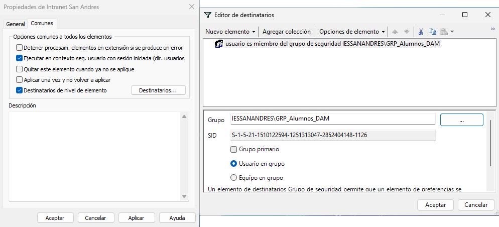

### Comprobaciones
- Comprobación del ejercicio 2.1.

Iniciamos sesión con el usuario `prof_info_1`.  
El resultado que se ha obtenido es que podemos ver el recurso compartido en **Ubicaciones de red** desde el **Explorador de archivos**.

- Comprobación del ejercicio 2.2.

Iniciamos sesión con el usuario `alu_dam_1`.  
> 💬 Se ha tenido que crear al usuario y agregarlo al grupo GRP_Alumnos_DAM.

## 📁 Parte 3: Filtrado WMI Avanzado
### 📌 3.1. Gestión de Memoria Virtual

### 📌 3.2. Diferenciación de Sistema Operativo (Workstation vs Server)

---
### [⬅️ Volver a UT05](../index.md)
---