# 📄 PR0601: Introducción a Powershell

> 💬 Para hacer los ejercicios, se pondrá los apartados que pide cada ejercicio, el comando que se usa y el resultado de ese comando.

## 📌 1. Descubrimiento y ayuda
- **Búsqueda por nombre (Sustantivo):** lista todos los comandos disponibles en el sistema que tengan la palabra `Service` en su nombre (noun) para identificar qué herramientas tienes para gestionar servicios.

```powershell
Get-Command -Noun Service
```


- **Búsqueda por acción (Verbo):** lista todos los comandos disponibles cuya acción sea `Stop` (detener), independientemente de lo que detengan.

```powershell
Get-Command -Verb Stop
```


- **Uso de la ayuda:** muestra por pantalla la ayuda detallada del comando `Get-Process`, pero asegúrate de que se muestren específicamente los **ejemplos** de uso.

```powershell
Get-Help -Name Get-Process
```


Si queremos la ayuda completa, pondremos al final del comando `-Full`. Es decir:  
```powershell
Get-Help -Name Get-Process -Full
```

## 📌 2. Exploración de objetos
- **Introspección de tipos:** ejecuta el comando para obtener la fecha actual (`Get-Date`) pero canaliza su salida para ver la lista de sus Miembros (Members).

Para ver los miembros, pondremos:  
```powershell
Get-Date | Get-Member
```


> 💬 Comando demasiado largo para poner el resultado completo.

- **Responde:** ¿Cuál es el `TypeName` del objeto devuelto?.

Al poner `Get-Date | Get-Member`, al principio del todo, se indica el **TypeName** que en este caso es `System.DateTime`.

- **Identificación de Propiedades vs Métodos:** usando el comando `Get-Member` sobre un proceso cualquiera (ej: `Get-Process`), identifica el nombre de un **Método** que permita finalizar (matar) el proceso.

Podemos filtrar los resultados usando `-MemberType`.
```powershell
Get-Process | Get-Member -MemberType Method
```

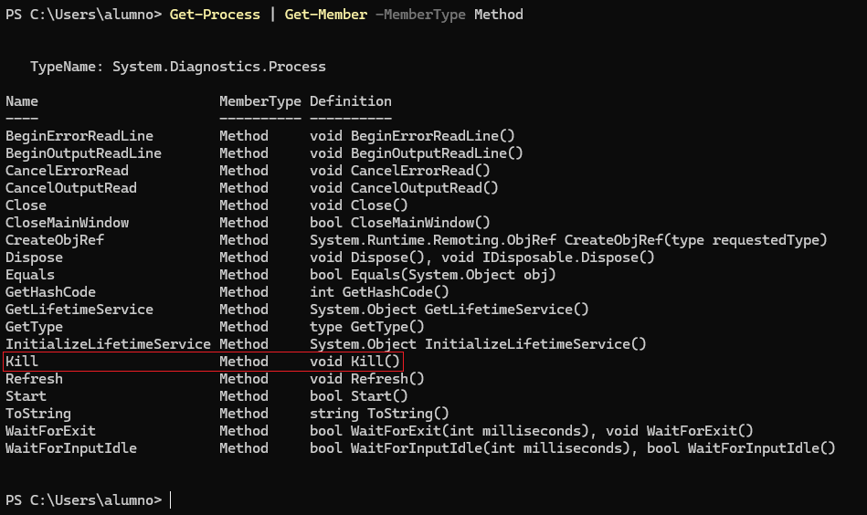

Podemos ver enmarcado en rojo que hay un método llamado `Kill` con la definición de `void Kill()`.  
Se puede filtrar mejor aún el resultado para que solo nos busque la palabra `Kill`.  
```powershell
Get-Process | Get-Member | Where-Object Name -eq "kill"
```

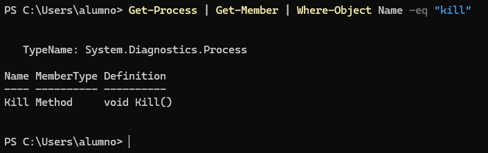

## 📌 3. El Pipeline (selección y ordenación)
- **Selección de columnas:** obtén la lista de todos los procesos, pero muestra por pantalla **únicamente** las propiedades `Id` y `ProcessName`. El resto de información debe ser descartada.

```powershell
Get-Process | Select-Object Id, ProcessName
```

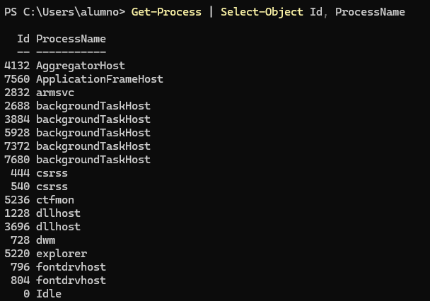

> 💬 Comando demasiado largo para poner el resultado completo.

- **Ordenación básica:** lista todos los procesos del sistema, ordenados por su consumo de `CPU` de forma **descendente** (el que más consume primero).

```powershell
Get-Process | Sort-Object cpu -descending
```

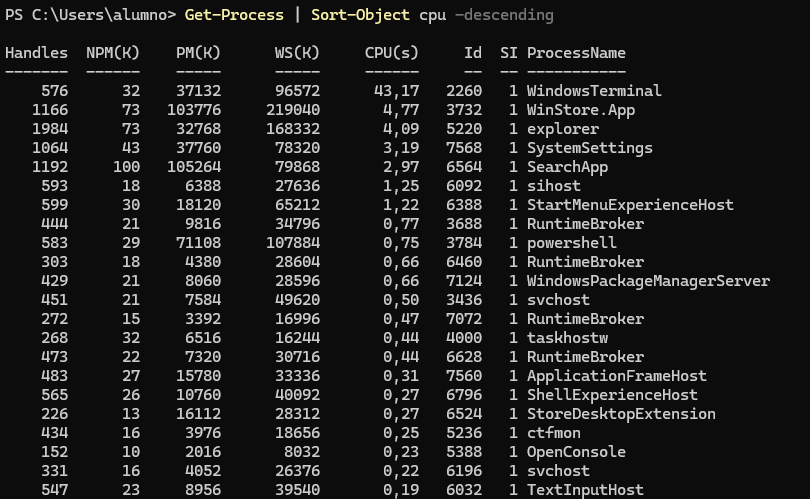

> 💬 Comando demasiado largo para poner el resultado completo.

- **Formato de tabla:** obtén los servicios del sistema y fuerza la salida para que se muestre como una tabla (`Format-Table`) que se auto-ajuste (`-AutoSize`) al ancho de la ventana.

```powershell
Get-Service | Format-Table -AutoSize
```

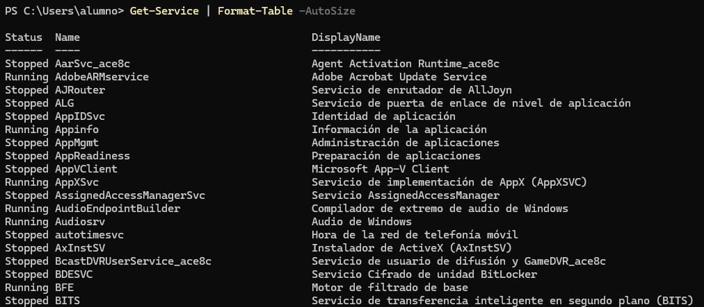

> 💬 Comando demasiado largo para poner el resultado completo.

## 📌 4. Filtrado y lógica (Where-Object)
- **Filtrado exacto:** muestra una lista de los servicios cuyo estado (`Status`) sea exactamente igual (`-eq`) a "Running".

```powershell
Get-Service | Where-Object Status -eq "Running"
```

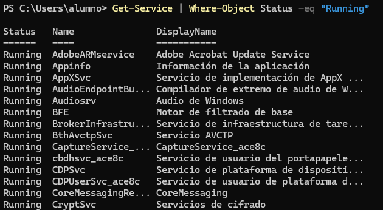

> 💬 Comando demasiado largo para poner el resultado completo.

- **Filtrado numérico:** lista los procesos cuyo identificador (`Id`) sea mayor que (`-gt`) 2000.

```powershell
Get-Process | Where-Object Id -gt 2000
```

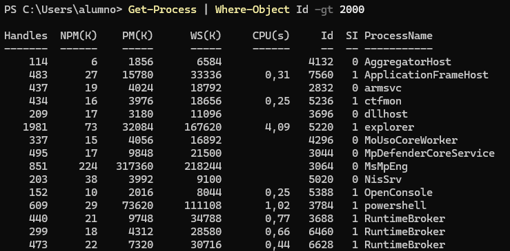

> 💬 Comando demasiado largo para poner el resultado completo.

- **Filtrado con comodines:** busca y muestra todos los procesos cuyo nombre (`Name`) comience por la letra "s" utilizando el operador `-like` y el comodín adecuado.

```powershell
Get-Process | Where-Object Name -like s*
```

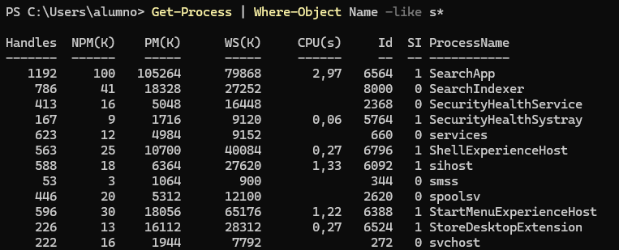

> 💬 Comando demasiado largo para poner el resultado completo.

## 📌 5. Agrupación y estadísticas
- **Agrupación de datos:** agrupa todos los servicios del sistema en función de su `Status`. El comando debe devolverte cuántos hay en cada grupo.

```powershell
Get-Service | Group-Object -Property Status
```

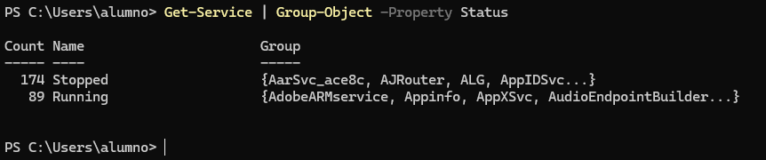

- **Cálculo estadístico:** obtén el listado de archivos del directorio actual (`Get-ChildItem`). Usando una tubería, calcula el promedio (`Average`) de la propiedad `Length` (tamaño) de todos los archivos.

```powershell
Get-ChildItem -File | Select-Object -ExpandProperty Length | Measure-Object -Average
```

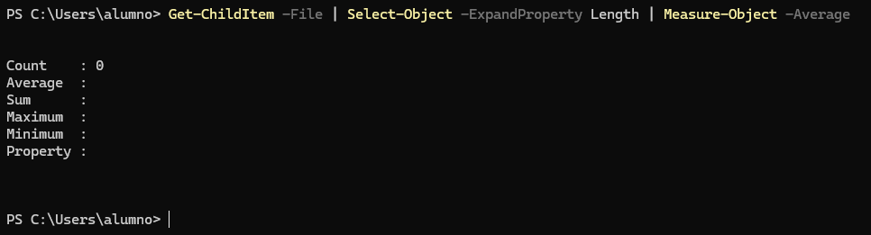

## 📌 6. Gestión del Historial
- **Consulta de actividad:** muestra por pantalla la lista de los últimos comandos que has ejecutado en la sesión actual.

```powershell
Get-History
```

Este comando muestra el historial de los comandos que se han puesto.

- **Exportación de datos:** exporta todo tu historial de comandos actual a un archivo en formato **CSV** llamado `historial_lab.csv`.

Como estoy haciendo los ejercicios en una máquina virtual, el archivo lo guardaré en `Documents`.
```powershell
Get-History | Export-Csv -Path 'C:\Users\alumno\Documents\historial_lab.csv'
```

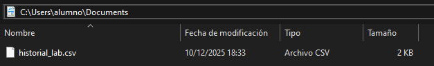

Si lo abrimos ya sea con el Bloc de notas, Excel o Visual Studio, podremos ver la lista de los comandos que hayamos escrito.

---
### [⬅️ Volver a UT06](../index.md)
---