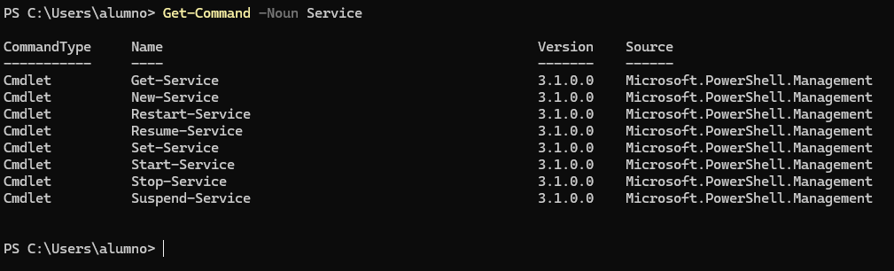
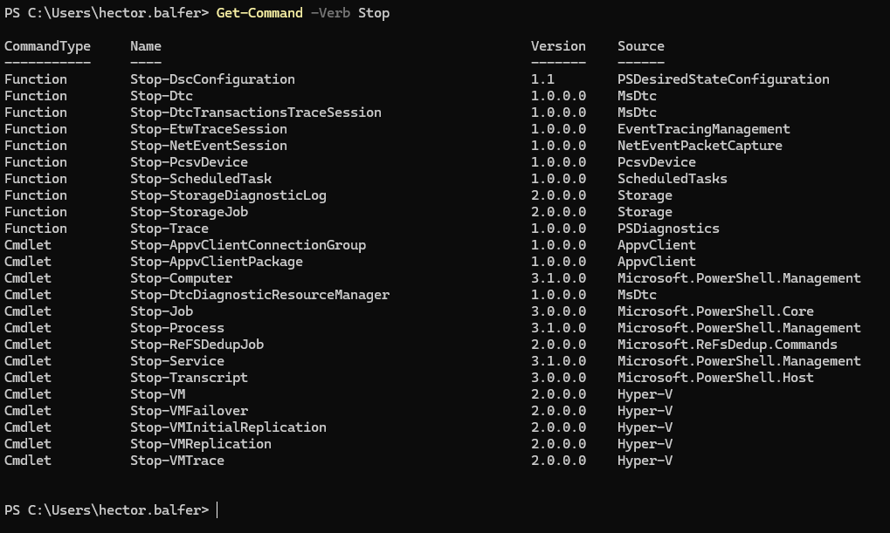
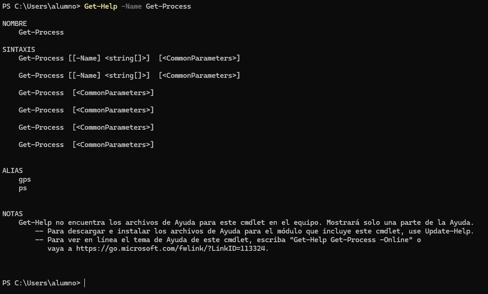

# 📄 PR0601: Introducción a Powershell

> 💬 Para hacer los ejercicios, se pondrá los apartados que pide cada ejercicio, el comando que se usa y el resultado de ese comando.

## 📌 1. Descubrimiento y ayuda
- **Búsqueda por nombre (Sustantivo):** lista todos los comandos disponibles en el sistema que tengan la palabra `Service` en su nombre (noun) para identificar qué herramientas tienes para gestionar servicios.

```powershell
Get-Command -Noun Service
```



- **Búsqueda por acción (Verbo):** lista todos los comandos disponibles cuya acción sea `Stop` (detener), independientemente de lo que detengan.

```powershell
Get-Command -Verb Stop
```



- **Uso de la ayuda:** muestra por pantalla la ayuda detallada del comando `Get-Process`, pero asegúrate de que se muestren específicamente los **ejemplos** de uso.

```powershell
Get-Help -Name Get-Process
```



Si queremos la ayuda completa, pondremos al final del comando `-Full`. Es decir:  
```powershell
Get-Help -Name Get-Process -Full
```

## 📌 2. Exploración de objetos


## 📌 3. El Pipeline (selección y ordenación)


## 📌 4. Filtrado y lógica (Where-Object)


## 📌 5. Agrupación y estadísticas


## 📌 6. Gestión del Historial


---
### [⬅️ Volver a UT06](../index.md)
---