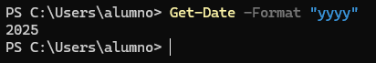

# 📄 PR0602: El pipeline en Powershell

> 💬 Para hacer los ejercicios, se pondrá los apartados que pide cada ejercicio, el comando que se usa y el resultado de ese comando.

## 📁 Parte 1
### 📌 Ejercicio 1
- El comando `Get-Date` muestra la fecha y hora actual. Muestra por pantalla únicamente el año en que estamos.

```powershell
Get-Date -Format "yyyy"
```



### 📌 Ejercicio 2
- Uno de los requisitos de Windows 11 es que es procesador tenga **TPM** habilitado. Powershell dispone del comando `Get-TPM` que nos muestra información sobre este módulo. Muestra por pantalla, en formato tabla, las propiedades `TpmPresent`, `TpmReady`, `TpmEnabled` y `TpmActivated`.

```powershell
Get-TPM | select TpmPresent, TpmReady, TpmEnabled, TpmActivated
```


> 💬 Para este comando hace falta abrir la terminal en modo **Administrador** porque si no, solo aparece así:  
```
TpmPresent  TpmReady    TpmEnabled  TpmActivated
----------  --------    ----------  ------------
```

## 📁 Parte 2
En los siguientes ejercicios trabajaremos con los ficheros devueltos por el comando `Get-ChildItem C:\Windows\System32`.

### 📌 Ejercicio 1
- Muestra por pantalla el número de ficheros y directorios que hay en ese directorio.

```powershell
Get-ChildItem C:\Windows\System32\ | Measure-Object
```


### 📌 Ejercicio 2
- Los objetos devueltos por el comando anterior tienen una propiedad denominada `Extension`, que indica la extensión del archivo. Calcula el número de ficheros en el directorio que tienen la extensión `.dll`.

```powershell
Get-ChildItem C:\Windows\System32\ | Where-Object Extension -eq ".dll" | Measure-Object
```


### 📌 Ejercicio 3
- Muestra los ficheros del directorio con extensión `.exe` que tengan un tamaño superior a 50000 bytes.

```powershell
Get-ChildItem C:\Windows\System32\ | Where-Object Extension -eq ".exe" | Where-Object Length -gt 50000
```


### 📌 Ejercicio 4
- Muestra los ficheros de este directorio que tengan extensión `.dll`, ordenados por fecha de creación y mostrando únicamente las propiedades de fecha de creación (`CreationTime`), último acceso (`LastAccessTime`) y nombre (`Name`).

```powershell
Get-ChildItem C:\Windows\System32\ | Where-Object Extension -eq ".dll" | select CreationTime, LastAccessTime, Name | Sort-Object CreationTime
```


### 📌 Ejercicio 5
- Muestra el tamaño (`Length`) y nombre completo (`FullName`) de todos los ficheros del directorio ordenados por tamaño en sentido descendente.

```powershell
Get-ChildItem C:\Windows\System32\ | select Length, FullName | Sort-Object Length -Descending
```


### 📌 Ejercicio 6
- Muestra el tamaño y nombre completo de todos los ficheros del directorio que tengan un tamaño superior a 10MB (10000000 bytes) ordenados por tamaño.

```powershell
Get-ChildItem C:\Windows\System32\ | select Length, FullName | Sort-Object Length | Where-Object Length -gt 10000000
```


### 📌 Ejercicio 7
- Muestra el tamaño y nombre completo de todos los ficheros del directorio que tengan un tamaño superior a 10MB y extensión `.exe` ordenados por tamaño.

```powershell
C:\Windows\System32\ | Where-Object Extension -eq ".exe" |Select-Object Length, FullName | Sort-Object Length | Where-Object Length -gt 10000000
```


## 📁 Parte 3

### 📌 Ejercicio 1
- Muestra todos los procesos que tienen el estado `Responding` puesto a `False`, es decir, todos los procesos del sistema que se hayan colgado.

```powershell
Get-Process | Where-Object Responding -eq $False
```


### 📌 Ejercicio 2
- Muestra todos los ficheros de `C:\Windows` que hayan sido creados con fecha posterior al 15 de octubre de este año.

```powershell
Get-ChildItem C:\Windows | Where-Object CreationTime -gt (Get-Date -Date "15-10-2025")
```


---
### [⬅️ Volver a UT06](../index.md)
---