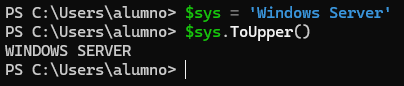
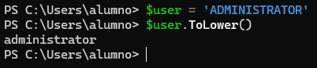
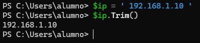
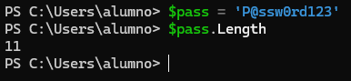

# 📄 PR0603: Manipulación de cadenas

> 💬 Para hacer los ejercicios, se pondrá a la vez en el mismo cuadro el comando de entrada y de salida acompañado de la captura de pantalla para ver el resultado.

## 📌 Ejercicio 1: Limpieza básica (mayúsculas, minúsculas y espacios)
**1.** Normalizar a mayúsculas.

```powershell
$sys = 'Windows Server'
Write-Host $sys.ToUpper()
```



**2.** Normalizar a minúsculas.

```powershell
$user = 'ADMINISTRATOR'
Write-Host $user.ToLower()
```



**3.** Limpieza de espacios extremos.

```powershell
$ip = ' 192.168.1.10 '
Write-Host $ip.Trim()
```



**4.** Eliminación total de espacios.

```powershell
$mac = '00 AA 11 BB 22 CC'
Write-Host $mac.Replace(' ', '')
```


**5.** Longitud de la cadena.

```powershell
$pass = 'P@ssw0rd123'
Write-Host $pass.Length
```



## 📌 Ejercicio 2: Reemplazo y sustitución
**6.** Cambio de separadores de fecha.

```powershell
$fecha = '2023.10.05'
$fecha.replace('.', '-')
```


**7.** Actualización de dominio.

```powershell
$web = 'www.miempresa.es'
$web.replace('.es', '.com')
```


**8.** Censura de datos.

```powershell
$tarjeta = '1234-5678-9012-3456'

```


**9.** Cambio de barra de rutas (Linux a Windows).

```powershell
$rutaLinux = '/home/usuario/docs'

```


**10.** Doble reemplazo (limpiar prefijo y sufijo).

```powershell
$valor = '(Software)'

```


## 📌 Ejercicio 3: Extracción por posición
**11.** Extraer prefijo de país.
- **Entrada:** `$tlf = '+34-600111222'`
- **Salida:** `+34`

```powershell

```


**12.** Extraer año fiscal (primeros 4 caracteres).
- **Entrada:** `$codigo = '2024-FACTURA-SEP'`
- **Salida:** `2024`

```powershell

```


**13.** Ignorar el primer carácter.
- **Entrada:** `$idEmpleado = 'E55421'`
- **Salida:** `55421`

```powershell

```


**14.** Extraer extensión de archivo (últimos 3).
- **Entrada:** `$fichero = 'informe.pdf'`
- **Salida:** `pdf`

```powershell

```


**15.** Relleno de ceros (Padding).
- **Entrada:** `$numero = '7'`
- **Salida:** `007`

```powershell

```


## 📌 Ejercicio 4: Troceado (Split) y arrays
**16.** Obtener nombre de usuario desde email.
- **Entrada:** `$email = 'pepe.garcia@empresa.com'`
- **Salida:** `pepe.garcia`

```powershell

```


**17.** Obtener dominio desde email.
- **Entrada:** `$email = 'pepe.garcia@empresa.com'`
- **Salida:** `empresa.com`

```powershell

```


**18.** Obtener nombre de archivo de una ruta larga.
- **Entrada:** `$path = 'C:\Users\Admin\Downloads\instaler.msi'`
- **Salida:** `instaler.msi`

```powershell

```


**19.** Obtener letra de unidad.
- **Entrada:** `$path = 'D:\Datos\Backups'`
- **Salida:** `D:`

```powershell

```


**20.** Separar CSV manual.
- **Entrada:** `$linea = 'Juan;Marketing;Madrid'`
- **Salida:** Muestra solo `Marketing`

```powershell

```


## 📌 Ejercicio 5: Aplicaciones prácticas
**21.** Detección de usuario Admin (Boolean). Devuelve `True` si empieza por “ADM”, `False` si no.
- **Entrada:** `$u = 'ADM_Lopez'`
- **Salida:** `True`

```powershell

```


**22.** Formato de nombre propio. Convierte la primera letra en mayúscula y el resto en minúscula.
- **Entrada:** `$nombre = 'JAVIER'`
- **Salida:** `Javier`

```powershell

```


**23.** Limpieza de Distinguished Name (AD). Extrae el nombre común (CN).
- **Entrada:** `$dn = 'CN=Beatriz,OU=Ventas,DC=dominio,DC=local'`
- **Salida:** `Beatriz`

```powershell

```


**24.** Generador de iniciales

```powershell
$n = 'Fernando'
$a = 'Alonso'
```

```powershell

```


**25.** Inversión de fecha. Transforma formato europeo a formato base de datos ISO (YYYYMMDD) sin guiones.
- **Entrada:** `$euDate = '31-12-2023'`
- **Salida:** `20231231`

```powershell

```


---
### [⬅️ Volver a UT06](../index.md)
---