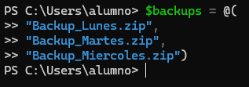
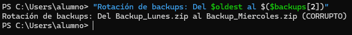
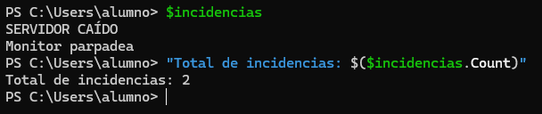
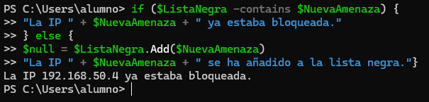
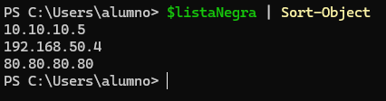

# 📄 PR0604: Manipulación de colecciones en PowerShell
> 💬 Para hacer los ejercicios, se pondrá a la vez en el mismo cuadro el comando de entrada y de salida acompañado de la captura de pantalla para ver el resultado.

## 📁 Parte 1: Arrays fijos
### 📌 1. Reconfiguración de DNS y Verificación
**Paso 1:**
```powershell
$dns = "192.168.1.10", "10.0.0.50"
```

> 💬 El primero se encuentra en la posición 0 y el segundo en la posición 1.

**Paso 2:**
```powershell
"Configuración actual: " + $dns[0] + " - " + $dns[1]
```


**Paso 3:**
```powershell
$dns[1] = "8.8.8.8"
```

**Paso 4:**
```powershell
$dns.Length
```


**Paso 5:**
```powershell
"Configuración final: " + $dns[0] + " - " + $dns[1]
```


### 📌 2. Rotación de logs de backups (LIFO - Last In, First Out)
**Paso 1:**
```powershell
$backups = @(
"Backup_Lunes.zip"
"Backup_Martes.zip"
"Backup_Miercoles.zip")
```



> 💬 El primero se encuentra en la posición 0, el segundo en la posición 1 y el tercero en la posición 2.

**Paso 2:**
```powershell
$oldest = $backups[0]
```

**Paso 3:**
```powershell
$newest = $backups[2]
```

**Paso 4:**
```powershell
$backups[2] = $backups[2] + " (CORRUPTO)"
```

**Paso 5:**
```powershell
"Rotación de backups: Del " + $oldest + " al " + $newest
```



## 📁 Parte 2: ArrayList
### 📌 3. Gestión de Cola de incidencias (Priorización)
**Paso 1:**
```powershell
$incidencias = New-Object System.Collections.ArrayList
```

**Paso 2:**
```powershell
$null = $incidencias.Add("Monitor parpadea")
$null = $incidencias.Add("Ratón no va")
```

**Paso 3:**
```powershell
$incidencias.Insert(0, "SERVIDOR CAÍDO")
```

**Paso 4:**
```powershell
$incidencias.Remove("Ratón no va")
```

**Paso 5:**
```powershell
$incidencias
"Total de incidencias: " + $incidencias.Count
```



### 📌 4. Validación de lista negra de IPs (Seguridad)
**Paso 1:**
```powershell
$listaNegra = New-Object System.Collections.ArrayList
$null = $listaNegra.Add("10.10.10.5")
$null = $listaNegra.Add("192.168.50.4")
$null = $listaNegra.Add("80.80.80.80")
```

**Paso 2:**
```powershell
$NuevaAmenaza = "192.168.50.4"
```

**Paso 3:**
```powershell
if ($ListaNegra -contains $NuevaAmenaza) {
"La IP " + $NuevaAmenaza + " ya estaba bloqueada."
} else {
$null = $ListaNegra.Add($NuevaAmenaza)
"La IP " + $NuevaAmenaza + " se ha añadido a la lista negra."}
```



**Paso 4:**
```powershell
$listaNegra | Sort-Object
```



## 📁 Parte 3: Listas genéricas
### 📌 5. Hardening de puertos de Firewall (List[int])
**Paso 1:**
```powershell

```


**Paso 2:**
```powershell

```


**Paso 3:**
```powershell

```


**Paso 4:**
```powershell

```


**Paso 5:**
```powershell

```


**Paso 6:**
```powershell

```


### 📌 6. Inventario de servicios críticos (List[string])
**Paso 1:**
```powershell

```


**Paso 2:**
```powershell

```


**Paso 3:**
```powershell

```


**Paso 4:**
```powershell

```


## 📁 Parte 4: Manipulación de texto
### 📌 7. Análisis de Log de usuario
**Entrada:**
```powershell
$logLine = " User: admin ; IP: 192.168.1.55 ; Status: Failed "
```
(Nota los espacios extra al principio y final).

**Paso 1:**
```powershell

```


**Paso 2:**
```powershell

```


**Paso 3:**
```powershell

```


**Paso 4:**
```powershell

```


**Paso 5:**
```powershell

```


### 📌 8. Generador de CSV para recursos humanos
**Paso 1:**
```powershell

```


**Paso 2:**
```powershell

```


**Paso 3:**
```powershell

```


**Paso 4:**
```powershell

```


**Paso 5:**
```powershell

```


---
### [⬅️ Volver a UT06](../index.md)
---