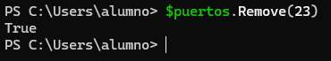
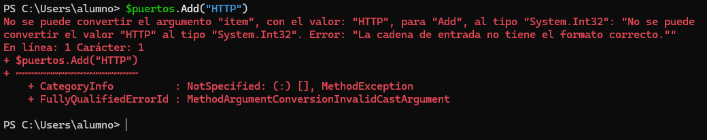
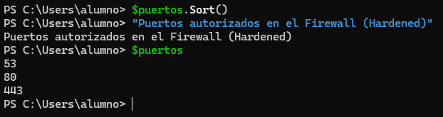
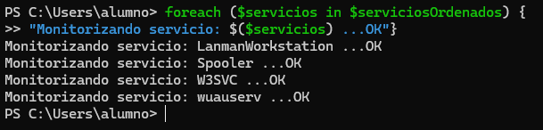
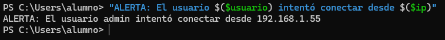
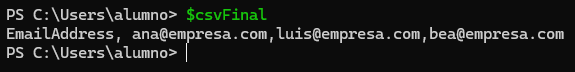

# 📄 PR0604: Manipulación de colecciones en PowerShell
> 💬 Para hacer los ejercicios, se pondrá a la vez en el mismo cuadro el comando de entrada y de salida acompañado de la captura de pantalla para ver el resultado.

## 📁 Parte 1: Arrays fijos
### 📌 1. Reconfiguración de DNS y Verificación
**Paso 1:** Declara el array con los valores iniciales: `192.168.1.10` (Primario) y `10.0.0.50` (Secundario erróneo).
```powershell
$dns = @("192.168.1.10", "10.0.0.50")
```

> 💬 El primero se encuentra en la posición 0 y el segundo en la posición 1.

**Paso 2:** Muestra en pantalla: “Configuración actual: [Primario] - [Secundario]”.
```powershell
"Configuración actual: $($dns[0]) - $($dns[1])"
```


**Paso 3:** Accede directamente al índice correspondiente y cambia la IP del secundario por la de Google: `8.8.8.8`.
```powershell
$dns[1] = "8.8.8.8"
```

**Paso 4:** Muestra en pantalla el número total de servidores DNS configurados.
```powershell
"Número total de servidores DNS: $($dns.Count)"
```


**Paso 5:** Muestra la configuración final corregida.
```powershell
"Configuración final: $($dns[0]) - $($dns[1])"
```


### 📌 2. Rotación de logs de backups (LIFO - Last In, First Out)
**Paso 1:**
```powershell
$backups = @("Backup_Lunes.zip", "Backup_Martes.zip", "Backup_Miercoles.zip")
```

**Paso 2:**
```powershell
$oldest = $backups[0]
```

**Paso 3:**
```powershell
$newest = $backups[2]
```

**Paso 4:**
```powershell
$backups[2] = $backups[2] + " (CORRUPTO)"
```

**Paso 5:**
```powershell
"Rotación de backups: Del $oldest al $($backups[2])"
```


## 📁 Parte 2: ArrayList
### 📌 3. Gestión de Cola de incidencias (Priorización)
**Paso 1:**
```powershell
$incidencias = New-Object System.Collections.ArrayList
```

**Paso 2:**
```powershell
[void]$incidencias.Add("Monitor parpadea")
[void]$incidencias.Add("Ratón no va")
```

**Paso 3:**
```powershell
$incidencias.Insert(0, "SERVIDOR CAÍDO")
```

**Paso 4:**
```powershell
$incidencias.Remove("Ratón no va")
```

**Paso 5:**
```powershell
$incidencias
"Total de incidencias: $($incidencias.Count)"
```


### 📌 4. Validación de lista negra de IPs (Seguridad)
**Paso 1:**
```powershell
$listaNegra = New-Object System.Collections.ArrayList
[void]$listaNegra.Add("10.10.10.5")
[void]$listaNegra.Add("192.168.50.4")
[void]$listaNegra.Add("80.80.80.80")
```

**Paso 2:**
```powershell
$NuevaAmenaza = "192.168.50.4"
```

**Paso 3:**
```powershell
if ($ListaNegra -contains $NuevaAmenaza) {
Write-Host "La IP $NuevaAmenaza ya estaba bloqueada. No se hace nada." -ForegroundColor Yellow
} else {
[void]$ListaNegra.Add($NuevaAmenaza)
Write-Host "La IP $NuevaAmenaza se ha añadido a la lista negra." -ForegroundColor Red
}
```


**Paso 4:**
```powershell
$ListaNegra.Sort()
$ListaNegra
```


## 📁 Parte 3: Listas genéricas
### 📌 5. Hardening de puertos de Firewall (List[int])
**Paso 1:**
```powershell
$puertos = [System.Collections.Generic.List[int]]::new()
```

**Paso 2:**
```powershell
$puertos.Add(80)
$puertos.Add(443)
$puertos.Add(53)
```

**Paso 3:**
```powershell
$puertos.Add(23)
```

**Paso 4:**
```powershell
$puertos.Remove(23)
```



**Paso 5:**
```powershell
$puertos.Add("HTTP")
```



> 💬 Da error porque la lista solo acepta enteros *(int)* y no texto *(string)*

**Paso 6:**
```powershell
$puertos.Sort()
"Puertos autorizados en el Firewall (Hardened)"
$puertos
```



### 📌 6. Inventario de servicios críticos (List[string])
**Paso 1:**
```powershell
$arrayServicios = @("Spooler", "W3SVC", "LanmanWorkstation")
$servicios = [System.Collections.Generic.List[string]]::new([string[]]$arrayServicios)
```

**Paso 2:**
```powershell
$servicios.Add("wuauserv")
```

**Paso 3:**
```powershell
$serviciosOrdenados = $servicios | Sort-Object
```

**Paso 4:**
```powershell
foreach ($servicios in $serviciosOrdenados) {
"Monitorizando servicio: $($servicios) ...OK"}
```



## 📁 Parte 4: Manipulación de texto
### 📌 7. Análisis de Log de usuario
**Entrada:**
```powershell
$logLine = " User: admin ; IP: 192.168.1.55 ; Status: Failed "
```
(Nota los espacios extra al principio y final).

**Paso 1:**
```powershell
$logLineLimpio = $logLine.Trim()
```

**Paso 2:**
```powershell
$partes = $logLineLimpio.Split(";")
```

**Paso 3:**
```powershell
$usuario = $partes[0].Split(":")[1].Trim()
```

**Paso 4:**
```powershell
$ip = $partes[1].Split(":")[1].Trim()
```

**Paso 5:**
```powershell
"ALERTA: El usuario $($usuario) intentó conectar desde $($ip)"
```



### 📌 8. Generador de CSV para recursos humanos
**Paso 1:**
```powershell
$m1 = "ana@empresa.com"
$m2 = "luis@empresa.com"
$m3 = "bea@empresa.com"
```

**Paso 2:**
```powershell
$emails = @($m1, $m2, $m3)
```

**Paso 3:**
```powershell
$listaEmails = $emails -join ","
```

**Paso 4:**
```powershell
$csvFinal = "EmailAddress, $($listaEmails)"
```

**Paso 5:**
```powershell
$csvFinal
```



---
### [⬅️ Volver a UT06](../index.md)
---