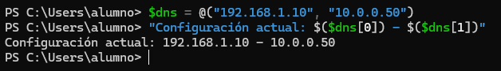
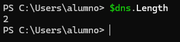
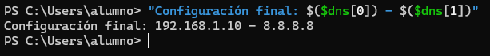

# 📄 PR0604: Manipulación de colecciones en PowerShell
> 💬 Para hacer los ejercicios, se pondrá a la vez en el mismo cuadro el comando de entrada y de salida acompañado de la captura de pantalla para ver el resultado.

## 📁 Parte 1: Arrays fijos
### 📌 1. Reconfiguración de DNS y Verificación
**Paso 1:**
```powershell
$dns = @("192.168.1.10", "10.0.0.50")
```

> 💬 El primero se encuentra en la posición 0 y el segundo en la posición 1.

**Paso 2:**
```powershell
"Configuración actual: $($dns[0]) - $($dns[1])"
```



**Paso 3:**
```powershell
$dns[1] = "8.8.8.8"
```

**Paso 4:**
```powershell
"Total de servidores DNS: $($dns.Count)"
```



**Paso 5:**
```powershell
"Configuración final: $($dns[0]) - $($dns[1])"
```



### 📌 2. Rotación de logs de backups (LIFO - Last In, First Out)
**Paso 1:**
```powershell
$backups = @("Backup_Lunes.zip", "Backup_Martes.zip", "Backup_Miercoles.zip")
```


**Paso 2:**
```powershell

```


**Paso 3:**
```powershell

```


**Paso 4:**
```powershell

```


**Paso 5:**
```powershell

```


## 📁 Parte 2: ArrayList
### 📌 3. Gestión de Cola de incidencias (Priorización)
**Paso 1:**
```powershell

```


**Paso 2:**
```powershell

```


**Paso 3:**
```powershell

```


**Paso 4:**
```powershell

```


**Paso 5:**
```powershell

```


### 📌 4. Validación de lista negra de IPs (Seguridad)


## 📁 Parte 3: Listas genéricas
### 📌 5. Hardening de puertos de Firewall (List[int])
**Paso 1:**
```powershell

```


**Paso 2:**
```powershell

```


**Paso 3:**
```powershell

```


**Paso 4:**
```powershell

```


**Paso 5:**
```powershell

```


**Paso 6:**
```powershell

```


### 📌 6. Inventario de servicios críticos (List[string])
**Paso 1:**
```powershell

```


**Paso 2:**
```powershell

```


**Paso 3:**
```powershell

```


**Paso 4:**
```powershell

```


## 📁 Parte 4: Manipulación de texto
### 📌 7. Análisis de Log de usuario
**Entrada:**
```powershell
$logLine = " User: admin ; IP: 192.168.1.55 ; Status: Failed "
```
(Nota los espacios extra al principio y final).

**Paso 1:**
```powershell

```


**Paso 2:**
```powershell

```


**Paso 3:**
```powershell

```


**Paso 4:**
```powershell

```


**Paso 5:**
```powershell

```


### 📌 8. Generador de CSV para recursos humanos
**Paso 1:**
```powershell

```


**Paso 2:**
```powershell

```


**Paso 3:**
```powershell

```


**Paso 4:**
```powershell

```


**Paso 5:**
```powershell

```


---
### [⬅️ Volver a UT06](../index.md)
---