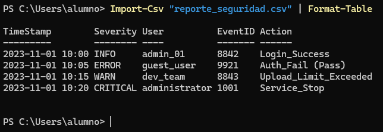

# 📄 PR0605: Limpieza de logs
## 📌 1. Objetivo
Eres el administrador de sistemas y debes crear un script en PowerShell que convierta unos logs antiguos y mal formateados en un archivo CSV limpio y estructurado para que el departamento de seguridad pueda auditar los accesos, ya que no es posible modificar cómo el servidor genera dichos logs.

## 📌 2. Datos de entrada
```powershell
$logCrudo = @"
[INFO] ID:8842 :: 2023/11/01_10:00 :: User:admin_01 :: Action:Login_Success
[ERROR] ID:9921 :: 2023/11/01_10:05 :: User:guest_user :: Action:Auth_Fail (Pass)
[WARN] ID:8843 :: 2023-11-01 10:15 :: User:dev_team :: Action:Upload_Limit_Exceeded
[CRITICAL] ID:1001 :: 01-11-2023_10:20 :: User:ROOT :: Action:Service_Stop
"@
```

## 📌 3. Los requisitos
```powershell
$logCrudo = @"
[INFO] ID:8842 :: 2023/11/01_10:00 :: User:admin_01 :: Action:Login_Success
[ERROR] ID:9921 :: 2023/11/01_10:05 :: User:guest_user :: Action:Auth_Fail (Pass)
[WARN] ID:8843 :: 2023-11-01 10:15 :: User:dev_team :: Action:Upload_Limit_Exceeded
[CRITICAL] ID:1001 :: 01-11-2023_10:20 :: User:ROOT :: Action:Service_Stop
"@ -split "`r`n"
 
$objetosProcesados = foreach ($linea in $logCrudo) {
    if ($linea.StartsWith("[INFO]")) { continue }
 
    $partes = $linea -split " :: "
    $nivelRaw = $partes[0].Split(']')[0].Replace('[', '').Trim()
    $id      = $partes[0].Split(':')[1].Trim()
 
    $fechaLimpia = $partes[1].Replace('_', ' ').Replace('-', '/')
    $timeStamp   = (Get-Date $fechaLimpia).ToString("yyyy-MM-dd HH:mm")
 
    $usuarioRaw = $partes[2].Split(':')[1].Trim().ToLower()
    if ($usuarioRaw -eq "root") { $usuarioRaw = "administrator" }
 
    # $accion = $partes[3].Substring($partes[3].IndexOf(':') + 1).Trim()
    $accion = partes[3].split(":")[1]
 
    [PSCustomObject]@{
        Fecha     = $timeStamp
        Severity  = $nivelRaw
        User      = $usuarioRaw
        EventID   = $id
        Action    = $accion
    }
}
 
$objetosProcesados | Export-Csv -Path "reporte_seguridad.csv"
$objetosProcesados | Format-Table -AutoSize
```

## 📌 4. Resultado esperado


---
### [⬅️ Volver a UT06](../index.md)
---