# 📄 PR0701: Compartición de carpetas con Samba

## 📌 Objetivo
1. Compartir 4 carpetas:
   - Gerencia, Administración, Taller, Pública
2. La empresa tendrá 6 empleados:
   - ger01, adm01, adm02, tall01, tall02, tall03

Las carpetas serán accesibles por los siguientes usuarios según los siguientes criterios:
- Todos los empleados podrán acceder a la carpeta `Pública` con permisos de lectura, mientras que el empleado `ger01` podrá hacerlo con permisos de lectura y escritura.
- El empleado `ger01` podrá acceder con todos los permisos a la carpeta `Gerencia`.
- Los empleados `adm01` y `adm02` tendrán acceso con todos los permisos a `Administración` y con permisos de lectura únicamente a la carpeta `Taller`.
- Los usuarios `tall01`, `tall02` y `tall03` tendrán acceso de lectura y escritura a la carpeta `Taller`.
- Cualquier usuario que no sea uno de los anteriores (invitado) podrá acceder únicamente a la carpeta `Pública`.
- Los usuarios `ger01`, `adm01` y `adm02` usan **Windows**.
- Los usuarios `tall01`, `tall02` y `tall03` usan **Linux**.

## 📌 Configuración del entorno
Para la práctica prepararemos 3 máquinas virtuales, un **Ubuntu Server 20.04**, un **Ubuntu Desktop 20.04** y un **Windows 10** con la siguiente configuración:

| Host                 | IP           | Máscara de subred | Puerta de enlace | Servidor DNS     |
| -------------------- | ------------ | ----------------- | ---------------- | ---------------- |
| `smb-hbf`            | 192.168.1.10 | 255.255.255.0 /24 | 192.168.1.1      | 8.8.8.8, 8.8.4.4 |
| `ClienteUbuntu-HBF`  | 192.168.1.20 | 255.255.255.0 /24 | 192.168.1.1      | 8.8.8.8, 8.8.4.4 |
| `ClienteWindows-HBF` | 192.168.1.30 | 255.255.255.0 /24 | 192.168.1.1      | 8.8.8.8, 8.8.4.4 |

Ahora pondremos las IPs estáticas en cada máquina virtual, en mi caso, he puesto en cada una de ellas dos adaptadores de red, uno en **red interna** y el otro en **NAT**. Así que configuramos la **red interna**.

### smb-hbf
Como en este caso es un Ubuntu Server, no tendremos entorno gráfico. Por lo que tendremos que editar el fichero de configuración de red con el siguiente comando:
```bash
sudo nano /etc/netplan/00-installer-config.yaml
```

Pondremos lo siguiente:


Aplicamos los cambios con `sudo netplan apply`. Para ver la IP pondremos `ifconfig`. Pero antes instalamos las `net-tools` con `sudo apt install net-tools`.


### ClienteUbuntu-HBF
Aquí, tendremos un Ubuntu con entorno gráfico, por lo que podremos evitar el archivo de configuración. Vamos a **Configuración** e iremos al apartado de **Red**. Clicamos en la **ruleta** para configurar que en este caso es el primer adaptador de red `enp0s3`. Cuando estemos dentro, haremos lo siguiente:


Veremos la IP con el comando `ifconfig`.


### ClienteWindows-HBF
Para Windows, pulsamos la combinación de teclas `Win+X` y escribimos `ncpa.cpl`, hacemos clic derecho en el adaptador de red y clicamos en `Propiedades`. Luego, clicamos en `Protocolo de Internet versión 4 (TCP/IPv4)` y pondremos lo siguiente:


Miramos la IP con el comando `ipconfig /all`.


Por último, desactivamos el **Firewall** desde el **Panel de control**, yendo hacia `Sistema y seguridad → Firewall de Windows Defender` y en la parte de la izquierda, clicamos en `Activar o desactivar el Firewall de Windows Defender`. Clicamos en `Desactivar Firewall de Windows Defender` tanto en `Redes privadas` como en `Redes públicas o invitadas`, aceptamos y ya está desactivado el Firewall.


## 📌 Instalación y configuración de `Samba`
Vamos a nuestro servidor y pondremos estos comandos:
```bash
sudo apt update
sudo apt install samba smbclient
```

Cuando lo tengamos instalado, pondremos este comando para verificar la versión que tenemos:
```bash
smbd --version
```

En mi caso tengo la versión `Version 4.15.13-Ubuntu`.

### Creación de los grupos y usuarios
Para crear los grupos, lo hacemos con el comando `groupadd`.
```bash
sudo groupadd gerencia
sudo groupadd administracion
sudo groupadd taller
```

Para los usuarios, los creamos con el comando `useradd`. Pondremos los modificadores `-m` y `-G`.
```bash
sudo useradd -m -G gerencia ger01
sudo useradd -m -G administracion adm01
sudo useradd -m -G administracion adm02
sudo useradd -m -G taller tall01
sudo useradd -m -G taller tall02
sudo useradd -m -G taller tall03
```

Ahora les pondremos la contraseña a cada usuario que hemos creado. Usaremos el comando `smbpasswd`, nos pedirá que repitamos la contraseña en cada uno de los casos. Le pondremos el modificador `-a`.
```bash
sudo smbpasswd -a ger01
sudo smbpasswd -a adm01
sudo smbpasswd -a adm02
sudo smbpasswd -a tall01
sudo smbpasswd -a tall02
sudo smbpasswd -a tall03
```

Para hacer la verificación entre los usuarios de **Linux** y **Samba**, pondremos este comando:
```bash
sudo pdbedit -L
```

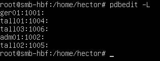

### Creación de las carpetas compartidas
Creamos las carpetas compartidas para los diferentes usuarios en un directorio que se llama `/samba`, de froma que sea fácil de buscar. Creamos uno por cada usuario usando el comando `mkdir`.
```bash
sudo mkdir /samba
sudo mkdir /samba/Gerencia
sudo mkdir /samba/Administracion
sudo mkdir /samba/Taller
sudo mkdir /samba/Publica
```

### Permisos y propietarios
Vamos a gestionar los permisos de cada una de las carpetas que hemos creado, dándoles permiso al grupo. Tendremos que hacer uso del comando `chmod` y `chown`.

- Carpeta Gerencia

```bash
sudo chown root:gerencia /samba/Gerencia
sudo chmod 2775 /samba/Gerencia
```

- Carpeta Administracion

```bash
sudo chown root:administracion /samba/Administracion
sudo chmod 2775 /samba/Administracion
```

- Carpeta Taller

```bash
sudo chown root:taller /samba/Taller
sudo chmod 2775 /samba/Taller
```

- Carpeta Publica

```bash
sudo chown root:root /samba/Publica
sudo chmod 755 /samba/Publica
```

### Configuración del fichero `smb.conf`
Antes de modificar el fichero, haremos una copia de seguridad del mismo. Usamos el comando `cp`.
```bash
sudo cp /etc/samba/smb.conf /etc/samba/smb.conf.bak
```

Cuando ya lo tengamos copiado, modificamos el archivo con `sudo nano /etc/samba/smb.conf` y pondremos lo siguiente:
```bash
[Publica]
comment = Carpeta Publica
path = /samba/Publica
browsable = yes
guest ok = yes
read only = yes
write list = ger01
create mask = 0644
directory mask = 0755

[Gerencia]
comment = Carpeta Gerencia
path = /samba/Gerencia
browsable = yes
valid users = @gerencia
read only = no

[Administracion]
comment = Carpeta Administracion
path = /samba/Administracion
browsable = yes
valid users = @administracion
read only = no

[Taller]
comment = Carpeta Taller
path = /samba/Taller
browsable = yes
valid users = @taller adm01 adm02
read only = no
write list = @taller
```

Dentro de `[global]`, pondremos esto en cualquier sitio:

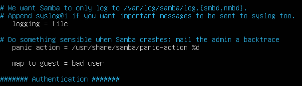

### Reinicio del servicio
Reiniciamos el servicio poniendo estos dos comandos:
```bash
sudo systemctl restart smbd
sudo systemctl status smbd
```

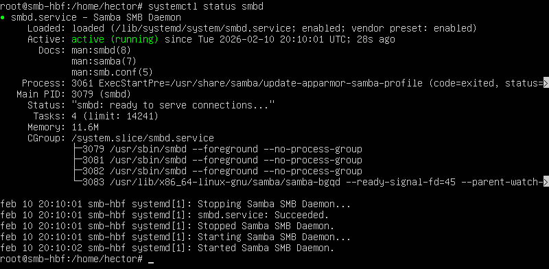

## 📌 Acceso desde Windows
Entramos en Configuración con Ctrl+I, vamos a **Cuentas → Otros usuarios** y creamos a los usuarios `ger01`, `adm01` y `adm02`.

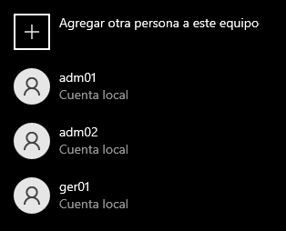

### Comprobación de `Gerencia`
Iniciamos sesión con `ger01`. Abrimos el explorador de archivos y escribimos `\\192.168.1.10`. Con esto entraríamos a las carpetas de **Samba**, clicamos en Gerencia y creamos un archivo de texto. Si nos permite hacerlo, está bien configurado.

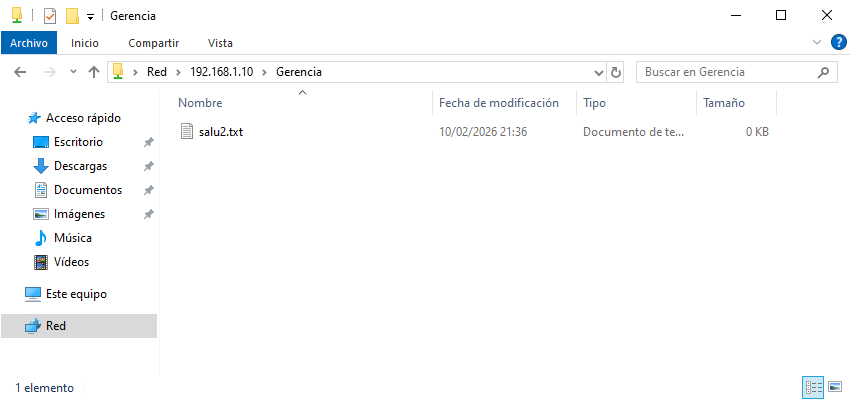

### Comprobación de `Administracion`
Iniciamos sesión con `adm01`. Haciendo lo mismo entramos ahora en Administracion y creamos un archivo de texto. Si podemos, está bien configurado.

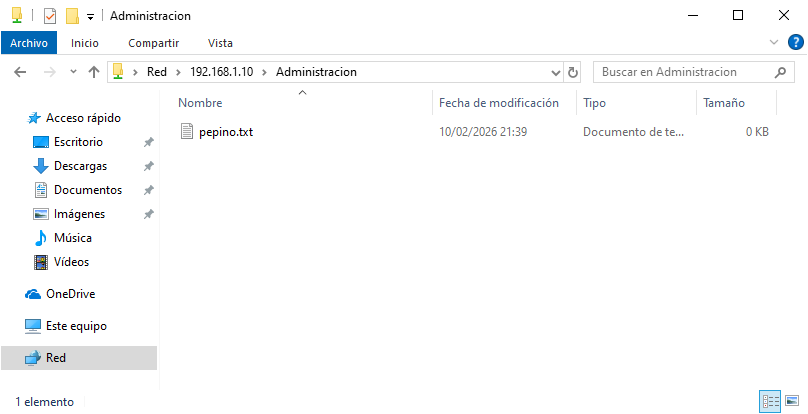

Si intentamos entrar ahora en **Taller**, veremos que no podemos modificar, solo ver.

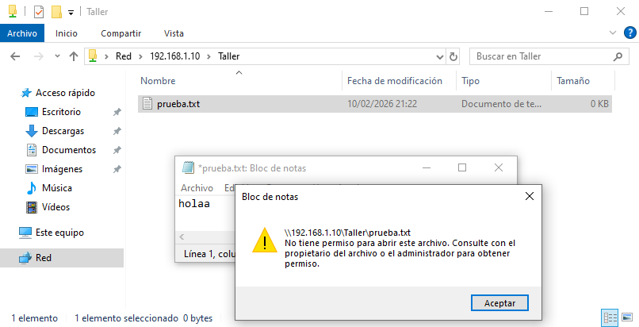

Si intentamos entrar con un usuario a una carpeta sin permisos, nos saldrá el siguiente aviso:

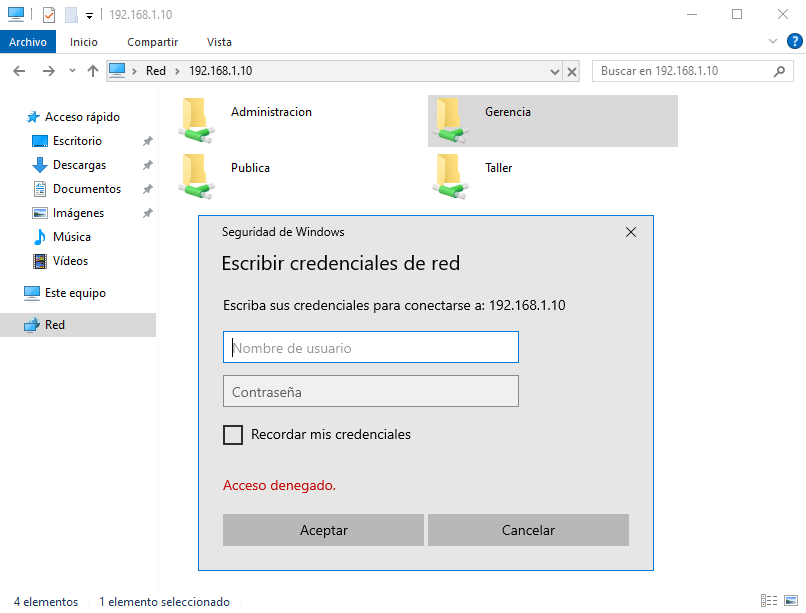

> 💬 He intentado entrar con el usuario `adm01` hacia **Gerencia**.

### Comprobación de `Publica`
Si volvemos hacia `\\192.168.1.10` e intentamos entrar en **Publica**, veremos que nos dará error.

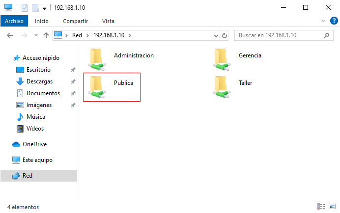

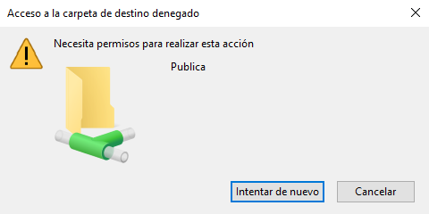

## 📌 Acceso desde Linux
Creamos a los usuarios de Taller:
```bash
sudo adduser tall01
sudo adduser tall02
sudo adduser tall03
```

Instalamos lo siguiente:
```bash
sudo apt install smbclient
sudo apt install cifs-utils
```

### Comprobación de `Taller`
Comprobamos el acceso con el siguiente comando:
```bash
smbclient //192.168.1.10/Taller -U tall01
```

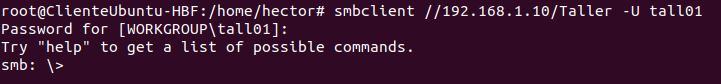

Saldremos de ahí con Ctrl+C y montamos la carpeta compartida con lo siguiente:
```bash
sudo mkdir -p /mnt/Taller
sudo mount -t cifs //192.168.1.10/Taller /mnt/Taller -o user=tall01
```

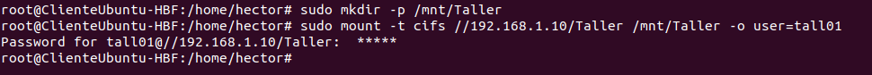

Probamos la lectura y escritura:
```bash
cd /mnt/Taller
touch prueba.txt
```

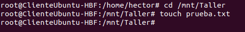

### Comprobación de `Publica`
Creamos la carpeta y la montamos:
```bash
sudo mkdir /mnt/Publica
sudo mount -t cifs //192.168.1.10/Publica /mnt/Publica -o guest,uid=tall01
```

Comprobamos que podremos leer pero no escribir.
```bash
ls /mnt/Publica/
touch /mnt/Publica/prueba.txt
```


---
### [⬅️ Volver a UT07](../index.md)
---