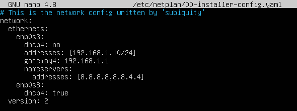
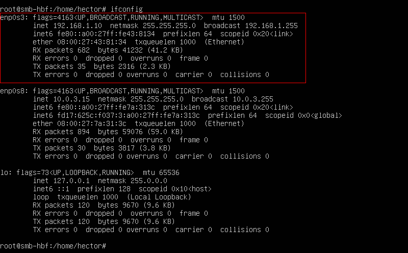
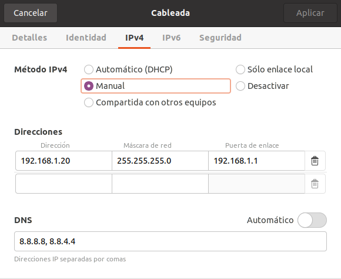
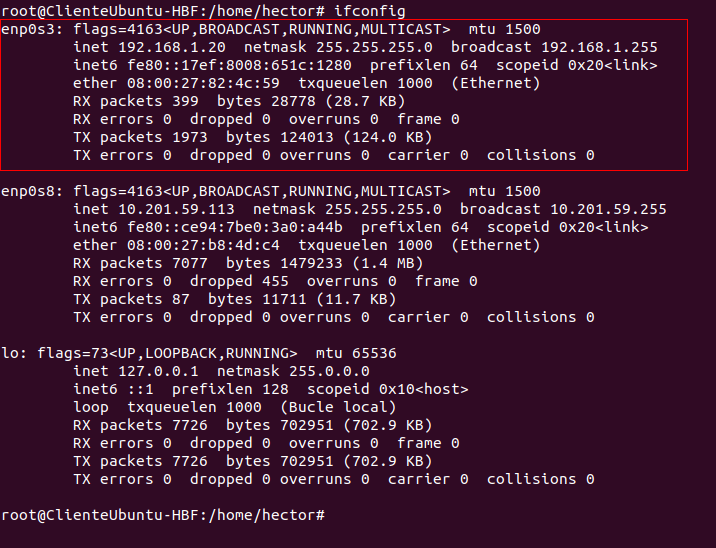
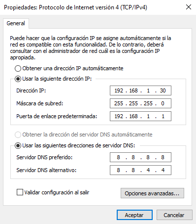
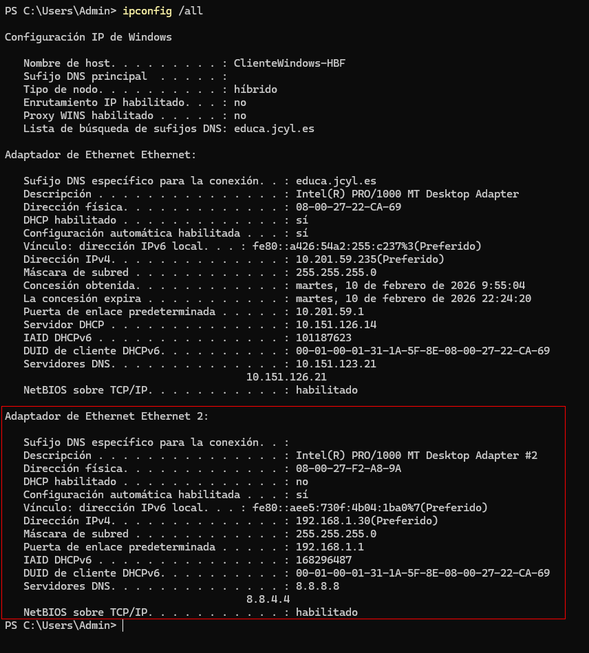
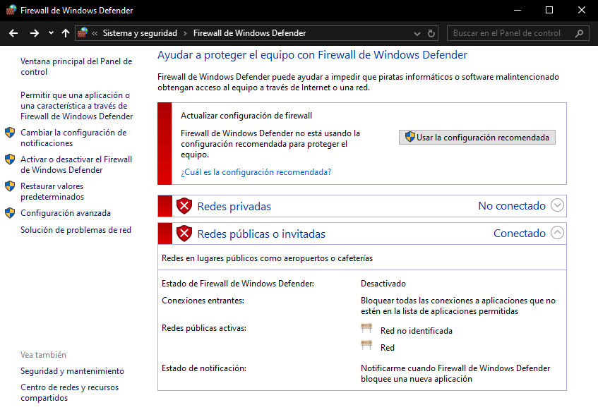

# 📄 PR0701: Compartición de carpetas con Samba

## 📌 Objetivo
1. Compartir 4 carpetas:
   - Gerencia, Administración, Taller, Pública
2. La empresa tendrá 6 empleados:
   - ger01, adm01, adm02, tall01, tall02, tall03

Las carpetas serán accesibles por los siguientes usuarios según los siguientes criterios:
- Todos los empleados podrán acceder a la carpeta `Pública` con permisos de lectura, mientras que el empleado `ger01` podrá hacerlo con permisos de lectura y escritura.
- El empleado `ger01` podrá acceder con todos los permisos a la carpeta `Gerencia`.
- Los empleados `adm01` y `adm02` tendrán acceso con todos los permisos a `Administración` y con permisos de lectura únicamente a la carpeta `Taller`.
- Los usuarios `tall01`, `tall02` y `tall03` tendrán acceso de lectura y escritura a la carpeta `Taller`.
- Cualquier usuario que no sea uno de los anteriores (invitado) podrá acceder únicamente a la carpeta `Pública`.
- Los usuarios `ger01`, `adm01` y `adm02` usan **Windows**.
- Los usuarios `tall01`, `tall02` y `tall03` usan **Linux**.

## 📌 Configuración del entorno
Para la práctica prepararemos 3 máquinas virtuales con la siguiente configuración:

| Host                 | IP           | Máscara de subred | Puerta de enlace | Servidor DNS     |
| -------------------- | ------------ | ----------------- | ---------------- | ---------------- |
| `smb-hbf`            | 192.168.1.10 | 255.255.255.0 /24 | 192.168.1.1      | 8.8.8.8, 8.8.4.4 |
| `ClienteUbuntu-HBF`  | 192.168.1.20 | 255.255.255.0 /24 | 192.168.1.1      | 8.8.8.8, 8.8.4.4 |
| `ClienteWindows-HBF` | 192.168.1.30 | 255.255.255.0 /24 | 192.168.1.1      | 8.8.8.8, 8.8.4.4 |

Ahora pondremos las IPs estáticas en cada máquina virtual, en mi caso, he puesto en cada una de ellas dos adaptadores de red, uno en **red interna** y el otro en **puente**. Así que configuramos la **red interna**.

### smb-hbf
> 💬 Para esta máquina, me he conectado por **SSH** para poder copiar y pegar comandos en caso necesario.

Como en este caso es un Ubuntu Server, no tendremos entorno gráfico. Por lo que tendremos que editar el fichero de configuración de red con el siguiente comando:
```bash
sudo nano /etc/netplan/00-installer-config.yaml
```

Pondremos lo siguiente:



Aplicamos los cambios con `sudo netplan apply`. Para ver la IP pondremos `ifconfig`. Pero antes instalamos las `net-tools` con `sudo apt install net-tools`.



### ClienteUbuntu-HBF
Aquí, tendremos un Ubuntu con entorno gráfico, por lo que podremos evitar el archivo de configuración. Vamos a **Configuración** e iremos al apartado de **Red**. Clicamos en la **ruleta** para configurar que en este caso es el primer adaptador de red `enp0s3`. Cuando estemos dentro, haremos lo siguiente:



Veremos la IP con el comando `ifconfig`.



### ClienteWindows-HBF
Para Windows, pulsamos la combinación de teclas `Win+X` y escribimos `ncpa.cpl`, hacemos clic derecho en el adaptador de red y clicamos en `Propiedades`. Luego, clicamos en `Protocolo de Internet versión 4 (TCP/IPv4)` y pondremos lo siguiente:



Miramos la IP con el comando `ipconfig /all`.



Por último, desactivamos el **Firewall** desde el **Panel de control**, yendo hacia `Sistema y seguridad → Firewall de Windows Defender` y en la parte de la izquierda, clicamos en `Activar o desactivar el Firewall de Windows Defender`. Clicamos en `Desactivar Firewall de Windows Defender` tanto en `Redes privadas` como en `Redes públicas o invitadas`, aceptamos y ya está desactivado el Firewall.



## 📌 Instalación y configuración de Samba


---
### [⬅️ Volver a UT07](../index.md)
---